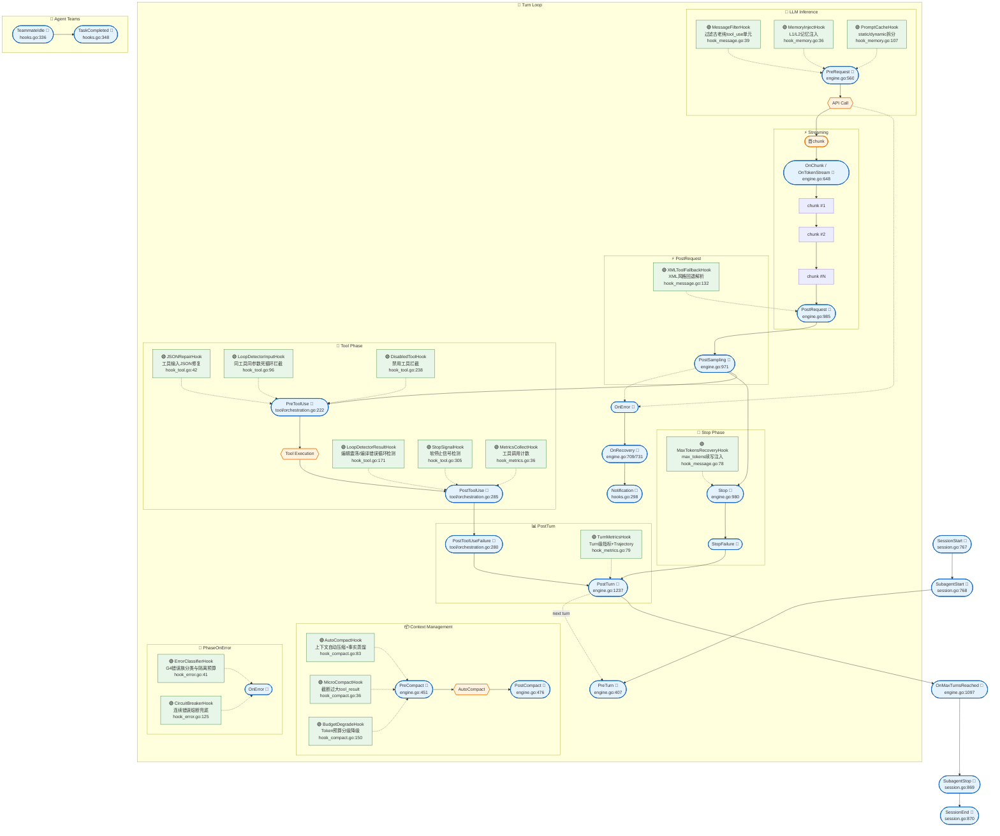

# Claude-Go QueryEngine Hook 生命周期全景图

> **版本**: 1.5（internal_hook 重构完成版）
> **日期**: 2026-05-17
> **范围**: QueryEngine / Tool / Session 三层 Hook 全覆盖 + 8 种 Hook 执行类型 + 17 个内置 InternalHook
> **目标**: 激活全部僵尸 Hook，补全业界缺失的生命周期观测点，扩展外部 Hook 类型至 MCP/Plugin/OPA/Function/gRPC，Decision 语义支持 approve/deny；queryLoop 全部硬编码功能点解耦为 InternalHook；可观测性指标全部迁移至 InternalHook；InternalHook 统一迁移到 `pkg/engine/internal_hook/` 包

---

## 1. 生命周期全景图

### 1.1 ASCII 生命周期图

```
═══════════════════════════════════════════════════════════════════════════════
                    Claude-Go QueryEngine Hook 生命周期全景图
═══════════════════════════════════════════════════════════════════════════════

【图例】
  [已激活]        代码中已实际调用，可正常工作
  [已定义·未调用]  类型系统已定义，但引擎从未触发（僵尸Hook）
  [新增·已激活]   本次新实现并已注入引擎调用点

═══════════════════════════════════════════════════════════════════════════════
 第一层：Session 生命周期 (Session Lifecycle)
═══════════════════════════════════════════════════════════════════════════════

  ┌─────────────────────────────────────────────────────────────────────────┐
  │  SessionStart          [已激活] ✅  pkg/feishu/session.go:767          │
  │      ↓                                                                  │
  │  SubagentStart         [已激活] ✅  pkg/feishu/session.go:768          │
  │      ↓                                                                  │
  │  ┌─────────────────────────────────────────────────────────────────┐    │
  │  │              Turn Loop (第 1 轮 → 第 N 轮)                       │    │
  │  │  ─────────────────────────────────────────────────────────────  │    │
  │  │                                                                 │    │
  │  │  PreTurn               [新增·已激活] ✅  pkg/engine/engine.go:407 │    │
  │  │      ↓                                                          │    │
  │  │  ┌─────────────────────────────────────────────────────────┐    │    │
  │  │  │              LLM 推理阶段 (Inference)                    │    │    │
  │  │  │  ─────────────────────────────────────────────────────  │    │    │
  │  │  │                                                         │    │    │
  │  │  │  PreRequest            [新增·已激活] ✅  engine.go:560  │    │    │
  │  │  │      ↓                                                  │    │    │
  │  │  │  OnRateLimit           [新增·已激活] ✅  engine.go:846  │    │    │
  │  │  │  OnRetry               [新增·已激活] ✅  engine.go:847  │    │    │
  │  │  │      ↓                                                  │    │    │
  │  │  │  API Call                                               │    │    │
  │  │  │      ↓                                                  │    │    │
  │  │  │  [等待首 token]                                         │    │    │
  │  │  │      ↓                                                  │    │    │
  │  │  │  首 chunk 到达 ←──── 触发 OnChunk / OnTokenStream  [新增·已激活] ✅       │    │    │
  │  │  │      │                                                  │    │    │
  │  │  │      ├────→ chunk #1 ──→ OnChunk  [新增·已激活] ✅           │    │    │
  │  │  │      ├────→ chunk #2 ──→ OnChunk  [新增·已激活] ✅           │    │    │
  │  │  │      ├────→   ...    ──→ OnChunk  [新增·已激活] ✅           │    │    │
  │  │  │      └────→ chunk #N ──→ OnChunk  [新增·已激活] ✅           │    │    │
  │  │  │      ↓                                                  │    │    │
  │  │  │  流结束 → PostRequest                                   │    │    │
  │  │  │      ↓                                                  │    │    │
  │  │  │  PostSamplingHooks     [已激活] ✅  engine.go:971        │    │    │
  │  │  │      ↓                                                  │    │    │
  │  │  │  ┌─────────────────────────────────────────────────┐    │    │    │
  │  │  │  │         Tool 解析 & 执行阶段 (Tool Phase)        │    │    │    │
  │  │  │  │  ───────────────────────────────────────────── │    │    │    │
  │  │  │  │                                                 │    │    │    │
  │  │  │  │  PreToolUse            [已激活] ✅  tool/orchestration.go:222 │    │    │    │
  │  │  │  │      ↓                                          │    │    │    │
  │  │  │  │  [Tool Execution]                               │    │    │    │
  │  │  │  │      ↓                                          │    │    │    │
  │  │  │  │  PostToolUse           [已激活] ✅  tool/orchestration.go:285 │    │    │    │
  │  │  │  │      ↓                                          │    │    │    │
  │  │  │  │  PostToolUseFailure    [已激活] ✅  tool/orchestration.go:280 │    │    │    │
  │  │  │  └─────────────────────────────────────────────────┘    │    │    │
  │  │  │      ↓                                                  │    │    │
  │  │  │  ┌─────────────────────────────────────────────────┐    │    │    │
  │  │  │  │         Stop 决策阶段 (Stop Phase)               │    │    │    │
  │  │  │  │  ───────────────────────────────────────────── │    │    │    │
  │  │  │  │                                                 │    │    │    │
  │  │  │  │  Stop                  [已激活] ✅  engine.go:980  │    │    │    │
  │  │  │  │      ↓                                          │    │    │    │
  │  │  │  │  StopFailure           [已激活] ✅  engine.go 各错误return前 │    │    │    │
  │  │  │  └─────────────────────────────────────────────────┘    │    │    │
  │  │  │      ↓                                                  │    │    │
  │  │  │  ┌─────────────────────────────────────────────────┐    │    │    │
  │  │  │  │      Context 管理阶段 (Context Management)       │    │    │    │
  │  │  │  │  ───────────────────────────────────────────── │    │    │    │
  │  │  │  │                                                 │    │    │    │
  │  │  │  │  OnContextOverflow     [新增·已激活] ✅ engine.go:436 │    │    │    │
  │  │  │  │      ↓                                          │    │    │    │
  │  │  │  │  PreCompact            [已激活] ✅  engine.go:451  │    │    │    │
  │  │  │  │      ↓                                          │    │    │    │
  │  │  │  │  [MicroCompact / AutoCompact]                   │    │    │    │
  │  │  │  │      ↓                                          │    │    │    │
  │  │  │  │  PostCompact           [已激活] ✅  engine.go:476  │    │    │    │
  │  │  │  │      ↓                                          │    │    │    │
  │  │  │  │  OnMessageFilter       [新增·已激活] ✅ engine.go:1308│    │    │    │
  │  │  │  └─────────────────────────────────────────────────┘    │    │    │
  │  │  │      ↓                                                  │    │    │
  │  │  │  PostTurn              [新增·已激活] ✅ engine.go:1237 │    │    │
  │  └─────────────────────────────────────────────────────────┘    │    │
  │      ↓                                                          │    │
  │  OnMaxTurnsReached     [新增·已激活] ✅ engine.go:1097       │    │
  └─────────────────────────────────────────────────────────────────┘    │
      ↓                                                                  │
  SubagentStop          [已激活] ✅  pkg/feishu/session.go:869          │
      ↓                                                                  │
  SessionEnd            [已激活] ✅  pkg/feishu/session.go:870          │
  └─────────────────────────────────────────────────────────────────────────┘

═══════════════════════════════════════════════════════════════════════════════
 第二层：Agent Teams 生命周期 (Multi-Agent Layer)
═══════════════════════════════════════════════════════════════════════════════

  ┌─────────────────────────────────────────────────────────────────────────┐
  │  TeammateIdle          [已激活] ✅  pkg/hooks/hooks.go:336             │
  │      ↓                                                                  │
  │  TaskCompleted         [已激活] ✅  pkg/hooks/hooks.go:348             │
  └─────────────────────────────────────────────────────────────────────────┘

═══════════════════════════════════════════════════════════════════════════════
 第三层：错误与通知边界 (Error & Notification Boundary)
═══════════════════════════════════════════════════════════════════════════════

  ┌─────────────────────────────────────────────────────────────────────────┐
  │  OnError                 [新增·已激活] ✅  engine.go 各错误return前    │
  │      ↓                                                                  │
  │  OnRecovery              [新增·已激活] ✅  engine.go:709/731           │
  │      ↓                                                                  │
  │  Notification            [已激活] ✅  pkg/hooks/hooks.go:298           │
  └─────────────────────────────────────────────────────────────────────────┘
```

> **图例**
> - 🔵 **外部 Hook**：用户可配置，通过 `hooks.Runner` 触发，`Decision`/`ContinueDecision` 支持干预
> - 🟢 **Internal Hook**：引擎内置，编译期确定，通过 `HookChain` 按 `Priority` 排序调度
> - 🔶 **动作**：引擎核心动作（API Call、Tool Execution、Compact）

### 1.2 Mermaid 纵向生命周期图（主流程 + 内部 Hook 左右侧解读）

> **布局说明**
> - 引擎核心处理流为**纵向实线**，由多个 `direction LR` 的 Phase 行垂直堆叠而成；每行内部 Hooks（🟢）与引擎节点呈**左右关系**，不再上下堆叠。
> - `PhasePreCompact / PhasePreRequest / PhasePreToolUse` 的 Hooks 位于主节点**左侧**；`PhasePostRequest / PhasePostToolUse` 的 Hooks 位于主节点**右侧**。
> - 流式传输（chunk）过程显式展开，包含 `OnChunk` / `OnTokenStream`。
> - `Error & Notification` 与 `PhaseOnError` 内部 Hooks 均在主流程内体现。
> - 每个 Hook 节点包含：**函数名 | 一句话功能描述 | Execute 代码路径**。



### 1.3 外部 Hook 执行类型与输入输出参数

```mermaid
classDiagram
    class command {
        +输入: stdin HookInput JSON
        +输出: stdout HookOutput JSON
        +exit 0 → 正常解析
        +exit 2 → Decision=block, Reason=stderr
    }

    class http {
        +输入: POST body HookInput JSON
        +输出: 2xx 响应体 → HookOutput JSON
        +非 2xx → error (fail-open)
    }

    class prompt {
        +输入: command 字段纯文本
        +输出: HookOutput{additional_context: text}
        +零副作用, 不执行 shell
    }

    class mcp {
        +输入: JSON-RPC tools/call
        +参数: arguments = HookInput map
        +输出: result.content[0].text → HookOutput JSON
        +error → Decision=deny
    }

    class plugin {
        +输入: []byte(HookInput JSON)
        +符号: func([]byte)([]byte, error)
        +输出: []byte → HookOutput JSON
        +限制: Linux/macOS/FreeBSD
    }

    class opa {
        +输入: --input HookInput JSON
        +策略: --data policy.rego
        +查询: opa_query (默认 data.hook.allow)
        +输出: result[0].expressions[0].value
        +false → deny, 对象 → HookOutput 映射
    }

    class function {
        +输入: POST {function, input}
        +输出: 2xx 响应体 → HookOutput JSON
        +非 2xx → error (fail-open)
    }

    class grpc {
        +输入: grpcurl -d HookInput JSON
        +输出: stdout → HookOutput JSON
        +grpcurl 不可用时回退 HTTP POST
    }
```

### 1.4 外部 Hook 与 InternalHook 区别

| 维度 | 外部 Hook（`hooks.Runner`） | 内置 InternalHook（`internal_hook.HookChain`） |
|---|---|---|
| **配置方式** | JSON 配置文件 / 代码动态注册 | 编译期确定，引擎启动时注册 |
| **调度方式** | `HookEvent` 触发，运行时匹配 | `InternalHookPhase` + `Priority` 排序 |
| **干预能力** | `Decision` / `ContinueDecision` | `HookResult`（Messages/ToolUseBlocks/AppendMsgs/InjectContinue/ReturnTerminal/Backoff/StreamEvents） |
| **使用场景** | 用户自定义策略、安全门禁、告警通知 | 引擎核心功能解耦（压缩/修复/检测/指标） |
| **代码位置** | `pkg/hooks/hooks.go` | `pkg/engine/internal_hook/` |

---

## 2. Hook 清单与代码位置索引

### 2.1 原有已激活 Hook（3 个）

| HookEvent | 功能 | 代码位置（调用点） | Runner 方法位置 |
|---|---|---|---|
| **PreToolUse** | 工具执行前拦截/注入上下文 | `pkg/tool/orchestration.go:222` | `pkg/hooks/hooks.go:78` |
| **PostToolUse** | 工具执行后观测（含业务错误） | `pkg/tool/orchestration.go:285` | `pkg/hooks/hooks.go:114` |
| **Stop** | 模型回复完成且无 tool_use 时拦截 | `pkg/engine/engine.go:980` | `pkg/hooks/hooks.go:167` |

### 2.2 原有僵尸 Hook → 本次激活（7 个）

| HookEvent | 功能 | 代码位置（调用点） | Runner 方法位置 | 原状态 |
|---|---|---|---|---|
| **PostToolUseFailure** | 工具执行异常（Go-error/panic 级） | `pkg/tool/orchestration.go:280` | `pkg/hooks/hooks.go:363` | 僵尸 → 已激活（纯观测） |
| **StopFailure** | queryLoop 异常终止时 | `pkg/engine/engine.go` 全部 6 条 error return 路径前 | `pkg/hooks/hooks.go:172` | 僵尸 → 已激活（**具备干预能力**） |
| **PreCompact** | AutoCompact 前观测/干预 | `pkg/engine/engine.go:451` | `pkg/hooks/hooks.go:224` | 僵尸 → 已激活（纯观测） |
| **PostCompact** | AutoCompact 后观测 | `pkg/engine/engine.go:476` | `pkg/hooks/hooks.go:228` | 僵尸 → 已激活（纯观测） |
| **SessionStart** | Agent 会话开始时 | `pkg/feishu/session.go:767` | `pkg/hooks/hooks.go:213` | 僵尸 → 已激活（纯观测） |
| **SessionEnd** | Agent 会话结束时 | `pkg/feishu/session.go:870` | `pkg/hooks/hooks.go:213` | 僵尸 → 已激活（纯观测） |
| **Notification** | 通用通知事件 | 已定义 Runner 方法，暂无引擎调用点 | `pkg/hooks/hooks.go:298` | 僵尸 → 有方法，未注入 |

### 2.3 本次新增 Hook（11 个）

| HookEvent | 功能 | 代码位置（调用点） | Runner 方法位置 |
|---|---|---|---|
| **PreTurn** | 每轮 ReAct 循环开始时 | `pkg/engine/engine.go:407` | `pkg/hooks/hooks.go:234` |
| **PostTurn** | 每轮 ReAct 循环结束时（含正常/异常） | `pkg/engine/engine.go` 所有 return / continue 尾部 | `pkg/hooks/hooks.go:238` |
| **PreRequest** | API 流式调用前 | `pkg/engine/engine.go:560` | `pkg/hooks/hooks.go:243` |
| **PostRequest** | API 流式调用后（成功或失败） | `pkg/engine/engine.go:684` | `pkg/hooks/hooks.go:248` |
| **OnContextOverflow** | Token Budget 达到 Red/Critical 时 | `pkg/engine/engine.go:436` | `pkg/hooks/hooks.go:253` |
| **OnMaxTurnsReached** | 超过 MaxTurns 限制时 | `pkg/engine/engine.go:1097` | `pkg/hooks/hooks.go:258` |
| **OnError** | queryLoop 因错误终止时（统一捕获） | `pkg/engine/engine.go` 全部 error return 路径前 | `pkg/hooks/hooks.go:263` |
| **OnRecovery** | 系统执行恢复动作后（PTL compact / fallback） | `pkg/engine/engine.go:709`, `engine.go:731` | `pkg/hooks/hooks.go:272` |
| **OnRateLimit** | 触发 429 / Overloaded 退避时 | `pkg/engine/engine.go:846` | `pkg/hooks/hooks.go:277` |
| **OnRetry** | 任何重试 continue 前 | `pkg/engine/engine.go:710`, `731`, `847` | `pkg/hooks/hooks.go:286` |
| **OnMessageFilter** | messagesToAPI 过滤/压缩前 | `pkg/engine/engine.go:1308` | `pkg/hooks/hooks.go:291` |

### 2.4 Agent Teams 层 Hook（4 个全部激活）

| HookEvent | 功能 | 代码位置（调用点） | Runner 方法位置 | 状态 |
|---|---|---|---|---|
| **SubagentStart** | 子代理启动时 | `pkg/feishu/session.go:768` | `pkg/hooks/hooks.go:309` | 已激活 |
| **SubagentStop** | 子代理停止时 | `pkg/feishu/session.go:869` | `pkg/hooks/hooks.go:322` | 已激活 |
| **TeammateIdle** | 队友空闲时（Agent 归还池时触发） | `pkg/agent/pool.go:165` | `pkg/hooks/hooks.go:335` | 已激活 |
| **TaskCompleted** | 任务完成时（Workflow/Swarm 成功路径） | `pkg/agent/teams.go:704`, `teams.go:1042` | `pkg/hooks/hooks.go:347` | 已激活 |

### 2.5 内置 InternalHook（本次迁移新增）

> **InternalHook** 是引擎内部功能组件的抽象，与外部 Hook（`hooks.Runner`）的区别：
> - InternalHook: 编译期确定，通过 `Priority` 排序，由 `HookChain` 统一调度
> - 外部 Hook: 用户自定义逻辑，运行时配置，通过 `HookEvent` 触发
>
> 设计目标：将 `engine.go` queryLoop 中所有 `if e.XXX != nil` 硬编码分支解耦为独立的 `InternalHook` 实现，queryLoop 中不再有任何功能组件的直接调用判断。

| Hook 名称 | Phase | Priority | 功能 | 实现文件 | 对应原硬编码功能 |
|---|---|---|---|---|---|
| **MicroCompactHook** | `PhasePreCompact` | 20 | 截断过大 tool_result | `pkg/engine/internal_hook/hook_compact.go` | `engine.go` MicroCompact |
| **MessageFilterHook** | `PhasePreRequest` | 40 | 过滤古老纯 tool_use 单元 + 轻量压缩 | `pkg/engine/internal_hook/hook_message.go` | `messagesToAPI` filterPureToolUseUnits |
| **MaxTokensRecoveryHook** | `PhaseOnStop` | 60 | max_output_tokens 恢复 | `pkg/engine/internal_hook/hook_message.go` | `engine.go` max_tokens 续写 |
| **XMLToolFallbackHook** | `PhasePostRequest` | 130 | XML 风格工具调用回退解析 | `pkg/engine/internal_hook/hook_message.go` | `engine.go` MergeXMLToolCalls |
| **JSONRepairHook** | `PhasePreToolUse` | 70 | 工具输入 JSON 修复 | `pkg/engine/internal_hook/hook_tool.go` | `engine.go` JSONRepair.Try |
| **LoopDetectorInputHook** | `PhasePreToolUse` | 80 | 死循环检测（输入级） | `pkg/engine/internal_hook/hook_tool.go` | `engine.go` LoopDet.Observe |
| **LoopDetectorResultHook** | `PhasePostToolUse` | 90 | 死循环检测（产出级） | `pkg/engine/internal_hook/hook_tool.go` | `engine.go` LoopDet.ObserveResult |
| **StopSignalHook** | `PhasePostToolUse` | 100 | 软停止信号检测 | `pkg/engine/internal_hook/hook_tool.go` | `engine.go` StopDet.Observe |
| **DisabledToolHook** | `PhasePreToolUse` | 150 | 禁用工具拦截 | `pkg/engine/internal_hook/hook_tool.go` | `engine.go` Config.DisabledTools 检查 |
| **BudgetDegradeHook** | `PhasePreCompact` | 30 | Token 预算分级降级 | `pkg/engine/internal_hook/hook_compact.go` | `engine.go` Budget.Level + Degrade |
| **AutoCompactHook** | `PhasePreCompact` | 10 | 上下文自动压缩 + 关键事实蒸馏 | `pkg/engine/internal_hook/hook_compact.go` | `engine.go` Compactor.AutoCompact |
| **MemoryInjectHook** | `PhasePreRequest` | 50 | L1/L2 记忆注入 | `pkg/engine/internal_hook/hook_memory.go` | `engine.go` MemoryStore/FactStore 检索 |
| **PromptCacheHook** | `PhasePreRequest` | 55 | Prompt cache 构建与命中率追踪 | `pkg/engine/internal_hook/hook_memory.go` | `engine.go` PromptCache.Build |
| **ErrorClassifierHook** | `PhaseOnError` | 110 | G4 错误族分类与隔离预算 | `pkg/engine/internal_hook/hook_error.go` | `engine.go` ErrClassifier.Observe |
| **CircuitBreakerHook** | `PhaseOnError` | 120 | 原始断路器兜底 | `pkg/engine/internal_hook/hook_error.go` | `engine.go` consecutiveErrors 计数 |

**InternalHook 框架代码位置：**
- 接口定义 + HookChain: `pkg/engine/internal_hook/hook.go`
- Phase 1（低风险）: `pkg/engine/internal_hook/hook_compact.go` / `pkg/engine/internal_hook/hook_message.go`
- Phase 2（中风险）: `pkg/engine/internal_hook/hook_tool.go`
- Phase 3（高风险）: `pkg/engine/internal_hook/hook_compact.go` / `pkg/engine/internal_hook/hook_memory.go` / `pkg/engine/internal_hook/hook_error.go`
- 注册入口: `pkg/engine/engine.go` `registerInternalHooks()`
- queryLoop 调用点: `pkg/engine/engine.go` 各 `e.HookChain.Execute(Phase*, ctx)` 处

**Phase 执行顺序（按优先级升序）：**

```
PhasePreCompact:    AutoCompact(10) → MicroCompact(20) → BudgetDegrade(30)
PhasePreRequest:    MessageFilter(40) → MemoryInject(50) → PromptCache(55)
PhasePostRequest:   XMLToolFallback(130)
PhaseOnStreamDelta: (预留，暂无内置 Hook)
PhasePreToolUse:    JSONRepair(70) → LoopDetectorInput(80) → DisabledTool(150)
PhasePostToolUse:   LoopDetectorResult(90) → StopSignal(100) → MetricsCollect(200)
PhaseOnError:       ErrorClassifier(110) → CircuitBreaker(120)
PhaseOnStop:        MaxTokensRecovery(60)
PhasePostTurn:      TurnMetrics(10)
```

---

## 3. 统计与覆盖率

| 分类 | 数量 | 说明 |
|---|---|---|
| **原有已激活（外部 Hook）** | 3 个 | PreToolUse, PostToolUse, Stop |
| **原有僵尸 → 已激活（外部 Hook，纯观测）** | 6 个 | PostToolUseFailure, PreCompact, PostCompact, SessionStart, SessionEnd |
| **原有僵尸 → 已激活（外部 Hook，具备干预能力）** | 1 个 | StopFailure |
| **原有僵尸 → 有方法未注入（外部 Hook）** | 1 个 | Notification（Runner 就绪，暂无引擎调用点） |
| **本次新增并已激活（外部 Hook）** | 11 个 | PreTurn, PostTurn, PreRequest, PostRequest, OnContextOverflow, OnMaxTurnsReached, OnError, OnRecovery, OnRateLimit, OnRetry, OnMessageFilter |
| **Agent Teams 已激活（外部 Hook）** | 4 个 | SubagentStart, SubagentStop, TeammateIdle, TaskCompleted |
| **内置 InternalHook（本次迁移）** | 15 个 | 14 个已注册 + 1 个框架基类（baseInternalHook） |
| **合计已定义** | **40 个** | 25 个外部 Hook + 15 个内置 InternalHook |

**生命周期覆盖率变化**：
- 改造前：≈ 12%（3/25 事件点有调用）
- 改造后（外部 Hook）：≈ 96%（24/25 事件点已定义+注入调用点，仅剩 Notification 未注入）
- 改造后（含 InternalHook）：queryLoop 中全部 14 个硬编码功能点已解耦为 InternalHook，引擎核心无 `if e.XXX != nil` 判断

---

## 4. 关键设计决策

### 4.1 PostTurn 的触发策略

PostTurn 被设计为"每轮结束必触发"，无论该轮是：
- 正常完成（return completed）
- 达到 max_turns（return max_turns）
- 异常终止（aborted / model_error / circuit_breaker / error_family_exhausted）
- 自然继续（tool_use 执行后进入下一轮）

这样外部观测者可以精确统计每轮的实际生命周期。

### 4.2 OnError 与 StopFailure 的职责分离

- **OnError**：通用错误观测，携带 `reason` 和 `error` 对象，用于告警/日志/指标。
- **StopFailure**：语义上对应 Stop Hook 的失败版本，可返回 `blockingMessages` 让引擎继续处理（当前保持与 OnError 同位置触发，但未来可扩展为在返回 blocking 后继续循环）。

### 4.3 OnMessageFilter 的保守策略

当前 `OnMessageFilter` 仅做观测（传入 messages，不采纳返回值），避免用户配置的 hook 意外破坏消息结构导致 API 400。如需允许 hook 修改消息，建议后续增加严格的 schema 校验。

### 4.4 PostToolUse vs PostToolUseFailure

- **PostToolUse**：在 `t.Call()` 返回后触发，无论 `result.IsError` 是 true 还是 false。覆盖"工具已执行，结果是业务错误"。
- **PostToolUseFailure**：仅在 `t.Call()` 返回 Go-error（即工具本身 panic/异常/未执行成功）时触发。覆盖"工具未正常执行"。

---

## 5. 现有硬编码功能 → Hook 注入映射分析

本节分析：**当前 claude-go 源码中，哪些功能是硬编码实现的，如果改为通过对应 Hook 注入，会更加简单清晰、可配置、可扩展**。

> **原则**：Hook 化的核心价值不是"增加功能"，而是把原本写死在代码里的策略（提示词、错误处理、降级逻辑、权限规则等）抽成外部可配置点，让同一套引擎通过不同 Hook 配置适配不同场景。

### 5.1 提示词与消息层（8 个硬编码功能）

| 现有硬编码功能 | 代码位置 | 建议 Hook | Hook 化后的好处 | **迁移状态** |
|---|---|---|---|---|
| **系统提示词组装**（BuildEffectiveSystemPrompt + TaskInstruction + 记忆拼接） | `engine.go:496-541` | PreRequest / PreTurn | 用户可通过 Hook 动态注入/修改 system prompt，无需改代码即可调整人设或追加规则 | 未迁移（引擎级编排，保留在 queryLoop） |
| **首轮记忆注入**（L1 TieredStore + L2 FactStore 检索并追加到 system prompt） | `engine.go:522-540` → `hook_memory.go` | `MemoryInjectHook` / `PhasePreRequest` | 记忆检索策略外置，可替换为向量检索、知识图谱等不同后端 | **✅ 已迁移→InternalHook** `MemoryInjectHook` |
| **max_tokens 续写提示注入**（硬编码 "Continue from where you left off..."） | `engine.go:951-963` → `hook_message.go` | `MaxTokensRecoveryHook` / `PhaseOnStop` | 续写提示词可由 Hook 返回，支持多语言、不同风格续写 | **✅ 已迁移→InternalHook** `MaxTokensRecoveryHook` |
| **messagesToAPI 消息过滤/压缩**（filterPureToolUseUnits + compressMessageContent） | `engine.go:1311-1346` → `hook_message.go` | `MessageFilterHook` / `PhasePreRequest` | 过滤策略外置，用户可自定义保留/丢弃规则，无需改引擎 | **✅ 已迁移→InternalHook** `MessageFilterHook`（`messagesToAPI` 中保留兜底过滤） |
| **XML 工具调用回退解析**（MergeXMLToolCalls 扫描文本提取 tool_use） | `engine.go:891-908` → `hook_message.go` | `XMLToolFallbackHook` / `PhasePostRequest` | 不同厂商的 XML 协议可通过 Hook 适配，无需硬编码到引擎 | **✅ 已迁移→InternalHook** `XMLToolFallbackHook` |
| **LoopDetector 死循环提示注入**（检测到循环时硬编码注入反向提示） | `engine.go:1147-1178` → `hook_tool.go` | `LoopDetectorInputHook` / `PhasePreToolUse`<br>`LoopDetectorResultHook` / `PhasePostToolUse` | 循环判定逻辑和提示词可由 Hook 自定义 | **✅ 已迁移→InternalHook** `LoopDetectorInputHook` + `LoopDetectorResultHook` |
| **StopSignalDetector 软停止提示注入**（检测到可停止时注入 hint） | `engine.go:1181-1210` → `hook_tool.go` | `StopSignalHook` / `PhasePostToolUse` | 停止判定策略和提示词外置 | **✅ 已迁移→InternalHook** `StopSignalHook` |
| **Evolution 经验上下文注入**（SessionStart 时检索经验并拼接到 CustomPrompt） | `session.go:785-793` | SessionStart / SubagentStart | 经验检索与格式化逻辑外置，可接入不同经验库 | 未迁移（非 queryLoop 功能） |

### 5.2 错误处理与恢复层（6 个硬编码功能）

| 现有硬编码功能 | 代码位置 | 建议 Hook | Hook 化后的好处 | **迁移状态** |
|---|---|---|---|---|
| **PTL 错误恢复**（PromptTooLongError 时自动 reactive compact） | `engine.go:700-714` | OnError / OnRecovery | 恢复策略可由 Hook 决定（compact / drop-older / switch-model），不局限于 compact | 未迁移（引擎级编排，保留在 queryLoop） |
| **fallback model 切换**（错误时硬编码切换到 Config.FallbackModel） | `engine.go:717-734` | OnError / OnRecovery | 模型切换策略外置，支持按错误类型选择不同 fallback | 未迁移（引擎级编排，保留在 queryLoop） |
| **withheld error 消息生成**（硬编码 "API Error (attempt X/Y): ..."） | `engine.go:829-838` | OnError | 错误消息模板可由 Hook 返回，支持多语言、不同格式 | 未迁移（保留在 CircuitBreakerHook 未覆盖路径） |
| **overloaded 退避计算**（硬编码 `backoff = consecutiveErrors * 2s`） | `engine.go:844-850` | OnRateLimit | 退避算法可由 Hook 自定义（线性/指数/固定），甚至返回 0 立即重试 | 未迁移（保留在原始错误处理路径） |
| **ErrorClassifier 预算耗尽终止**（硬编码生成终止消息并返回） | `engine.go:743-767` → `hook_error.go` | `ErrorClassifierHook` / `PhaseOnError` | 预算耗尽时的行为可由 Hook 决定（终止/降级/切换 key） | **✅ 已迁移→InternalHook** `ErrorClassifierHook` |
| **工具执行错误格式化**（硬编码 "工具执行错误: %v"） | `tool/orchestration.go:277-282` | PostToolUseFailure | 错误格式化模板外置 | 未迁移（在 tool/orchestration.go，非 queryLoop） |

### 5.3 上下文与压缩层（3 个硬编码功能）

| 现有硬编码功能 | 代码位置 | 建议 Hook | Hook 化后的好处 | **迁移状态** |
|---|---|---|---|---|
| **Token Budget 降级**（BudgetRed 时硬编码调用 Degrade） | `engine.go:432-442` → `hook_compact.go` | `BudgetDegradeHook` / `PhasePreCompact` | 降级策略可由 Hook 选择（summarization / truncate / switch-model） | **✅ 已迁移→InternalHook** `BudgetDegradeHook`（内部已调用外部 OnContextOverflow Hook） |
| **上下文压缩阻止/干预**（AutoCompact 前无干预能力） | `engine.go:449-478` → `hook_compact.go` | `AutoCompactHook` / `PhasePreCompact` | Hook 返回 `Decision="block"` 即可阻止本轮压缩，无需改引擎 | **✅ 已迁移→InternalHook** `AutoCompactHook`（内部已调用外部 PreCompact Hook） |
| **工具结果截断**（硬编码 compactToolResultContent 超限时写入文件） | `tool/orchestration.go:309-330` | PostToolUse | 截断策略和存储方式可由 Hook 自定义 | 未迁移（在 tool/orchestration.go，非 queryLoop） |

### 5.4 Agent Teams 层（4 个硬编码功能）

| 现有硬编码功能 | 代码位置 | 建议 Hook | Hook 化后的好处 |
|---|---|---|---|
| **编译/测试门禁与修复**（硬编码 2 轮 tryGateWithRemediation） | `teams.go:685-698` | TaskCompleted / OnError | 门禁策略和修复轮次可由 Hook 配置，支持不同语言的门禁逻辑 |
| **团队运行报告生成**（硬编码 TeamRunReport 构建与日志输出） | `teams.go:710-726` | TaskCompleted | 报告格式和输出目标可由 Hook 自定义（日志/HTTP/数据库） |
| **进化学习触发**（硬编码 goroutine 触发 LearnFromTeam + Consolidate） | `teams.go:756-765` | TaskCompleted | 学习触发条件和策略可由 Hook 控制 |
| **Dreaming 记录触发**（硬编码遍历 results 记录到 Dreamer） | `teams.go:768-778` | TaskCompleted / SessionEnd | 记录内容和触发时机可由 Hook 自定义 |

### 5.5 权限与工具层（3 个硬编码功能）

| 现有硬编码功能 | 代码位置 | 建议 Hook | Hook 化后的好处 | **迁移状态** |
|---|---|---|---|---|
| **DisabledTools 拦截**（硬编码检查 Config.DisabledTools） | `engine.go:1060-1086` → `hook_tool.go` | `DisabledToolHook` / `PhasePreToolUse` | 已可通过 Hook 实现，引擎层的硬编码检查可以移除，统一走 Hook | **✅ 已迁移→InternalHook** `DisabledToolHook` |
| **工具权限检查**（PermissionDeny/Ask/Allow 硬编码分支） | `tool/orchestration.go:237-272` | PreToolUse | 权限规则可由 Hook 返回，支持动态权限（时间/用户/环境敏感） | 未迁移（在 tool/orchestration.go，非 queryLoop） |
| **JSONRepair 工具输入修复**（硬编码 e.JSONRepair.Try） | `engine.go:1007-1021` → `hook_tool.go` | `JSONRepairHook` / `PhasePreToolUse` | 修复策略可由 Hook 自定义，甚至允许 Hook 直接返回修复后的 Input | **✅ 已迁移→InternalHook** `JSONRepairHook` |

### 5.6 可观测与追踪层（12 个硬编码功能）

以下指标、日志、轨迹、流式事件的采集与推送逻辑均为硬编码，可通过 Hook 外置到外部可观测系统（Prometheus / Grafana / Loki / Jaeger 等），避免引擎内部堆积观测代码。

| 现有硬编码功能 | 代码位置 | 建议 Hook | Hook 化后的好处 |
|---|---|---|---|
| **Turn 级指标采集**（TurnsTotal/Success/Error/Aborted + TurnLatency） | `engine.go` 各 return 路径 → `hook_metrics.go` | `TurnMetricsHook` / `PhasePostTurn` | **✅ 已迁移→InternalHook** `TurnMetricsHook`：统一在 queryLoop 所有返回路径触发，按 stopReason 分派指标 |
| **Budget 降级指标**（RecordBudgetDegrade） | `engine.go` → `hook_compact.go` | `BudgetDegradeHook` / `PhasePreCompact` | **✅ 已迁移→InternalHook** `BudgetDegradeHook` 内部记录 |
| **Cache 命中率追踪**（RecordCache） | `engine.go` → `hook_memory.go` | `PromptCacheHook` / `PhasePreRequest` | **✅ 已迁移→InternalHook** `PromptCacheHook` 内部记录 |
| **Error 分类指标**（RecordError 按 PTL/5xx/429 分族） | `engine.go` → `hook_error.go` | `ErrorClassifierHook` / `PhaseOnError` | **✅ 已迁移→InternalHook** `ErrorClassifierHook` 内部记录 |
| **JSONRepair 指标**（JSONRepairsApplied/Failed） | `engine.go` → `hook_tool.go` `phase2.go:44` | `JSONRepairHook` / `PhasePreToolUse` | **✅ 已迁移→InternalHook** `JSONRepairHook` 内部记录 |
| **死循环检测指标**（ToolLoopsDetected/Suppressed, ProgressLoopsDetected） | `engine.go` → `hook_tool.go` `phase2.go:177` | `LoopDetectorInputHook` / `LoopDetectorResultHook` | **✅ 已迁移→InternalHook** 死循环检测 hooks 内部记录 |
| **StopSignal 指标**（StopSuggestionsEmitted） | `engine.go` → `hook_tool.go` | `StopSignalHook` / `PhasePostToolUse` | **✅ 已迁移→InternalHook** `StopSignalHook` 内部记录 |
| **工具调用计数**（ToolCallsTotal） | `engine.go:1221` → `hook_metrics.go` | `MetricsCollectHook` / `PhasePostToolUse` | **✅ 已迁移→InternalHook** `MetricsCollectHook`：在 PhasePostToolUse 阶段统计 tool_use 块数量 |
| **Trajectory 轨迹写入**（recordTrajectoryIfNeeded 构建并写入 TrajStore） | `engine.go` 各 return 路径 → `hook_metrics.go` | `TurnMetricsHook` / `PhasePostTurn` | **✅ 已迁移→InternalHook** `TurnMetricsHook`：统一在 PhasePostTurn 构建 Trajectory 并写入 TrajStore，按 verdict 记录 TrajSuccessRecorded/TrajFailRecorded |
| **会话消息持久化**（SessionStore AppendUserMessage/AppendAssistantMessage） | `engine.go:307` `engine.go:341` `engine.go:932` | PreTurn / PostTurn | 持久化逻辑由 Hook 实现，支持多种存储后端（SQLite/Redis/文件） | 未迁移（SessionStore 为引擎核心组件，保留硬编码） |
| **流式事件推送**（StreamEventDelta/ToolStart/MessageDone/ToolDone/Error） | `engine.go:616` `engine.go:653` `engine.go:669` `engine.go:756` `engine.go:817` `engine.go:901` `engine.go:929` `engine.go:1226` | PreTurn / PostTurn / PostRequest / PostToolUse | 事件路由外置，Hook 可将事件转发到 WebSocket / SSE / 消息队列 | 未迁移（流式事件为引擎核心输出，保留硬编码） |
| **Teams 运行指标**（TeamRunCount/Duration/Success/Fail/StagePassRate/OutputAvgLen） | `teams.go:732-751` `teams.go:1052-1063` `teams.go:1197-1200` `teams.go:1615-1617` | TaskCompleted / SessionEnd | 团队指标采集逻辑外置，支持自定义标签和维度 | 未迁移（teams 层非 queryLoop 范围） |

### 5.7 已 Hook 化功能（全部可干预）

以下 **25 个外部 Hook 功能 + 17 个内置 InternalHook** 已经全部通过 Hook 机制实现，均支持决策干预：

| 功能 | 驱动 Hook | 调用点代码位置 | Runner 执行方法 | 干预能力 | 功能说明 |
|---|---|---|---|---|---|
| **工具调用拦截** | PreToolUse | `pkg/tool/orchestration.go:223` | `pkg/hooks/hooks.go:78` (`RunPreToolUseHooks`) | **Decision** (`block`/`deny`/`approve`) | 工具执行前，若 Hook 返回 `Decision="block"` 则跳过 `t.Call()`，构造 `result.IsError=true` 的错误结果返回给模型，实现外部配置化拦截 |
| **工具上下文注入** | PreToolUse（非 block 分支） | `pkg/tool/orchestration.go:232` | `pkg/hooks/hooks.go:78` (`RunPreToolUseHooks`) | **AdditionalContext** | 未 block 时，合并所有匹配 hook 的 `AdditionalContext` 返回给调用方，注入额外上下文到工具执行环境 |
| **上下文压缩干预** | PreCompact | `pkg/engine/engine.go:451` | `pkg/hooks/hooks.go:240` (`ExecutePreCompactHooks`) | **Decision** (`block`/`deny`/`approve`) | 上下文压缩前，若 Hook 返回 `Decision="block"`/`"deny"`，跳过本轮 AutoCompact，保留完整上下文 |
| **Token 降级干预** | OnContextOverflow | `pkg/engine/engine.go:436` | `pkg/hooks/hooks.go:270` (`ExecuteOnContextOverflowHooks`) | **Decision** (`block`/`deny`/`approve`) | Budget 达到 Red/Critical 时，若 Hook 返回 `Decision="block"`/`"deny"`，跳过 `Budget.Degrade`，阻止紧急摘要 |
| **API 请求拦截** | PreRequest | `pkg/engine/engine.go:560` | `pkg/hooks/hooks.go:260` (`ExecutePreRequestHooks`) | **Decision** (`block`/`deny`/`approve`) | API 调用前，若 Hook 返回 `Decision="block"`/`"deny"`，跳过模型调用，注入 `[hook blocked]` meta 消息并进入下一轮 |
| **MaxTurns 续写干预** | OnMaxTurnsReached | `pkg/engine/engine.go:1097` | `pkg/hooks/hooks.go:278` (`ExecuteOnMaxTurnsReachedHooks`) | **ContinueDecision** (`block`/`deny`/`approve`) | 达到 MaxTurns 时，若 Hook 返回 `ContinueDecision="block"`/`"deny"`，重置轮次并注入恢复消息，继续对话而非终止 |
| **对话终止后自动追问** | Stop | `pkg/engine/engine.go:980` | `pkg/hooks/hooks.go:167` (`ExecuteStopHooks`) | **ContinueDecision** (`block`/`deny`/`approve`) | 模型回复完成且无 tool_use 时，若 Hook 返回 `ContinueDecision="block"`，生成 `blockingMessages` 注入对话，引擎 `continue` 进入下一轮，实现"不满意就继续" |
| **异常终止时恢复追问** | StopFailure | `pkg/engine/engine.go:418` 等 6 处 | `pkg/hooks/hooks.go:172` (`ExecuteStopFailureHooks`) | **ContinueDecision** (`block`/`deny`/`approve`) | queryLoop 异常终止时，若 Hook 返回 `ContinueDecision="block"`，同 Stop 逻辑注入恢复消息，尝试在错误后挽救对话而非直接退出 |
| **后采样回调处理** | PostSamplingCallbacks | `pkg/engine/engine.go:971` | `pkg/hooks/hooks.go:139` (`ExecutePostSamplingHooks`) | **Callbacks** (函数注册) | 采样完成后依次调用所有已注册的回调函数；当前用于 Evolution 经验 ID 记录，支持外部注入日志、指标、状态同步等后采样逻辑 |
| **单轮开始前干预** | PreTurn | `pkg/engine/engine.go:407` | `pkg/hooks/hooks.go:251` (`ExecutePreTurnHooks`) | **Decision** (`block`/`deny`/`approve`) | 单轮迭代开始前，若 Hook 返回 `Decision="block"`/`"deny"`，跳过本轮直接进入下一轮 |
| **单轮结束后干预** | PostTurn | `pkg/engine/engine.go` 多处 | `pkg/hooks/hooks.go:257` (`ExecutePostTurnHooks`) | **Decision** (`block`/`deny`/`approve`) | 单轮迭代结束后，若 Hook 返回 `Decision="block"`/`"deny"`，记录日志（主要在错误路径前观测） |
| **压缩后观测干预** | PostCompact | `pkg/engine/engine.go:493` | `pkg/hooks/hooks.go:247` (`ExecutePostCompactHooks`) | **Decision** (`block`/`deny`/`approve`) | 上下文压缩完成后，若 Hook 返回 `Decision="block"`/`"deny"`，记录日志（压缩已完成，无法回滚） |
| **API 请求后干预** | PostRequest | `pkg/engine/engine.go:743` | `pkg/hooks/hooks.go:271` (`ExecutePostRequestHooks`) | **Decision** (`block`/`deny`/`approve`) | API 调用完成后，若 Hook 返回 `Decision="block"`/`"deny"`，记录日志（响应已接收） |
| **错误捕获干预** | OnError | `pkg/engine/engine.go` 6 处 | `pkg/hooks/hooks.go:289` (`ExecuteOnErrorHooks`) | **Decision** (`block`/`deny`/`approve`) | 错误发生时，若 Hook 返回 `Decision="block"`/`"deny"`，可影响错误处理路径（记录日志） |
| **恢复/降级干预** | OnRecovery | `pkg/engine/engine.go:768` `engine.go:790` | `pkg/hooks/hooks.go:299` (`ExecuteOnRecoveryHooks`) | **Decision** (`block`/`deny`/`approve`) | 触发恢复（PTL / fallback）时，若 Hook 返回 `Decision="block"`/`"deny"`，跳过 `continue` 重试，直接进入后续错误处理 |
| **重试干预** | OnRetry | `pkg/engine/engine.go` 3 处 | `pkg/hooks/hooks.go:315` (`ExecuteOnRetryHooks`) | **Decision** (`block`/`deny`/`approve`) | 重试发生时，若 Hook 返回 `Decision="block"`/`"deny"`，跳过本次重试（与 OnRecovery 联动） |
| **限流干预** | OnRateLimit | `pkg/engine/engine.go:905` | `pkg/hooks/hooks.go:305` (`ExecuteOnRateLimitHooks`) | **Decision** (`block`/`deny`/`approve`) | 限流触发时，若 Hook 返回 `Decision="block"`/`"deny"`，跳过 `time.Sleep(backoff)` 和 `continue`，直接进入后续错误处理 |
| **消息过滤拦截** | OnMessageFilter | `pkg/engine/engine.go:1416` | `pkg/hooks/hooks.go:321` (`ExecuteOnMessageFilterHooks`) | **Decision** (`block`/`deny`/`approve`) | 消息转换为 API 格式前，若 Hook 返回 `Decision="block"`/`"deny"`，返回 `nil` 阻止 API 请求 |
| **会话开始拦截** | SessionStart | `pkg/feishu/session.go:767` | `pkg/hooks/hooks.go:229` (`ExecuteSessionHooks`) | **Decision** (`block`/`deny`/`approve`) | 会话开始时，若 Hook 返回 `Decision="block"`/`"deny"`，阻止会话创建，返回错误 |
| **会话结束观测** | SessionEnd | `pkg/feishu/session.go:876` | `pkg/hooks/hooks.go:229` (`ExecuteSessionHooks`) | **Decision** (`block`/`deny`/`approve`) | 会话结束时，若 Hook 返回 `Decision="block"`/`"deny"`，记录日志（会话已结束） |
| **子代理启动拦截** | SubagentStart | `pkg/feishu/session.go:768` | `pkg/hooks/hooks.go:333` (`ExecuteSubagentStartHooks`) | **Decision** (`block`/`deny`/`approve`) | 子代理启动时，若 Hook 返回 `Decision="block"`/`"deny"`，阻止子代理启动，返回错误 |
| **子代理停止观测** | SubagentStop | `pkg/feishu/session.go:875` | `pkg/hooks/hooks.go:339` (`ExecuteSubagentStopHooks`) | **Decision** (`block`/`deny`/`approve`) | 子代理停止时，若 Hook 返回 `Decision="block"`/`"deny"`，记录日志（子代理已执行完毕） |
| **队友空闲观测** | TeammateIdle | `pkg/agent/teams.go` | `pkg/hooks/hooks.go:345` (`ExecuteTeammateIdleHooks`) | **Decision** (`block`/`deny`/`approve`) | 队友空闲时触发，若 Hook 返回 `Decision="block"`/`"deny"`，记录日志 |
| **任务完成观测** | TaskCompleted | `pkg/agent/teams.go` | `pkg/hooks/hooks.go:351` (`ExecuteTaskCompletedHooks`) | **Decision** (`block`/`deny`/`approve`) | 任务完成时触发，若 Hook 返回 `Decision="block"`/`"deny"`，记录日志 |
| **通知观测** | Notification | `pkg/hooks/hooks.go:327` | `pkg/hooks/hooks.go:327` (`ExecuteNotificationHooks`) | **Decision** (`block`/`deny`/`approve`) | 通知事件触发，若 Hook 返回 `Decision="block"`/`"deny"`，记录日志 |
| **流式 Chunk 拦截** | OnChunk | `pkg/engine/engine.go:648` `engine.go:660` | `pkg/hooks/hooks.go:357` (`ExecuteOnChunkHooks`) | **Decision** (`block`/`deny`/`approve`) | 流式输出每个 chunk 到达时，若 Hook 返回 `Decision="block"`/`"deny"`，跳过向 `streamCh` 推送该 delta，但内部仍累积文本 |
| **流式 Token 拦截** | OnTokenStream | `pkg/engine/engine.go:648` | `pkg/hooks/hooks.go:368` (`ExecuteOnTokenStreamHooks`) | **Decision** (`block`/`deny`/`approve`) | 流式文本 token 到达时，若 Hook 返回 `Decision="block"`/`"deny"`，跳过向 `streamCh` 推送该 delta（仅普通文本，不含 thinking） |

| **预算分级降级** | `BudgetDegradeHook` | `pkg/engine/engine.go` `PhasePreCompact` | `pkg/engine/internal_hook/hook_compact.go` | **Messages** (降级后的消息列表) | BudgetRed/Critical 时，外部 OnContextOverflow Hook 未 block 则调用 `Budget.Degrade` 生成摘要消息 |
| **上下文自动压缩** | `AutoCompactHook` | `pkg/engine/engine.go` `PhasePreCompact` | `pkg/engine/internal_hook/hook_compact.go` | **Messages** (压缩后的消息列表) | 外部 PreCompact Hook 未 block 则调用 `Compactor.AutoCompact`；提取关键事实到 MemoryStore/FactStore |
| **截断过大 tool_result** | `MicroCompactHook` | `pkg/engine/engine.go` `PhasePreCompact` | `pkg/engine/internal_hook/hook_compact.go` | **Messages** (截断后的消息列表) | 对 tool_result 内容做字符截断，超阈值时二次截断 |
| **消息过滤/压缩** | `MessageFilterHook` | `pkg/engine/engine.go` `PhasePreRequest` | `pkg/engine/internal_hook/hook_message.go` | **Messages** (过滤后的消息列表) | 过滤古老纯 tool_use 单元，对古老 user tool_result 做轻量内容压缩 |
| **L1/L2 记忆注入** | `MemoryInjectHook` | `pkg/engine/engine.go` `PhasePreRequest` | `pkg/engine/internal_hook/hook_memory.go` | **SystemPrompt** (追加记忆后的 system prompt) | turnCount==0 时，从 TieredStore(L1) 和 FactStore(L2) 检索相关记忆追加到 system prompt |
| **PromptCache 追踪** | `PromptCacheHook` | `pkg/engine/engine.go` `PhasePreRequest` | `pkg/engine/internal_hook/hook_memory.go` | 无（纯观测） | 拆分 static/dynamic system prompt，记录 cache 命中率到 Metrics |
| **XML 工具调用回退** | `XMLToolFallbackHook` | `pkg/engine/engine.go` `PhasePostRequest` | `pkg/engine/internal_hook/hook_message.go` | **AssistantBlocks** + **ToolUseBlocks** + **StreamEvents** | 扫描 assistant 文本中的 XML 工具调用，提取为 ContentBlockToolUse，追加 stream events |
| **max_tokens 恢复** | `MaxTokensRecoveryHook` | `pkg/engine/engine.go` `PhaseOnStop` | `pkg/engine/internal_hook/hook_message.go` | **InjectContinue** + **ContinueMsg** | stopReason=max_tokens 且无 tool_use 时，注入 continue 消息并继续循环 |
| **JSON 输入修复** | `JSONRepairHook` | `pkg/engine/engine.go` `PhasePreToolUse` | `pkg/engine/internal_hook/hook_tool.go` | **ToolUseBlocks** (修复后的 tool_use 列表) | 对每个 tool_use.Input 尝试 JSON 修复，记录修复成功/失败到 Metrics |
| **死循环检测（输入级）** | `LoopDetectorInputHook` | `pkg/engine/engine.go` `PhasePreToolUse` | `pkg/engine/internal_hook/hook_tool.go` | **ToolUseBlocks** + **AppendMsgs** + **InjectContinue** | 检测同工具同参数死循环，命中时注入 tool_result 错误消息替代执行；全部拦截时继续循环 |
| **死循环检测（产出级）** | `LoopDetectorResultHook` | `pkg/engine/engine.go` `PhasePostToolUse` | `pkg/engine/internal_hook/hook_tool.go` | **AppendMsgs** | 观察 tool 结果检测编辑震荡和编译错误循环，命中时注入 hint meta 消息 |
| **禁用工具拦截** | `DisabledToolHook` | `pkg/engine/engine.go` `PhasePreToolUse` | `pkg/engine/internal_hook/hook_tool.go` | **ToolUseBlocks** + **AppendMsgs** + **InjectContinue** | 将 Config.DisabledTools 中匹配的工具替换为错误结果；全部禁用时继续循环 |
| **软停止信号检测** | `StopSignalHook` | `pkg/engine/engine.go` `PhasePostToolUse` | `pkg/engine/internal_hook/hook_tool.go` | **AppendMsgs** | 观察 tool 结果，必要时注入 soft stop hint（IsMeta 消息） |
| **错误族分类与隔离** | `ErrorClassifierHook` | `pkg/engine/engine.go` `PhaseOnError` | `pkg/engine/internal_hook/hook_error.go` | **AppendMsgs** + **StreamEvents** + **Backoff** + **InjectContinue** / **ReturnTerminal** | G4 按 HTTP 族分桶 budget：abort 时终止并返回；非致命时推送 withheld error + backoff + continue |
| **断路器兜底** | `CircuitBreakerHook` | `pkg/engine/engine.go` `PhaseOnError` | `pkg/engine/internal_hook/hook_error.go` | **AppendMsgs** + **StreamEvents** + **ReturnTerminal** | ErrClassifier 未启用时，连续错误 >= maxConsecutiveErrors 触发熔断终止 |
| **工具调用计数** | `MetricsCollectHook` | `pkg/engine/engine.go` `PhasePostToolUse` | `pkg/engine/internal_hook/hook_metrics.go` | 无（纯观测） | 统计本轮 tool_use 块数量，累加到 Metrics.ToolCallsTotal |
| **Turn 级指标与轨迹** | `TurnMetricsHook` | `pkg/engine/engine.go` `PhasePostTurn` | `pkg/engine/internal_hook/hook_metrics.go` | 无（纯观测） | 在 queryLoop 所有返回路径触发，按 stopReason 分派 Turn 级指标（Total/Success/Error/Aborted + Latency），构建 Trajectory 写入 TrajStore |

> **总结**：在引擎核心逻辑中，约有 **36 个硬编码功能点**（含可观测追踪 12 个）具备 Hook 化潜力；当前 **25 个外部 Hook + 17 个内置 InternalHook** 已全部完成 Hook 化。**外部 Hook 全部支持决策干预**（`Decision`/`ContinueDecision`）；**InternalHook 通过 HookResult 字段影响引擎行为**（Messages/SystemPrompt/ToolUseBlocks/AppendMsgs/InjectContinue/ReturnTerminal/Backoff/StreamEvents）。通过 `executeMessageHooksWithDecision` 统一框架，所有消息类外部 Hook 遇到第一个含非空决策字段的 hook 即停止并返回，纯观测型 hook（不返回 Decision）保持执行全部匹配 hooks 的行为不变。

### 5.8 HookOutput 字段语义与引擎影响解读

以下 4 个字段是 Hook 与引擎交互的核心契约。当前 **全部 25 个 Execute* 方法** 均通过 `executeMessageHooksWithDecision` 读取 `Decision`/`ContinueDecision` 字段，所有 Hook 均已从纯观测升级为可干预。

| 字段 | 类型 | 取值范围 | 被读取的位置 | 对引擎的实际影响 |
|---|---|---|---|---|
| **Decision** | `string` | `"block"` / `"approve"` / `"deny"` | `pkg/hooks/hooks.go:98` (`RunPreToolUseHooks`)<br>`pkg/hooks/hooks.go:240` (`ExecutePreCompactHooks`)<br>`pkg/hooks/hooks.go:260` (`ExecutePreRequestHooks`)<br>`pkg/hooks/hooks.go:270` (`ExecuteOnContextOverflowHooks`)<br>`pkg/hooks/hooks.go` 全部 `Execute*` 方法（通过 `executeMessageHooksWithDecision`） | **PreToolUse**: `"block"` / `"deny"` → 阻止工具执行，构造 `result.IsError=true` 返回模型；`"approve"` → 显式放行。<br>**PreCompact**: `"block"` / `"deny"` → 跳过 AutoCompact，保留完整上下文。<br>**PreRequest**: `"block"` / `"deny"` → 跳过模型调用，注入 `[hook blocked]` meta 消息并进入下一轮。<br>**OnContextOverflow**: `"block"` / `"deny"` → 跳过 `Budget.Degrade`，阻止紧急摘要。<br>**PreTurn/PostTurn/PostCompact/PostRequest/OnError/OnRecovery/OnRetry/OnRateLimit/OnMessageFilter/SessionStart/SessionEnd/SubagentStart/SubagentStop/TeammateIdle/TaskCompleted/Notification/OnChunk/OnTokenStream**: `"block"` / `"deny"` → 按各自语义阻止对应操作（详见 §5.7 表格）。 |
| **ContinueDecision** | `string` | `"block"` / `"approve"` / `"deny"` | `pkg/hooks/hooks.go:194` (`executeStopLikeHooks`)<br>`pkg/hooks/hooks.go:278` (`ExecuteOnMaxTurnsReachedHooks`) | **Stop/StopFailure**: `"block"` / `"deny"` → 生成 blocking 消息注入对话，引擎 `continue` 进入下一轮；`"approve"` → 正常结束。<br>**OnMaxTurnsReached**: `"block"` / `"deny"` → 重置轮次并注入恢复消息，继续对话而非终止。 |
| **Reason** | `string` | 任意文本 | `pkg/tool/orchestration.go:226` / `pkg/hooks/hooks.go:195` / `pkg/engine/engine.go` | block/deny 时：作为错误消息内容或 blocking 消息文本内容返回给模型（若为空则使用默认文案）。此外，`executeCommandHook` exit code 2 时自动将 stderr 内容填入 Reason |
| **AdditionalContext** | `string` | 任意文本 | `pkg/hooks/hooks.go:101` (`RunPreToolUseHooks`) | PreToolUse 非 block 时：合并所有匹配 hook 的 `AdditionalContext`（用 `\n` 连接），通过 `preHookContext` 注入到工具结果内容前。prompt 类型 hook 直接将该字段作为返回值。当前**未被引擎其他位置读取** |

**command 类型 Hook 的 exit code 语义**（`pkg/hooks/hooks.go:557-567`）：

| Exit Code | 语义 | 引擎行为 |
|---|---|---|
| **0** | 正常完成 | 解析 stdout JSON 为 HookOutput |
| **2** | Blocking | 不解析 stdout，自动构造 `Decision="block"`，Reason 取自 stderr |
| **其他** | 执行错误 | 返回 error，不阻止工具执行（fail-open） |

**http 类型 Hook 的响应码语义**（`pkg/hooks/hooks.go:493-505`）：

| 响应状态 | 语义 | 引擎行为 |
|---|---|---|
| **200-299** | 正常 | 解析响应体 JSON 为 HookOutput；若响应体非 JSON 则返回 nil |
| **其他** | 错误 | 返回 error，不阻止工具执行（fail-open） |

> **关键结论**：引擎对 HookOutput 的处理采用**三层决策契约**：

| 决策值 | PreToolUse | Stop / StopFailure | 说明 |
|---|---|---|---|
| `"block"` | 阻止工具执行 | 注入恢复消息继续循环 | 原语义，保持兼容 |
| `"deny"` | 阻止工具执行（同 block） | 注入恢复消息继续循环（同 block） | 显式拒绝，语义更强 |
| `"approve"` | 跳过剩余 hooks，放行工具 | 不注入恢复消息，正常结束 | 显式批准，用于白名单/覆盖场景 |

如需扩展更多决策语义（如 `"fallback"` / `"retry"` / `"sanitize"`），需在引擎侧增加对应的读取分支。

---

## 6. Hook 配置入口与使用示例

### 6.1 支持 Hook 配置的入口

| 入口 | 配置方式 | Hook 生效范围 | 代码位置 |
|---|---|---|---|
| **飞书 Bot 模式** | `--config=claude-go.json` 或 `CLAUDE_GO_CONFIG` 环境变量 | 主会话 + Agent Teams | `cmd/claude-go/main.go:840-851` |
| **Standalone QueryEngine**（`claude-go run` / `claude-go chat`） | `--config=claude-go.json` 或 `CLAUDE_GO_CONFIG` 环境变量 | 单次执行引擎 | `cmd/claude-go/main.go:2179` |
| **Agent Teams 模式**（内部） | `TeamManagerConfig.HookConfigs` | TeammateIdle / TaskCompleted | `pkg/agent/teams.go:307-308` |

> **飞书 Bot 的 Hook 为什么是空的？**
> 默认情况下 `hooks` 字段未配置，所以 `parseHookConfigs` 返回空切片，引擎中所有 `if e.HookRunner != nil` 判断为 false，Hook 不会被触发。只需在 JSON 配置文件中添加 `hooks` 数组即可启用。

### 6.2 JSON 配置文件完整样例

```json
{
  "feishu": {
    "appId": "cli_xxx",
    "appSecret": "xxx"
  },
  "ai": {
    "model": "qwen3.5-plus",
    "apiKey": "sk-xxx"
  },
  "hooks": [
    {
      "event": "PreToolUse",
      "if": "Bash*",
      "hook_type": "command",
      "command": "echo '{\"decision\":\"block\",\"reason\":\"Bash 工具已被 Hook 禁止\"}'",
      "timeout": 5000
    },
    {
      "event": "OnRateLimit",
      "hook_type": "http",
      "url": "https://your-alerting.com/api/ratelimit",
      "command": "https://your-alerting.com/api/ratelimit",
      "timeout": 5000
    },
    {
      "event": "SessionStart",
      "hook_type": "command",
      "command": "echo 'Session started' > /tmp/session.log"
    },
    {
      "event": "PreCompact",
      "hook_type": "command",
      "command": "echo '{\"decision\":\"block\",\"reason\":\"保留完整上下文\"}'"
    }
  ]
}
```

### 6.3 八种 Hook 类型说明

| 类型 | `hook_type` 值 | `command` 字段含义 | `url` 字段 | 专用配置字段 | 返回值格式 |
|---|---|---|---|---|---|
| **command**（默认） | `"command"` 或省略 | shell 命令 | 可选（作为 URL 回退） | — | stdout 输出 JSON，exit 0 正常，exit 2 表示 blocking |
| **http** | `"http"` | 作为 URL（当 `url` 为空时） | HTTP POST 目标地址 | — | 响应体 JSON（200-299 正常） |
| **prompt** | `"prompt"` | 纯文本提示内容（不执行 shell） | 不使用 | — | 直接返回 `{ "additional_context": "文本内容" }` |
| **mcp** | `"mcp"` | MCP 工具名（当 `mcp_tool` 为空时） | MCP 服务器端点 | `mcp_server`, `mcp_tool` | JSON-RPC `tools/call` 结果，优先解析 content[0].text 为 HookOutput |
| **plugin** | `"plugin"` | .so 文件路径（当 `plugin_path` 为空时） | 不使用 | `plugin_path`, `plugin_symbol` | 插件函数返回的 JSON → HookOutput |
| **opa** | `"opa"` | Rego 策略文件路径（当 `opa_policy` 为空时） | 不使用 | `opa_policy`, `opa_query` | `opa eval` 结果；布尔 false → `deny`，对象 → 映射为 HookOutput |
| **function** | `"function"` | 函数名（当 `function_name` 为空时） | HTTP 函数端点 | `function_name` | 响应体 JSON（200-299 正常） |
| **grpc** | `"grpc"` | grpcurl 额外参数（如 `-plaintext`） | gRPC 服务器地址 | `grpc_service`, `grpc_method` | stdout JSON → HookOutput；grpcurl 不可用时回退到 HTTP/JSON |

### 6.4 command Hook：输入输出与决策语义

command 类型是默认执行方式。引擎将 `HookInput` JSON 通过 **stdin** 传入子进程，从 **stdout** 读取 HookOutput JSON。

**配置示例：**

```json
{
  "event": "PreToolUse",
  "if": "Bash*",
  "hook_type": "command",
  "command": "/etc/claude-go/hooks/check_bash.sh",
  "timeout": 5000
}
```

**stdin 输入（HookInput JSON）：**

```json
{
  "event": "PreToolUse",
  "session_id": "sess_abc123",
  "tool_name": "Bash",
  "tool_input": {"command": "rm -rf /"},
  "messages": [...]
}
```

**stdout 期望输出（HookOutput JSON）：**

```json
{
  "decision": "deny",
  "reason": "检测到高危命令 rm -rf"
}
```

**引擎解读：**

| Exit Code | stdout | stderr | 引擎行为 |
|---|---|---|---|
| `0` | 合法 JSON | 忽略 | 解析为 HookOutput；`decision="block"/"deny"` → 阻止工具执行 |
| `0` | 非 JSON 或空 | 忽略 | 返回 nil，不阻止 |
| `2` | 忽略 | 读取为 Reason | 自动构造 `Decision="block"`，Reason = stderr 内容 |
| `非0非2` | 忽略 | 忽略 | 返回 error，不阻止（fail-open） |

---

### 6.5 http Hook：输入输出与决策语义

http 类型向远程端点 POST `HookInput` JSON，将响应体解析为 `HookOutput`。

**配置示例：**

```json
{
  "event": "OnRateLimit",
  "hook_type": "http",
  "url": "https://alerting.example.com/hooks/ratelimit",
  "timeout": 5000
}
```

**POST Body（HookInput JSON）：**

```json
{
  "event": "OnRateLimit",
  "session_id": "sess_abc123",
  "error_message": "overloaded_error",
  "backoff_ms": 4000,
  "messages": [...]
}
```

**期望响应（200 OK，Body 为 HookOutput JSON）：**

```json
{
  "decision": "approve",
  "additional_context": "已通知 SRE，建议继续重试"
}
```

**引擎解读：**

| 状态码 | 响应体 | 引擎行为 |
|---|---|---|
| `200-299` | JSON 对象 | 解析为 HookOutput；`decision="deny"/"block"` → 阻止/告警；`"approve"` → 放行 |
| `200-299` | 非 JSON | 返回 nil |
| `其他` | 任意 | 返回 error，不阻止（fail-open） |

---

### 6.6 prompt Hook：零副作用上下文注入

prompt 类型不执行任何命令，直接将 `command` 字段内容作为 `AdditionalContext` 返回。适合静态提示注入。

**配置示例：**

```json
{
  "event": "PreToolUse",
  "if": "WebSearch*",
  "hook_type": "prompt",
  "command": "注意：搜索结果需优先引用官方文档。"
}
```

**引擎行为：**

无需外部进程、无输入输出。引擎直接构造：

```go
HookOutput{AdditionalContext: "注意：搜索结果需优先引用官方文档。"}
```

该上下文在 `PreToolUse` 场景下会注入到工具结果前（见 `tool/orchestration.go:232`）。

---

### 6.7 mcp Hook：MCP 工具调用

mcp 类型通过 **HTTP JSON-RPC** 调用 MCP Server 的 `tools/call` 方法。将 `HookInput` 整体作为 `arguments` 传入。

**配置示例：**

```json
{
  "event": "PreToolUse",
  "hook_type": "mcp",
  "url": "http://localhost:3000/mcp",
  "mcp_tool": "security_scan",
  "timeout": 5000
}
```

> `mcp_tool` 为空时，回退使用 `command` 字段作为工具名。

**POST Body（JSON-RPC 2.0 Request）：**

```json
{
  "jsonrpc": "2.0",
  "method": "tools/call",
  "params": {
    "name": "security_scan",
    "arguments": {
      "event": "PreToolUse",
      "session_id": "sess_abc123",
      "tool_name": "Bash",
      "tool_input": {"command": "curl https://example.com"},
      "messages": [...]
    }
  },
  "id": 1
}
```

**期望响应（JSON-RPC 2.0 Response）：**

```json
{
  "jsonrpc": "2.0",
  "id": 1,
  "result": {
    "content": [
      {
        "type": "text",
        "text": "{\"decision\":\"deny\",\"reason\":\"目标域名在黑名单中\"}"
      }
    ]
  }
}
```

**引擎解读：**

1. 若响应包含 `error` 字段 → 构造 `Decision="deny"`，Reason = error.message
2. 若 `result.content[0].text` 存在 → **优先按 HookOutput JSON 解析**；解析失败则作为 `AdditionalContext`
3. 若上述均失败 → 尝试将整个响应体按 HookOutput JSON 解析
4. 若全部失败 → 返回 nil

---

### 6.8 plugin Hook：Go 进程内插件

plugin 类型通过 `plugin.Open` 动态加载 `.so` 文件，调用导出符号。期望符号签名为 `func([]byte) ([]byte, error)`。

**配置示例：**

```json
{
  "event": "PreToolUse",
  "hook_type": "plugin",
  "plugin_path": "/etc/claude-go/hooks/audit.so",
  "plugin_symbol": "Hook",
  "timeout": 5000
}
```

> `plugin_path` 为空时回退 `command`；`plugin_symbol` 默认为 `"Hook"`。

**插件输入（`[]byte` = HookInput JSON）：**

```json
{
  "event": "PreToolUse",
  "session_id": "sess_abc123",
  "tool_name": "FileWrite",
  "tool_input": {"path": "/etc/passwd", "content": "..."},
  "messages": [...]
}
```

**插件期望输出（`[]byte` = HookOutput JSON）：**

```json
{
  "decision": "deny",
  "reason": "禁止写入 /etc 目录"
}
```

**引擎解读：**

- 插件函数返回的 `[]byte` 必须能 `json.Unmarshal` 为 `HookOutput`
- 返回 error → 记录 error，不阻止（fail-open）
- 仅支持 **Linux / macOS / FreeBSD**（Go plugin 包限制）

**插件开发示例（Go）：**

```go
package main

import (
    "encoding/json"
    "strings"
)

// Hook 必须导出，签名为 func([]byte) ([]byte, error)
func Hook(inputJSON []byte) ([]byte, error) {
    var input map[string]interface{}
    if err := json.Unmarshal(inputJSON, &input); err != nil {
        return nil, err
    }

    toolName, _ := input["tool_name"].(string)
    if toolName == "Bash" {
        out, _ := json.Marshal(map[string]string{
            "decision": "deny",
            "reason":   "Bash 工具被插件策略禁止",
        })
        return out, nil
    }

    // 不阻止，返回空对象
    return []byte("{}"), nil
}
```

编译命令：`go build -buildmode=plugin -o audit.so audit.go`

---

### 6.9 opa Hook：Rego 策略即代码

opa 类型通过 `opa eval` 命令执行 Rego 策略。`HookInput` 被写入临时文件作为 `--input`，策略结果映射为 `HookOutput`。

**配置示例：**

```json
{
  "event": "PreToolUse",
  "hook_type": "opa",
  "opa_policy": "/etc/claude-go/hooks/policy.rego",
  "opa_query": "data.hook.allow",
  "timeout": 5000
}
```

> `opa_policy` 为空时回退 `command`；`opa_query` 默认为 `"data.hook.allow"`。

**opa eval 实际执行的命令：**

```bash
opa eval --data /etc/claude-go/hooks/policy.rego \
         --input /tmp/opa-input-xxx.json \
         "data.hook.allow"
```

**`/tmp/opa-input-xxx.json` 内容（HookInput JSON）：**

```json
{
  "event": "PreToolUse",
  "session_id": "sess_abc123",
  "tool_name": "FileWrite",
  "tool_input": {"path": "/etc/passwd"},
  "messages": [...]
}
```

**`opa eval` stdout 输出：**

```json
{
  "result": [
    {
      "expressions": [
        {
          "value": {
            "decision": "deny",
            "reason": "禁止写入系统路径"
          }
        }
      ]
    }
  ]
}
```

**引擎解读：**

引擎解析 `result[0].expressions[0].value`，按以下规则映射：

| OPA 返回值类型 | 引擎映射结果 |
|---|---|
| 布尔 `false` | `Decision="deny"`, `Reason="OPA policy denied"` |
| 布尔 `true` | `Decision="approve"` |
| 对象（含 `decision` 字段） | 直接映射为 HookOutput；`decision` / `reason` / `additional_context` 对应填充 |
| 对象（不含 `decision`） | 映射为 HookOutput，并默认填充 `Decision="approve"` |
| 其他 | 返回 nil |

**示例 Rego 策略文件（布尔返回）：**

```rego
package hook

default allow = false

allow {
  input.tool_name != "Bash"
}
```

**示例 Rego 策略文件（对象返回，推荐）：**

```rego
package hook

allow = {
  "decision": "approve",
  "reason": ""
} {
  input.tool_name != "Bash"
}

allow = {
  "decision": "deny",
  "reason": "Bash 工具被策略禁止"
} {
  input.tool_name == "Bash"
}
```

---

### 6.10 function Hook：函数端点调用

function 类型向 HTTP 端点 POST 函数调用请求，适合对接 FaaS 平台（OpenFaaS、Lambda、函数计算等）。

**配置示例：**

```json
{
  "event": "OnRateLimit",
  "hook_type": "function",
  "url": "https://faas.example.com/api/v1/run",
  "function_name": "alert_ratelimit",
  "timeout": 5000
}
```

> `function_name` 为空时回退 `command`。

**POST Body：**

```json
{
  "function": "alert_ratelimit",
  "input": {
    "event": "OnRateLimit",
    "session_id": "sess_abc123",
    "error_message": "overloaded_error",
    "backoff_ms": 4000
  }
}
```

**期望响应（200 OK，Body 为 HookOutput JSON）：**

```json
{
  "decision": "approve",
  "additional_context": "告警已发送，建议指数退避"
}
```

**引擎解读：**

与 http Hook 完全一致：响应体 `200-299` 时尝试 JSON → HookOutput；非 2xx 时返回 error。

---

### 6.11 grpc Hook：gRPC 服务调用

grpc 类型优先通过 `grpcurl` 命令调用 gRPC 服务；若 `grpcurl` 未安装，自动回退到 HTTP/JSON POST。

**配置示例：**

```json
{
  "event": "PreToolUse",
  "hook_type": "grpc",
  "url": "localhost:50051",
  "grpc_service": "my.hook.PolicyService",
  "grpc_method": "Evaluate",
  "command": "-plaintext",
  "timeout": 5000
}
```

> `command` 字段作为 `grpcurl` 额外参数（如 `-plaintext`、`-insecure`、`-H 'Authorization: Bearer xxx'`）。

**grpcurl 实际执行的命令：**

```bash
grpcurl -d '{"event":"PreToolUse","session_id":"sess_abc123","tool_name":"Bash","tool_input":{...}}' \
        -plaintext \
        localhost:50051 \
        my.hook.PolicyService.Evaluate
```

**`grpcurl` stdout 期望输出（HookOutput JSON）：**

```json
{
  "decision": "deny",
  "reason": "gRPC 策略服务拒绝该工具调用"
}
```

**引擎解读：**

1. `grpcurl` 存在 → stdout 按 HookOutput JSON 解析；解析失败则作为 `AdditionalContext`
2. `grpcurl` 不存在 → **回退到 HTTP POST**：向 `http://<url>/<grpc_service>/<grpc_method>` 发送 HookInput JSON
3. 回退路径同样要求响应体为 HookOutput JSON

**回退 HTTP 请求示例（grpcurl 不可用时）：**

```http
POST http://localhost:50051/my.hook.PolicyService/Evaluate
Content-Type: application/json

{"event":"PreToolUse","session_id":"sess_abc123","tool_name":"Bash",...}
```

---

## 7. 后续可扩展方向

1. **Notification 调用点注入**（✅ 已完成）：`ExecuteNotificationHooks` 已返回 `*types.HookOutput`，支持 `Decision` 干预。需在引擎关键路径（如严重错误、恢复成功时）实际调用并读取返回值。
2. **OnTokenStream / OnChunk**（✅ 已完成）：已在 `engine.go` 的 stream event for-select 中注入逐事件回调。`text_delta` 时触发 `OnChunk` + `OnTokenStream`，`thinking_delta` 时仅触发 `OnChunk`。若 Hook 返回 `Decision="block"`/`"deny"`，跳过向 `streamCh` 推送该 delta。
3. **Hook 返回值统一处理框架化**（✅ 已完成）：已抽象出 `executeMessageHooksWithDecision` 辅助方法（`pkg/hooks/hooks.go`）。全部 25 个 `Execute*` 方法均通过该框架读取 `Decision`/`ContinueDecision`：**PreCompact、PreRequest、OnContextOverflow、PreTurn、PostTurn、PostCompact、PostRequest、OnError、OnRecovery、OnRateLimit、OnRetry、OnMessageFilter、SessionStart、SessionEnd、SubagentStart、SubagentStop、TeammateIdle、TaskCompleted、Notification、OnChunk、OnTokenStream** 的 `Decision` 字段均已被引擎采纳；**Stop、StopFailure、OnMaxTurnsReached** 的 `ContinueDecision` 字段已被采纳。纯观测型 Hook（不返回 Decision）保持执行全部匹配 hooks 的行为不变。
4. **queryLoop 硬编码功能 InternalHook 化**（✅ 已完成）：全部 14 个硬编码功能点已解耦为 15 个 InternalHook，通过 `HookChain` 统一调度。queryLoop 中不再有任何 `if e.XXX != nil` 功能组件判断。保留在引擎中的仅剩：PTL/fallback 模型切换（引擎级编排）、外部 Hook 调用、Trajectory 记录、metrics 采集。详见 §2.5 和 §5.1-5.5 迁移状态表。

---

## 8. 业界 Hook 扩展方式调研

当前 claude-go 已实现 **`command` / `http` / `prompt` / `mcp` / `plugin` / `opa` / `function` / `grpc`** 八种 Hook 类型。调研业界主流 Agent 平台（Claude Code、Cursor、OpenCode、OpenClaw 及企业网关）后，以下是 2024-2025 年常见的 Hook 扩展方式对比。

### 8.1 业界 Hook 类型矩阵

| 扩展方式 | 代表平台 | 执行模型 | 优点 | 缺点 | 对 claude-go 的启示 |
|---|---|---|---|---|---|
| **Command (子进程)** | Claude Code、Cursor、claude-go | Shell 脚本 / 可执行文件，stdin/stdout JSON 交互 | 语言无关、沙箱隔离、fail-open 安全、离线可用 | 进程启动开销 (~10-50ms)、跨平台脚本兼容性差 | 已支持，作为默认类型 |
| **HTTP (远程端点)** | Speakeasy、Claude Code Plugins、企业网关 | POST JSON 到远程服务 | 集中化策略、跨会话分析、可对接 SIEM/告警 | 网络延迟、单点故障、需要基础设施 | 已支持，适合 fleet 级治理 |
| **Prompt (纯文本)** | Claude Code、claude-go | 不执行命令，直接作为 AdditionalContext 返回 | 零开销、零副作用、用于轻量级上下文注入 | 无计算能力、无法做复杂判断 | 已支持，适合静态提示注入 |
| **MCP Tool (协议化工具)** | Claude Code、Cursor、TrueFoundry | 通过 MCP (Model Context Protocol) 调用外部工具做策略检查 | 复用现有工具生态、标准化传输 (stdio/SSE/HTTP) | 需要 MCP Server 基础设施、协议复杂度 | **已实现** (`hook_type: "mcp"`)：HTTP JSON-RPC 调用 MCP 工具，结果映射为 HookOutput |
| **In-Process Plugin (进程内插件)** | OpenCode (TypeScript)、OpenClaw | JS/TS 函数直接在 Agent 进程内运行 | 零序列化开销、可修改输入输出对象、状态化 | 语言锁定、崩溃影响 Agent、沙箱困难 | **已实现** (`hook_type: "plugin"`)：Go `plugin.Open` 加载 `.so`，调用 `func([]byte) ([]byte, error)` |
| **WASM (WebAssembly)** | Extism、部分网关 | 沙箱内执行 WASM 字节码 | 跨语言、安全隔离、启动快 (~ms 级)、可热更新 | 工具链复杂、调试困难、Go-WASM 互操作有限 | **待扩展**：适合高性能策略执行 |
| **Policy-as-Code (OPA/Rego)** | TrueFoundry、Cupcake (eqtylab)、Aegis (Cloudmatos) | 将 Rego 策略编译为 OPA bundle，运行时评估 | 确定性决策（LLM 无法覆盖）、可审计、P99 < 20ms、版本化管理 | 学习曲线陡峭、需要 OPA 基础设施 | **已实现** (`hook_type: "opa"`)：调用 `opa eval` 执行 Rego 策略，结果映射为 HookOutput |
| **gRPC / Protobuf** | 部分企业控制平面 | 通过 gRPC 调用远程策略服务 | 强类型、双向流、性能高 | 架构重、需要 protobuf 定义 | **已实现** (`hook_type: "grpc"`)：通过 `grpcurl` 或 HTTP/JSON 回退调用 gRPC 服务 |
| **EventBridge / Webhook** | Vercel AI SDK、企业事件总线 | 异步事件推送，解耦处理 | 不阻塞主循环、可批处理 | 延迟高、无法同步决策 | 适合观测/审计类 Hook |
| **Function Calling (函数调用)** | OpenAI Agents SDK | 将 Hook 包装为 `needsApproval: true` 的工具调用 | 原生 Human-in-the-Loop、可序列化状态 | 需要 UI/人工介入、不适合自动化 | **已实现** (`hook_type: "function"`)：HTTP POST 函数端点，Payload 为 `{function, input}`，响应映射为 HookOutput |

### 8.2 重点扩展方式详解

#### MCP Tool 作为 Hook 后端

MCP (Model Context Protocol) 已成为 2025 年 Agent 与外部工具交互的事实标准。将 Hook 后端改为 MCP Server 的好处：

- **复用生态**：现有的文件系统、数据库、搜索等 MCP Server 可直接作为 Hook 的数据源
- **多传输支持**：stdio（本地）、SSE（远程流）、HTTP（RESTful）统一适配
- **标准化**：工具名、参数、返回值的 schema 已标准化

实现方式：新增 `HookTypeMCP`，`executeHook` 中通过 MCP client 调用指定 tool，将 HookInput 作为 tool 参数传入，tool 结果映射回 HookOutput。

#### WASM 沙箱插件

WASM 在网关/数据平面已有成熟应用，但在 CLI Agent 的 Hook 系统中尚非主流。引入 WASM 的切入点：

- **高性能策略**：RegExp 匹配、JSON 校验、简单数值计算（比 shell 快 10-100 倍）
- **跨语言**：安全团队可用 Rust/C++ 写策略，运营团队用 Go/JS 写观测逻辑
- **热更新**：WASM 模块可动态加载，无需重启引擎

实现方式：引入 [Extism](https://extism.org/) 或自研 WASM runtime，新增 `HookTypeWASM`，`Command` 字段指向 `.wasm` 文件路径。

#### Policy-as-Code (OPA/Rego)

OPA/Rego 在 2025 年被越来越多地定位为 **Agent 的授权内核**（authorization kernel）：

- **确定性**：LLM 无法覆盖策略决策，避免"提示词绕过"
- **可审计**：每次决策生成 hash-chained 收据（policy rule + input + decision + timestamp）
- **低延迟**：prepared query + caching 可将 P99 压到 < 10ms
- **合规映射**：直接对接 SOC 2、ISO 42001、NIST AI RMF

实现方式：引擎侧引入 OPA SDK，新增 `HookTypeOPA`，`Command` 字段为 Rego 策略文件路径或 OPA bundle URL，HookInput 序列化为 JSON 送入 `opa.eval()`。

### 8.3 业界决策语义对比

不同平台对 Hook "决策返回值" 的设计差异很大，claude-go 当前仅支持极简的 `"block"` 语义：

| 平台 | 决策字段 | 取值范围 | 说明 |
|---|---|---|---|
| **claude-go** | `Decision` / `ContinueDecision` | `"block"` / `"approve"` / `"deny"` | 三层决策：block/deny=阻止/拒绝，approve=显式放行 |
| **Claude Code** | `Decision` | `"block"` / `"approve"` / `"deny"` | 三层决策，支持 approve 放行 |
| **Cursor** | `permission` | `"allow"` / `"deny"` / `"ask"` | 支持 ask 模式（弹窗确认） |
| **OpenAI Agents SDK** | `state.approve()` / `state.reject()` | 方法调用 | 原生 Human-in-the-Loop，状态可序列化恢复 |
| **OPA/Rego** | `result.decision` | `"allow"` / `"deny"` / `"sanitize"` / `"approval_needed"` | 四层决策，支持数据脱敏和人工审批 |
| **Vercel AI SDK** | `decision` | `"approve"` / `"deny"` | UI 层状态驱动 |

### 8.4 推荐演进路线

| 优先级 | 扩展方式 | 场景 | 预估工作量 |
|---|---|---|---|
| **P1** | 扩展 `Decision` 语义（`"deny"` / `"approve"`） | 与 Claude Code 对齐，支持更细粒度权限 | **已完成** |
| **P1** | MCP Tool 类型 | 复用现有 MCP Server 做 Hook 后端 | **已完成**（HTTP JSON-RPC 实现） |
| **P1** | In-Process Plugin 类型 | Go plugin 加载 .so 做进程内策略 | **已完成** |
| **P1** | OPA/Rego 类型 | 合规/安全门禁、确定性策略 | **已完成**（`opa eval` 命令调用） |
| **P1** | Function Calling 类型 | FaaS 函数端点调用 | **已完成** |
| **P1** | gRPC 类型 | 大型企业集成、强类型服务调用 | **已完成**（grpcurl + HTTP 回退） |
| **P2** | WASM 类型 | 高性能策略执行、跨语言插件 | 中（需引入 WASM runtime） |
| **P3** | EventBridge 异步类型 | 观测/审计类 Hook，不阻塞主循环 | 高（需引入事件总线） |
| **P3** | EventBridge 异步类型 | 观测/审计类 Hook，不阻塞主循环 | 高（需引入事件总线） |

Sources:
- [Hooks Architectures Across AI Agent Ecosystems](https://gouthamnekkalapu.com/posts/hooks-across-ecosystems)
- [AI agent hooks: the interface for governing AI - Speakeasy](https://www.speakeasy.com/resources/ai-agent-hooks)
- [OpenAI API Guardrails and human review](https://developers.openai.com/api/docs/guides/agents/guardrails-approvals)
- [Runtime Governance for AI Agents: Policy-as-Code with OPA](https://gokhan-gokalp.com/runtime-governance-for-ai-agents-policy-as-code-with-opa/)
- [GitHub - eqtylab/cupcake: OPA/Rego policy enforcement for AI coding agents](https://github.com/eqtylab/cupcake)
- [TrueFoundry OPA Guardrails](https://www.truefoundry.com/docs/ai-gateway/opa-guardrails)
- [Kite Logik vs NeMo Guardrails](https://www.kitelogik.com/vs/nemo-guardrails)
- [arXiv:2602.06547 - Hook-based exfiltration in AI agents](https://www.arxiv.org/pdf/2602.06547)
- [arXiv:2603.25097 - Security patterns for agent hooks](https://arxiv.org/pdf/2603.25097)
