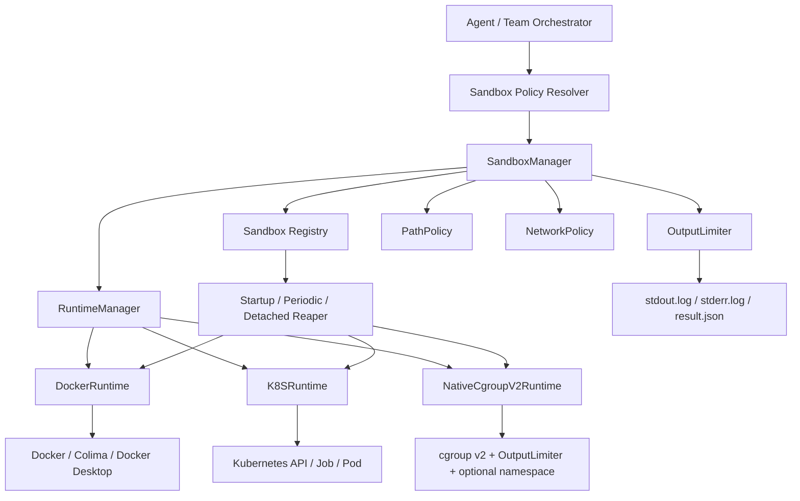

# claude-go 沙盒容器完整设计

日期: 2026-05-06

目标仓库: `/Users/huaquan.liang/Documents/GitHub/ruflo/claude-go`

## Summary

本文给出 `claude-go` 面向研发团队、飞书 Bot、自动测试与工具执行的完整沙盒容器设计。核心目标不是“看起来有容器”，而是让错误代码、无限输出、OOM、fork bomb、网络外传、主进程异常退出都被可靠隔离和可恢复管理。

设计采用三层思路:

1. `Sandbox Control Plane`: `claude-go` 自研的统一控制面，负责策略、调度、生命周期、registry、lease、reaper、metrics、失败分类。
2. `Runtime Adapter`: 运行时适配层，支持 `docker`、`k8s`、`native-cgroupv2` 三类 runtime。
3. `Isolation Primitive`: 具体隔离原语，Docker/K8S 复用容器 runtime 和 cgroups；自研 runtime 以 Linux cgroup v2 为资源隔离核心，叠加 namespace、mount jail、network deny 和 OutputLimiter。

推荐默认:

- macOS 本地: `auto -> docker-warm/colima-managed -> k8s(optional) -> fail-fast`。macOS 没有 cgroup v2，不能用自研 native runtime 防 OOM。
- Ubuntu 本地: `auto -> native-cgroupv2 -> docker -> k8s(optional) -> fail-fast`。
- 飞书研发团队: 单机优先 `native-cgroupv2/docker`；如果用户已配置 K8S，则可用 `k8s Job`。
- 任何自动研发团队验证都不允许降级到裸 `exec.Command`。

## Design Goals

### 必须解决的问题

- 研发团队运行错误测试代码时，不能导致 `claude-go` 主进程 OOM。
- 错误代码无限输出时，不能因为 `bytes.Buffer` / `CombinedOutput()` 撑爆主进程。
- build/test/verification 必须有 memory、CPU、PIDs、timeout、output、disk 限制。
- `claude-go` 主进程重启、panic、kill -9、机器睡眠、Docker/K8S 异常后，沙盒资源必须可发现、可恢复、可清理。
- 飞书 Bot 长时间运行时，不能把高权限 shell 长期暴露在宿主机。
- 支持 macOS 和 Ubuntu Linux 自动适配，优先快启动、低资源、低管理成本。
- 支持 Docker、K8S、以及自研 runtime，并对上层 agent 暴露同一套语义。

### 范围收敛

- 只面向 `claude-go` 自用，不做企业级多租户平台。
- 不规划 microVM、E2B、远端 worker、组织级策略中心。
- 自研资源隔离一步到位使用 Linux cgroup v2，不再把 `systemd+bwrap` 和纯 Go cgroup 分成多个阶段。
- Docker/K8S 是 runtime 适配器，不是自研资源隔离的核心。
- 首要覆盖研发团队 build/test/verification、Shell 和 hook 输出限流，浏览器/ComputerUse 后续按同一接口接入即可。

## Agent 对沙盒的需求

Agent 不是普通 CI job。它会持续规划、生成代码、运行测试、阅读输出、修复问题、多 agent 并发，并通过飞书长时间存在。因此沙盒需要满足这些需求。

| 需求 | 说明 | 沙盒能力 |
| --- | --- | --- |
| 快速验证 | Leaf task 需要频繁跑 `go build` / `go test` | warm runtime、cache volume、低延迟 runner |
| 防主进程 OOM | 错误测试可能无限分配内存或无限输出 | cgroup/container memory limit + OutputLimiter |
| 可反馈 | 测试失败要转成 agent 能理解的摘要 | failure classification + stdout/stderr preview |
| 可复盘 | 后续要看完整日志和资源统计 | log files + result.json + metrics |
| 并发安全 | 多 coder/tester 并发执行，不互相污染 | per-team-run workspace、per-agent worktree、sandbox labels |
| 受控依赖 | Go/Rust/Node 可能需要下载依赖 | dependency-sync profile + allowlist network + cache |
| 长生命周期 | 飞书 Bot 和团队任务可能跑很久 | registry、lease、reaper、TTL、quota |
| 自动适配 | macOS 笔记本、Ubuntu server、K8S 集群都要能跑 | RuntimeManager probe + canary + policy |
| 最小权限 | 自动 agent 不应看到宿主 secrets | temp HOME、env scrub、secret broker |
| 可降级但不裸奔 | Docker/K8S 不可用时要明确阻止危险任务 | fail-fast policy、manual-only process runner |

## High-Level Architecture



核心链路:

```text
agent task -> SandboxPolicy -> CommandSpec -> RuntimeManager.Select()
          -> Runner.Create/Run -> OutputLimiter stream
          -> Runtime inspect/status -> CommandResult
          -> failure classification -> agent feedback / metrics / dashboard
```

## 功能设计

### 1. 执行隔离

支持这些执行目标:

- `build`: `go build`、`go vet`、`cargo build`、`npm run build`。
- `test`: `go test`、`pytest`、`cargo test`、`npm test`。
- `verification`: final local gate、TODO scan、artifact check。
- `shell`: agent 主动调用 Shell 工具。
- `hook`: pre/post hook 命令。
- `dependency-sync`: 依赖下载和缓存预热。

一步到位覆盖:

- `build/test/verification` 100% 走 sandbox。
- `Shell` 在 coding/team profile 走 sandbox，在 chat/research profile 默认禁用。
- `hook` 接入 OutputLimiter；可执行 hook 同样走 sandbox policy。

### 2. 资源限制

所有自动执行必须配置:

| 限制 | Docker | K8S | Native Linux | 说明 |
| --- | --- | --- | --- | --- |
| memory | `--memory`、`--memory-swap` | `resources.limits.memory` | cgroup v2 `memory.max`、`memory.swap.max` | 防 OOM 拖垮主机 |
| CPU | `--cpus` | `resources.limits.cpu` | cgroup v2 `cpu.max` | 防 CPU 打满 |
| PIDs | `--pids-limit` | node/runtime 支持或 Pod PID limit 配置 | cgroup v2 `pids.max` | 防 fork bomb |
| timeout | context + `docker kill` | Job `activeDeadlineSeconds` + client watch | context deadline + `cgroup.kill` | 防无限运行 |
| output | pipe stream limiter | pod log stream limiter | pipe stream limiter | 防主进程日志 OOM |
| disk | tmpfs size / volume quota | `ephemeral-storage` limit / PVC quota | project quota / tmpfs size | 防磁盘打满 |
| network | `--network none` / proxy | NetworkPolicy / proxy | net namespace / proxy | 防外传和内网访问 |

Go 默认资源建议:

| 任务 | Memory | CPU | PIDs | Timeout | Output preview | Log file cap |
| --- | --- | --- | --- | --- | --- | --- |
| Leaf build | 1536Mi | 2 | 256 | 45s | 2MiB | 10MiB |
| Leaf test | 2048Mi | 2 | 256 | 60s | 2MiB | 10MiB |
| Final verification | 4096Mi | 4 | 512 | 120s | 4MiB | 20MiB |
| Dependency sync | 2048Mi | 2 | 256 | 120s | 2MiB | 20MiB |

### 3. 输出限流

这是防止 `claude-go` 主进程 OOM 的第一优先级。

禁止在自动执行路径继续使用:

```go
cmd.CombinedOutput()
var stdout, stderr bytes.Buffer
```

统一改为:

```go
type OutputLimiter struct {
    MaxTotalBytes int64
    MaxFileBytes  int64
    HeadBytes     int64
    TailBytes     int64
    LogDir        string
    OnLimit       func(reason string)
}
```

行为:

- stdout/stderr 通过 pipe 流式复制。
- 完整日志写文件，但文件也有 hard cap。
- 内存只保留 head/tail ring buffer。
- 超过 `MaxTotalBytes` 时 kill sandbox。
- `CommandResult` 返回 `OutputLimited=true` 和日志路径。

### 4. 文件系统隔离

默认挂载:

```text
/workspace       rw, 当前 team run / agent worktree
/tmp             tmpfs, rw, size limited
/home/agent      tmpfs, rw, size limited
/cache           optional, language-specific, quota + TTL
rootfs           read-only
```

文件策略:

- `ReadRoots`: 默认只读 `${workspace}`、必要的 SDK/cache。
- `WriteRoots`: 默认只写 `${workspace}`、`/tmp`、`/home/agent`。
- 禁止直接挂载宿主 `$HOME`。
- 禁止把 provider API key、飞书 token、SSH key 注入 sandbox。
- 所有文件工具也要过 `PathPolicy`，不能只保护 Shell。

### 5. 网络隔离

网络 profile:

| Profile | 默认 | 用途 |
| --- | --- | --- |
| `none` | 默认 | build/test/verification |
| `websearch-only` | 工具代理 | 普通问答和调研 |
| `dependency-allowlist` | 显式域名 | `go mod download`、`npm install` |
| `egress-proxy` | 宿主代理 | 需要审计的外部访问 |
| `open` | 禁止给自动 team 默认用 | 管理员手工任务 |

依赖下载分两段:

```text
dependency-sync: network=dependency-allowlist, command=go mod download
build/test:      network=none, use warmed cache
```

### 6. Secret Broker

原则:

- sandbox 内不直接暴露宿主环境变量。
- 模型 API 调用仍由 `claude-go` 主进程完成，不让测试代码拿到 provider key。
- GitHub/包管理 token 通过短期、按域、按命令授权的 broker 发放。
- 所有 secret 注入都写审计日志，不写 prompt debug 原文。

### 7. Artifact 管理

每个 sandbox 输出:

```text
.claude-go/sandboxes/<sandboxID>/
  spec.json
  result.json
  stdout.log
  stderr.log
  resource.json
  diff.patch
```

`result.json` 示例:

```json
{
  "sandboxID": "sbx_...",
  "runner": "docker",
  "purpose": "test",
  "exitCode": 137,
  "failureKind": "sandbox_oom",
  "oomKilled": true,
  "outputLimited": false,
  "durationMS": 18342,
  "stdoutPreview": "...",
  "stderrPreview": "...",
  "logDir": ".claude-go/sandboxes/sbx_..."
}
```

## Runtime Abstraction

### Go 接口

```go
package sandbox

type Runner interface {
    Name() string
    Probe(ctx context.Context) ProbeResult
    Prepare(ctx context.Context, spec CommandSpec) (*PreparedSandbox, error)
    Start(ctx context.Context, prepared *PreparedSandbox) error
    Wait(ctx context.Context, prepared *PreparedSandbox) (*RuntimeStatus, error)
    Kill(ctx context.Context, sandboxID string) error
    Cleanup(ctx context.Context, sandboxID string, mode CleanupMode) error
    Inspect(ctx context.Context, sandboxID string) (*RuntimeStatus, error)
}

type CommandSpec struct {
    SandboxID     string
    Purpose       string
    Args          []string
    Cwd           string
    Workdir       string
    Image         string
    Env           map[string]string
    ReadRoots     []Mount
    WriteRoots    []Mount
    CacheMounts   []Mount
    Network       NetworkPolicy
    Limits        ResourceLimits
    OutputLimits  OutputLimits
    RuntimeHints  RuntimeHints
    Labels        map[string]string
}

type ResourceLimits struct {
    TimeoutSec         int
    MemoryBytes        int64
    MemorySwapBytes    int64
    CPUQuotaMilliCores int
    PidsLimit          int
    EphemeralBytes     int64
}

type CommandResult struct {
    SandboxID      string
    Runner         string
    ExitCode       int
    FailureKind    string
    TimedOut       bool
    OOMKilled      bool
    OutputLimited  bool
    PidsLimited    bool
    NetworkDenied  bool
    DurationMS     int64
    PeakMemoryByte int64
    StdoutPreview  string
    StderrPreview  string
    LogDir         string
}
```

### FailureKind

```text
ok
sandbox_oom
sandbox_timeout
sandbox_output_limit
sandbox_pids_limit
sandbox_network_denied
sandbox_disk_limit
sandbox_setup_failed
sandbox_orphan_reaped
interrupted_by_restart
runtime_unavailable
policy_denied
```

Agent feedback 依赖 `FailureKind`，不要把 OOM、timeout、output limit 都混成普通测试失败。

## Runtime 1: DockerRuntime

### 适用场景

- macOS 本地开发，Docker Desktop/Colima 已启动。
- Ubuntu 单机或 server，有 Docker daemon。
- 希望跨平台行为一致、实现最快。

### 执行流程

不要用一条 `docker run` 黑盒执行。建议拆成:

```text
registry: reserved
docker create
registry: creating -> running
docker attach stdout/stderr -> OutputLimiter
docker start
docker wait or context deadline
docker inspect
registry: exited
docker rm
registry: cleaned
```

### Docker create 基线

```bash
docker create \
  --name claude-go-${SANDBOX_ID} \
  --label claude-go.sandbox=true \
  --label claude-go.sandbox.id=${SANDBOX_ID} \
  --label claude-go.team_run_id=${TEAM_RUN_ID} \
  --label claude-go.task_id=${TASK_ID} \
  --network none \
  --cpus 2 \
  --memory 2g \
  --memory-swap 2g \
  --pids-limit 256 \
  --cap-drop ALL \
  --security-opt no-new-privileges \
  --read-only \
  --tmpfs /tmp:rw,nosuid,nodev,exec,size=512m \
  --tmpfs /home/agent:rw,nosuid,size=512m \
  -e HOME=/home/agent \
  -e GOCACHE=/tmp/go-cache \
  -v "${WORKTREE}:/workspace:rw" \
  -w /workspace \
  golang:1.24 \
  go test -count=1 -timeout=30s -parallel=4 ./...
```

### Docker 管理

Image 管理:

- 默认可先使用官方 `golang:1.24`，保证无需维护镜像也能跑。
- 同时提供 `ghcr.io/ruflo/claude-go-sandbox-go:1.24`，预置 `git`、`ca-certificates`、`ripgrep`、`make`，用于减少冷启动和依赖安装成本。
- 按语言拆镜像: `go`、`node`、`python`、`rust`、`cpp`。
- `pullPolicy`: `if-not-present`，飞书 Bot 启动不主动拉大镜像，首次任务 lazy pull。

Cache 管理:

- `claude-go-gomod-${projectHash}` 保存 `GOMODCACHE`。
- cache volume 加 label 和 TTL。
- cache 不存 secrets。
- cache quota 超过阈值时 LRU 清理。

Daemon 管理:

- macOS daemon 未启动时，默认 fail-fast。
- 如果 `sandbox.autoStart=true`，尝试启动 Colima profile 或 Docker Desktop。
- `keepWarmSec` 控制飞书 Bot 任务结束后是否保持 warm。
- `doctor sandbox` 输出 Docker daemon、context、cgroup、镜像、canary 状态。

### Docker canary

启动时或定期验证:

- memory canary: 64Mi 容器内分配 256Mi，应 OOMKilled。
- pids canary: 限制 32 PIDs，fork/子进程测试应失败。
- output canary: 输出超过 2MiB，应被 OutputLimiter kill。
- network canary: `network=none` 下访问外网应失败。

只有 canary 通过，DockerRuntime 才允许用于 team auto verification。

## Runtime 2: K8SRuntime

### 适用场景

- 飞书 Bot 长时间运行。
- 多人共享研发团队。
- 需要把执行从开发者机器转移到受控集群。
- 需要配额、审计、统一清理、弹性扩容。
- 如果用户已有 K8S 集群，可按需接 gVisor/Kata RuntimeClass；这不是本地自研 runtime 的必需项。

### K8S 资源模型

每个 sandbox 对应一个 Kubernetes `Job`，每个 Job 创建一个 Pod。

推荐对象:

```text
Namespace:       claude-go-sandbox
ServiceAccount: claude-go-sandbox-runner
Role/RoleBinding: 最小权限，管理本 namespace 内 Job/Pod/log
Job:            每个 sandbox 一个
Pod:            执行 build/test/verification
ConfigMap:      非敏感 spec/env
Secret:         仅短期、必要时使用，默认不用
PVC/emptyDir:   workspace/cache/log，按策略选择
NetworkPolicy:  默认 deny egress，dependency-sync 才 allow
ResourceQuota:  namespace 总资源上限
LimitRange:     默认单 Pod 限制
```

### K8S Job 规范

关键字段:

- `backoffLimit: 0` 或 `1`，避免错误代码重复 OOM。
- `activeDeadlineSeconds` 对应 `CommandSpec.Limits.TimeoutSec`。
- `ttlSecondsAfterFinished` 控制 Job 完成后的 K8S GC。
- `restartPolicy: Never`。
- `resources.requests/limits` 配置 CPU、memory、ephemeral-storage。
- `securityContext` 使用 restricted 风格。
- `runtimeClassName` 可选 `runsc`/`kata`。

示例:

```yaml
apiVersion: batch/v1
kind: Job
metadata:
  name: claude-go-sbx-sbx123
  namespace: claude-go-sandbox
  labels:
    claude-go.sandbox: "true"
    claude-go.sandbox.id: "sbx123"
    claude-go.team_run_id: "team456"
    claude-go.task_id: "task789"
spec:
  backoffLimit: 0
  activeDeadlineSeconds: 60
  ttlSecondsAfterFinished: 3600
  template:
    metadata:
      labels:
        claude-go.sandbox: "true"
        claude-go.sandbox.id: "sbx123"
    spec:
      restartPolicy: Never
      serviceAccountName: claude-go-sandbox-runner
      runtimeClassName: runsc
      automountServiceAccountToken: false
      securityContext:
        runAsNonRoot: true
        seccompProfile:
          type: RuntimeDefault
      containers:
        - name: runner
          image: ghcr.io/ruflo/claude-go-sandbox-go:1.24
          command: ["go", "test", "-count=1", "-timeout=30s", "-parallel=4", "./..."]
          workingDir: /workspace
          resources:
            requests:
              cpu: "500m"
              memory: "512Mi"
              ephemeral-storage: "1Gi"
            limits:
              cpu: "2"
              memory: "2Gi"
              ephemeral-storage: "4Gi"
          securityContext:
            allowPrivilegeEscalation: false
            readOnlyRootFilesystem: true
            capabilities:
              drop: ["ALL"]
          env:
            - name: HOME
              value: /home/agent
            - name: GOCACHE
              value: /tmp/go-cache
          volumeMounts:
            - name: workspace
              mountPath: /workspace
            - name: tmp
              mountPath: /tmp
            - name: home
              mountPath: /home/agent
      volumes:
        - name: workspace
          emptyDir:
            sizeLimit: 2Gi
        - name: tmp
          emptyDir:
            sizeLimit: 512Mi
        - name: home
          emptyDir:
            sizeLimit: 512Mi
```

### Workspace 同步策略

K8SRuntime 不能直接挂载开发者本机目录，因此需要 workspace transport。

可选方案:

| 方案 | 优点 | 缺点 | 推荐 |
| --- | --- | --- | --- |
| Git clone + patch apply | 简单、可审计 | 未提交代码/本地文件处理麻烦 | 适合远端仓库 |
| Tar upload/download | 支持未提交工作区 | 大文件需要过滤和限额 | 默认推荐 |
| Object storage artifact | 可扩展、适合大集群 | 需要存储服务 | K8S 可选 |
| PVC per team run | 性能好，支持多 step | 清理和配额复杂 | K8S 可选 |
| NFS/shared volume | 简单 | 安全边界差，污染风险 | 不推荐默认 |

默认推荐:

```text
claude-go 打包 workspace diff/tar -> 上传到 K8S init container 或对象存储
init container 解包到 emptyDir /workspace
runner container 执行命令
完成后打包 /workspace diff/artifacts -> claude-go 下载并应用
```

### 日志与输出限流

K8S pod logs 也可能无限输出。不能直接把 `kubectl logs -f` 全部读入内存。

实现:

- 使用 Kubernetes Go client stream pod logs。
- stream 接 `OutputLimiter`。
- 超过 output limit 时调用 `delete Job` 或 `delete Pod`。
- `result.json` 保留 `podName`、`containerID`、`reason`、`message`。

### K8S 安全策略

Namespace:

- `pod-security.kubernetes.io/enforce=restricted`
- `pod-security.kubernetes.io/audit=restricted`
- `pod-security.kubernetes.io/warn=restricted`

Pod/Container:

- `runAsNonRoot: true`
- `allowPrivilegeEscalation: false`
- `readOnlyRootFilesystem: true`
- `capabilities.drop: ["ALL"]`
- `seccompProfile.type: RuntimeDefault`
- `automountServiceAccountToken: false`
- 不使用 privileged、hostNetwork、hostPID、hostPath。

Network:

- 默认 deny egress NetworkPolicy。
- dependency-sync namespace/profile 才 allow DNS + allowlist domains/proxy。
- 如果 CNI 不支持 FQDN policy，走 egress proxy。

RuntimeClass:

- 默认 `runc` 适合可信单租户。
- `runsc` / gVisor 适合不可信代码。
- `kata` 隔离更强，但不是 `claude-go` 自用场景的默认选择。

### K8S 生命周期管理

K8S 有 Job controller 和 TTL controller，但 `claude-go` 仍然要有 registry/reaper。

原因:

- Job TTL 只在 Job 完成后清理。
- `claude-go` 需要区分 `sandbox_oom`、`sandbox_timeout`、`interrupted_by_restart`。
- Workspace/PVC/object storage/cache 不一定随 Job 自动清理。
- 日志需要保留一定时间给 dashboard。

Reconcile 逻辑:

```text
startup:
  list Jobs with label claude-go.sandbox=true
  list Pods with label claude-go.sandbox=true
  list PVC/ConfigMap/Secret with label claude-go.sandbox=true
  compare registry
  stale running Job -> delete or mark interrupted
  completed Job -> fetch status/log summary -> registry exited
  orphan PVC/cache -> TTL cleanup
```

K8SRuntime 状态映射:

| K8S 状态 | Sandbox 状态 | FailureKind |
| --- | --- | --- |
| Job Complete | exited | ok |
| Job Failed reason DeadlineExceeded | exited | sandbox_timeout |
| Pod container terminated reason OOMKilled | exited | sandbox_oom |
| Pod Evicted ephemeral storage | exited | sandbox_disk_limit |
| ImagePullBackOff | setup_failed | sandbox_setup_failed |
| Forbidden by admission | setup_failed | policy_denied |
| Reaper deleted stale Job | cleaned | interrupted_by_restart |

## Runtime 3: 自研 NativeCgroupV2Runtime

自研 runtime 的资源隔离统一使用 Linux cgroup v2，一步到位覆盖 memory、swap、CPU、PIDs、timeout、output 和进程树清理。它只为 `claude-go` 服务，不做通用容器平台，不做企业多租户，不做 microVM。

参考 Anthropic `sandbox-runtime` / 微信文章《不用 Docker 也能隔离 AI Agent》的 OS 原语路线时，需要区分两类能力:

- 文件/网络策略隔离: macOS Seatbelt、Linux bubblewrap/seccomp/proxy 很轻，适合 MCP server、轻量 Shell、文件和网络权限控制。
- 资源隔离: 研发团队测试 OOM 的核心问题必须靠 cgroup v2 这类进程组资源控制解决。macOS 没有原生 cgroup v2，因此 macOS 上要通过 Docker/Colima 的 Linux VM 获得同等级资源隔离。

### 设计定位

| 平台 | 自研资源隔离策略 | 说明 |
| --- | --- | --- |
| Ubuntu Linux | `NativeCgroupV2Runtime` 首选 | 直接使用 cgroup v2 控制 memory、pids、cpu、swap，并叠加 OutputLimiter |
| macOS | 不支持 native cgroup v2 | 使用 Docker/Colima；OSPrimitive 只用于轻量文件/网络策略，不能跑自动测试 |
| K8S | 可选 runtime | 适合已有集群时使用；不是本方案重点 |

### 能力边界

一步到位实现这些能力:

- `memory.max`: 限制 RSS/page cache 等 cgroup 内存。
- `memory.swap.max`: 限制 swap，避免宿主机被拖慢到假死。
- `pids.max`: 限制进程/线程数量，防 fork bomb 和 goroutine 失控造成线程爆炸。
- `cpu.max`: 限制 CPU quota。
- `io.max` 或 `io.weight`: 可选限制磁盘 IO，防止测试刷盘。
- `cgroup.kill`: 终止整个 sandbox 进程树。
- `memory.events`: 识别 `oom` / `oom_kill`。
- `pids.events`: 识别 PIDs 上限命中。
- `OutputLimiter`: 限制 stdout/stderr，避免主进程 OOM。
- `PathPolicy`: 限制文件工具和 working directory。
- `NetworkPolicy`: build/test 默认 no network；dependency-sync 才 allowlist。

### 权限与安装模式

cgroup v2 写入通常需要 root 或 systemd delegation。为了只服务 `claude-go`，推荐提供一个一次性本机 setup，而不是做复杂企业安装器。

模式:

| 模式 | 适用 | 说明 |
| --- | --- | --- |
| `direct` | root 运行或已授权 cgroup 子树 | `claude-go` 直接创建 `/sys/fs/cgroup/claude-go/<sandboxID>` |
| `delegated` | 普通 Ubuntu 用户 | 一次性 setup 创建并 chown `/sys/fs/cgroup/claude-go-$UID`，开启 subtree controllers |
| `systemd-delegated` | 不允许直接 chown cgroup 的系统 | 使用 systemd user scope 获得 delegated cgroup path，但限制仍读取/验证 cgroup v2 文件 |
| `unsupported` | macOS 或 cgroup v1 | 不允许 team auto verification 使用 native runtime |

建议命令:

```bash
claude-go sandbox setup-cgroupv2
claude-go sandbox doctor
```

`setup-cgroupv2` 在 Ubuntu 上做一次性配置:

```text
1. 检查 /sys/fs/cgroup/cgroup.controllers 包含 memory pids cpu io。
2. 创建 /sys/fs/cgroup/claude-go-<uid>。
3. chown 给当前用户。
4. 在父 cgroup 写 cgroup.subtree_control: +memory +pids +cpu +io。
5. 写入 ~/.claude-go/config/config.json 的 nativeCgroupV2.basePath。
6. 运行 memory/pids/output canary。
```

如果没有权限执行 setup，`doctor sandbox` 给出明确提示，不自动回退裸跑。

### 进程启动模型

为了避免子进程在加入 cgroup 前就开始分配内存，采用 re-exec child handshake。

```text
parent:
  1. registry 写 reserved。
  2. 创建 cgroup: <base>/sbx_<id>。
  3. 写 memory.max / memory.swap.max / pids.max / cpu.max。
  4. 创建 pipe。
  5. 启动 `claude-go sandbox-child --spec <spec>`，child 阻塞等待 pipe。
  6. parent 将 child pid 写入 cgroup.procs。
  7. parent 启动 OutputLimiter。
  8. parent 写 pipe 放行 child exec 用户命令。
  9. parent wait + 读取 cgroup events。

child:
  1. 设置新 process group / session。
  2. 可选 unshare namespace。
  3. 设置 env / cwd / temp HOME。
  4. 等待 parent 放行。
  5. exec command。
```

关键点:

- 不直接用 `exec.Command(...).CombinedOutput()`。
- 不允许 child 在进入 cgroup 前执行用户命令。
- 所有 descendant 都继承同一 cgroup。
- timeout、output limit、主进程重启都通过 `cgroup.kill` 清理整棵进程树。

### cgroup v2 文件写入

示例:

```text
/sys/fs/cgroup/claude-go-501/sbx_abc123/
  cgroup.procs
  cgroup.kill
  memory.max        = 2147483648
  memory.swap.max   = 0
  pids.max          = 256
  cpu.max           = 200000 100000
  memory.events
  pids.events
```

CPU quota:

```text
2 CPUs -> cpu.max = "200000 100000"
0.5 CPU -> cpu.max = "50000 100000"
unlimited -> cpu.max = "max 100000"
```

OOM 识别:

```text
memory.events:
  low 0
  high 0
  max 3
  oom 1
  oom_kill 1
```

PIDs 识别:

```text
pids.events:
  max 1
```

### Namespace 与文件/网络策略

资源隔离必须是 cgroup v2；文件和网络隔离可以采用两种实现方式。

首选简单实现:

- 文件工具层强制 `PathPolicy`，禁止读写 workspace 外敏感路径。
- 执行命令使用 temp HOME、temp TMPDIR、受控 cwd。
- test/build 默认清空敏感 env。
- network 默认通过 profile 禁止，不允许 Shell 任意 curl。

增强实现:

- Linux 下 child 使用 `CLONE_NEWNET` 实现 no network。
- 使用 mount namespace + bind mount workspace 到 `/workspace`。
- 使用 tmpfs `/tmp` 和 `/home/agent`。
- 可复用 bubblewrap 做 mount/net namespace，但资源限制仍由 NativeCgroupV2Runtime 自己写 cgroup v2。

说明:

- bubblewrap 可以作为 namespace helper，不作为资源隔离核心。
- seccomp/proxy 可以作为网络和 syscall 增强，不影响 cgroup v2 的主线。
- macOS Seatbelt 只放在 OSPrimitive policy runtime 中，不参与自动测试资源隔离。

### OutputLimiter

NativeCgroupV2Runtime 必须内建 OutputLimiter。

行为:

- stdout/stderr pipe 分别流式写入日志文件。
- 内存只保留 head/tail preview。
- 超过 `MaxTotalBytes` 时:
  - 写 registry failureKind=`sandbox_output_limit`。
  - 调用 `cgroup.kill`。
  - 返回 preview 和 log path。

### Kill 与清理

终止顺序:

```text
1. 写 cgroup.kill = 1。
2. 等待 2s。
3. 如果 cgroup.procs 仍非空，逐 PID SIGKILL。
4. 读取 memory.events / pids.events。
5. 删除 cgroup 目录。
6. registry 标记 exited/cleaned。
```

主进程异常退出后:

- StartupReaper 扫描 registry 中 running/stale sandbox。
- 扫描 `<base>/sbx_*` cgroup。
- 对 stale sandbox 写 `cgroup.kill`。
- 读取 events 后标记 `interrupted_by_restart` 或 `sandbox_orphan_reaped`。

### 失败分类

| 条件 | FailureKind |
| --- | --- |
| `memory.events oom_kill > 0` | `sandbox_oom` |
| `pids.events max > 0` | `sandbox_pids_limit` |
| context deadline | `sandbox_timeout` |
| OutputLimiter 超限 | `sandbox_output_limit` |
| cgroup setup 无权限 | `sandbox_setup_failed` |
| cgroup v2 不可用 | `runtime_unavailable` |
| Reaper 清理残留 | `sandbox_orphan_reaped` |

### NativeCgroupV2Runtime 配置

```json
{
  "sandbox": {
    "nativeCgroupV2": {
      "enabled": true,
      "basePath": "/sys/fs/cgroup/claude-go-501",
      "requireControllers": ["memory", "pids", "cpu"],
      "optionalControllers": ["io"],
      "useSystemdDelegation": true,
      "killGraceMs": 2000,
      "setupRequired": true
    }
  }
}
```

### Doctor 输出

```text
NativeCgroupV2:
  OS: linux
  cgroup version: v2
  base path: /sys/fs/cgroup/claude-go-501
  controllers: memory=ok pids=ok cpu=ok io=optional
  writable: yes
  cgroup.kill: yes
  memory canary: pass
  pids canary: pass
  output canary: pass
  selected for team verification: yes
```

macOS:

```text
NativeCgroupV2:
  OS: darwin
  available: no
  reason: cgroup v2 is Linux-only
  selected fallback: docker/colima if available
```

## RuntimeManager 自动适配

Runtime 自适应不是简单按固定顺序选 `k8s -> docker -> native`。不同 runtime 的代价差异很大: OS 原语几乎零冷启动但缺少资源硬隔离，NativeCgroupV2 在 Ubuntu 上最轻且能防 OOM，Docker warm 后很稳但 daemon/VM 有成本，K8S 管理强但 workspace 同步成本高。正确设计是“先硬性能力过滤，再按场景成本打分选择最轻 runtime”。

### Runtime 能力模型

每个 runtime probe 后要上报能力，而不是只报 available。

```go
type RuntimeCapability struct {
    Name                    string
    Platform                []string
    Available               bool
    Warm                    bool
    StartupMsP50            int
    StartupMsP95            int
    IdleMemoryMB            int
    PerRunMemoryOverheadMB  int
    SupportsMemoryLimit     bool
    SupportsPidsLimit       bool
    SupportsCPUQuota        bool
    SupportsDiskLimit       bool
    SupportsNetworkDeny     bool
    SupportsDomainAllowlist bool
    SupportsFilesystemPolicy bool
    SupportsSeccomp         bool
    SupportsRuntimeClass    bool
    SupportsWorkspaceMount  bool
    SupportsWorkspaceUpload bool
    IsolationLevel          int // 0 none, 1 policy, 2 os-primitive, 3 native-cgroupv2, 4 container, 5 k8s-container
    OpsCost                 int // 1 low, 5 high
    CanaryPassed            bool
    Reason                  string
}
```

Capability 通过 probe/canary 动态刷新:

- `docker info`、镜像是否存在、memory/pids/output/network canary。
- K8S API、namespace/RBAC/Quota/NetworkPolicy/RuntimeClass、Job canary。
- Ubuntu cgroup v2 controllers、basePath writable、cgroup.kill、memory/pids/output canary。
- macOS sandbox-exec 可用性、Seatbelt profile canary、proxy canary。

### 任务需求模型

不同 agent 场景对 runtime 的硬要求不同。

```go
type RuntimeRequirement struct {
    Purpose                 string // chat | mcp | shell | dependency-sync | build | test | verification | browser
    EntryPoint              string // cli | feishu | team | dashboard | ci
    TrustLevel              string // trusted | repo-untrusted | internet-untrusted
    NeedMemoryLimit         bool
    NeedPidsLimit           bool
    NeedOutputLimit         bool
    NeedNetworkDeny         bool
    NeedDomainAllowlist     bool
    NeedFilesystemPolicy    bool
    NeedReproducibleImage   bool
    NeedWorkspaceUpload     bool
    NeedLowLatency          bool
    MaxColdStartMs          int
    MaxIdleMemoryMB         int
    MinIsolationLevel       int
}
```

场景映射:

| 场景 | 硬要求 | 最轻可用 runtime |
| --- | --- | --- |
| 飞书普通问答 | 不执行代码 | none |
| MCP server 读写约束 | 文件/网络 policy | OSPrimitiveRuntime |
| 手工轻量 Shell | 文件/网络 policy + output limit | OSPrimitiveRuntime |
| 依赖下载 | domain allowlist + output + timeout | OSPrimitiveRuntime 或 Docker/K8S dependency-sync |
| Go leaf build | memory/pids/output/timeout | Ubuntu NativeCgroupV2 或 Docker |
| Go leaf test | memory/pids/output/timeout | Ubuntu NativeCgroupV2 或 Docker；macOS Docker |
| Final verification | memory/pids/output/disk/timeout | Docker 或 K8S |
| 飞书长期研发团队 | lifecycle/reaper/quota/audit | Ubuntu NativeCgroupV2 或 Docker；已有集群时 K8S |
| 不可信仓库/互联网代码 | 强隔离 + network deny | Docker 或 K8S RuntimeClass(gVisor/Kata) |

### 成本模型

通过硬性能力过滤后，再用成本函数选最轻 runtime。

```text
score = capabilityFit
      - coldStartPenalty
      - idleMemoryPenalty
      - perRunOverheadPenalty
      - workspaceSyncPenalty
      - opsCostPenalty
      - riskPenalty
      + warmCacheBonus
      + localityBonus
```

建议权重:

| 因子 | 权重 | 说明 |
| --- | --- | --- |
| `capabilityFit` | +1000 | 硬要求满足后才进入打分 |
| `coldStartPenalty` | 0-200 | CLI/高频 leaf 更敏感 |
| `idleMemoryPenalty` | 0-150 | macOS 笔记本更敏感 |
| `perRunOverheadPenalty` | 0-100 | 大量 leaf 并发时敏感 |
| `workspaceSyncPenalty` | 0-200 | K8S 远端 tar 上传会变慢 |
| `opsCostPenalty` | 0-150 | K8S/Docker daemon 运维成本 |
| `riskPenalty` | 0-300 | 低隔离 runtime 跑高风险任务扣分 |
| `warmCacheBonus` | 0-100 | Docker warm、K8S image cached、dependency cache hit |
| `localityBonus` | 0-80 | 本地 worktree 直接挂载，无 tar sync |

不同入口的权重不同:

| EntryPoint | 优先优化 |
| --- | --- |
| CLI 单次 | 冷启动、低管理成本 |
| 飞书 Bot | 稳定性、生命周期、可恢复 |
| `/go development` | OOM 防护、输出限流、并发资源预算 |
| CI/server | 可复现、审计、资源配额 |

### 自适应选择算法

```text
SelectRuntime(task):
  req = BuildRequirement(task)
  caps = ProbeAllRuntimes(cacheTTL=60s)

  candidates = []
  for cap in caps:
    if !cap.Available or !cap.CanaryPassed:
      continue
    if req.NeedMemoryLimit and !cap.SupportsMemoryLimit:
      continue
    if req.NeedPidsLimit and !cap.SupportsPidsLimit:
      continue
    if req.NeedNetworkDeny and !cap.SupportsNetworkDeny:
      continue
    if req.NeedFilesystemPolicy and !cap.SupportsFilesystemPolicy:
      continue
    if cap.IsolationLevel < req.MinIsolationLevel:
      continue
    candidates.add(cap)

  if candidates.empty:
    if task.IsManual and config.allowProcessUnsafe:
      return process-unsafe with warning
    return fail-fast(runtime_unavailable)

  for candidate in candidates:
    candidate.Score = CostScore(candidate, req, currentHostLoad, cacheState)

  return maxScore(candidates)
```

选择器必须解释选择结果:

```json
{
  "selected": "native-cgroupv2",
  "reason": "meets memory/pids/output limits with lower startup cost than docker",
  "rejected": [
    {"runtime": "os-primitive", "reason": "missing memory limit"},
    {"runtime": "k8s", "reason": "workspace sync cost too high for local leaf test"}
  ],
  "score": 842
}
```

### 代价矩阵

| Runtime | 冷启动 | Warm 启动 | 空闲资源 | 单次开销 | 隔离强度 | 管理成本 | 最适合 |
| --- | --- | --- | --- | --- | --- | --- | --- |
| none/tool-profile | 0 | 0 | 0 | 0 | 低 | 低 | chat/research |
| OSPrimitive macOS Seatbelt | 极低 | 极低 | 极低 | 极低 | 中 | 中 | MCP/轻量 Shell |
| OSPrimitive Linux bwrap | 低 | 极低 | 极低 | 低 | 中 | 中 | 轻量 Shell/依赖下载 |
| NativeCgroupV2 | 低 | 极低 | 极低 | 低 | 中高 | 低 | Ubuntu 快速 build/test |
| Docker warm | 中 | 低 | 中 | 中 | 高 | 低 | macOS/Ubuntu 通用 build/test |
| Docker cold/Colima start | 高 | 低 | 中高 | 中 | 高 | 中 | macOS 长任务 |
| K8S Job | 中高 | 中 | 集群承担 | 中高 | 高 | 中高 | 已配置集群的飞书任务 |
| K8S gVisor/Kata | 高 | 中高 | 集群承担 | 高 | 很高 | 高 | 不可信代码 |

### 场景示例

macOS 本地 `/go development`:

```text
task=go test, needMemoryLimit=true
OSPrimitive rejected: no reliable memory cgroup on macOS
Docker warm selected if daemon running
Docker cold selected only if autoStart=true and task is long-running
otherwise fail-fast with "start Docker/Colima"
```

Ubuntu 本地高频 leaf test:

```text
task=go test, trusted repo, needMemoryLimit=true
native-cgroupv2 selected if cgroup v2 canary passed
docker selected if native missing or reproducible image required
k8s rejected due workspace sync/ops cost
```

飞书 Bot 长时间研发:

```text
entrypoint=feishu, team task, need lifecycle/quota/audit
native-cgroupv2 selected on Ubuntu if canary passed
docker selected on macOS or when reproducible image required
k8s selected only if user configured cluster and namespace canary passed
```

MCP server:

```text
purpose=mcp, need fs/network policy, no memory-intensive tests
OSPrimitive selected
docker/k8s rejected due unnecessary startup and management cost
```

### 选择输入

```go
type RuntimeSelectionInput struct {
    OS              string
    Arch            string
    Purpose         string
    TrustLevel      string // trusted | untrusted
    EntryPoint      string // cli | feishu | team | dashboard | ci
    RequireNetwork  bool
    RequireGPU      bool
    MaxStartupMS    int
    ConfigPreferred []string
}
```

### 选择优先级

macOS:

```text
1. docker-warm, if docker info <= 2s and canary passed
2. colima-managed, if autoStart=true and colima available
3. docker-desktop-managed, if autoStart=true
4. k8s-remote, if configured
5. fail-fast for team auto verification
```

Ubuntu:

```text
1. native-cgroupv2, if cgroup v2 basePath writable and canary passed
2. docker, if daemon running and canary passed
3. k8s, if user configured cluster and namespace canary passed
4. fail-fast for team auto verification
```

CI/server:

```text
1. native-cgroupv2
2. docker
3. k8s if configured
```

### ProbeResult

```json
{
  "runner": "docker",
  "available": true,
  "warm": true,
  "startupMs": 184,
  "memoryLimitVerified": true,
  "pidsLimitVerified": true,
  "outputLimitVerified": true,
  "networkDenyVerified": true,
  "reason": ""
}
```

### 降级规则

- 可以从 K8S 降级到 Docker，只要资源限制和输出限流通过。
- 可以从 Docker 降级到 NativeCgroupV2，只要 cgroup v2 和输出限流 canary 通过。
- 不能从任何 sandbox 降级到裸 `exec.Command` 跑 team auto verification。
- CLI 手工模式可显式 `--sandbox=process-unsafe`，但必须打印高危警告并记录 metrics。

## 生命周期管理

### Sandbox Registry

位置:

```text
<stateDir>/.claude-go/sandboxes/registry.sqlite
<stateDir>/.claude-go/sandboxes/<sandboxID>/
```

记录:

```go
type SandboxRecord struct {
    ID              string
    Runner          string
    State           string
    TeamRunID        string
    AgentID          string
    TaskID           string
    Purpose          string
    Worktree         string
    LogDir           string
    DockerID         string
    KubernetesJob    string
    KubernetesPod    string
    CgroupPath       string
    SystemdUnit      string
    RemoteID         string
    OwnerPID         int
    CreatedAt        time.Time
    StartedAt        time.Time
    LastHeartbeatAt  time.Time
    LeaseExpiresAt   time.Time
    DeadlineAt       time.Time
    CleanupAfter     time.Time
    StateUpdatedAt   time.Time
    FailureKind      string
}
```

状态机:

```text
reserved -> preparing -> running -> stopping -> exited -> cleaned
                       -> setup_failed
running -> stale -> orphaned -> cleaned
```

规则:

- 先写 `reserved`，再创建底层 runtime 资源。
- 任何底层资源都必须带 label，可以反向发现。
- 状态变更使用 SQLite transaction 或文件锁。
- `Run()` 结束后显式写 `exited/cleaned`，不依赖 defer。

### Labels

通用 label:

```text
claude-go.sandbox=true
claude-go.sandbox.id=<sandboxID>
claude-go.team_run_id=<teamRunID>
claude-go.agent_id=<agentID>
claude-go.task_id=<taskID>
claude-go.purpose=<purpose>
claude-go.deadline_at=<RFC3339>
```

Docker、K8S、systemd/cgroup 都要尽量带这些 label 或命名。

### Lease 和 Heartbeat

默认:

```json
{
  "heartbeatSec": 5,
  "leaseTTLSeconds": 20,
  "startupReconcile": true,
  "orphanPolicy": "kill-transient",
  "logRetentionHours": 72,
  "cacheRetentionHours": 168,
  "maxCleanupConcurrency": 4
}
```

语义:

- `lease` 表示当前 `claude-go` 主进程还负责 sandbox。
- `deadline` 表示命令绝对不能超过的时间。
- 主进程重启后，旧 lease 不再续期，新进程启动时 reconcile。
- transient sandbox 重启后默认 kill，并标记 `interrupted_by_restart`。

### Reaper

三类 reaper:

| Reaper | 触发 | 职责 |
| --- | --- | --- |
| StartupReaper | `claude-go` 启动 | reconcile registry 与实际 runtime 资源 |
| PeriodicReaper | 每 30-60 秒 | 清理过期 lease、超时 sandbox、过期日志/cache |
| DetachedReaper | 每个 sandbox 可选启动 | 主进程 kill -9 后仍能按 deadline kill 底层资源 |

Reconcile:

```text
1. 获取 registry lock
2. list docker containers by label
3. list k8s jobs/pods/pvc/configmap by label
4. list native cgroups/systemd scopes by name
5. 对比 registry 和实际资源
6. stale running transient -> kill/cleanup
7. unknown labeled resource -> mark discovered_orphan -> cleanup
8. completed resource -> collect status/log summary -> registry exited
9. cache/log/artifact -> TTL/quota cleanup
```

### 资源保留策略

| 资源 | 默认保留 | 原因 |
| --- | --- | --- |
| running build/test sandbox | 重启后 kill | 可重跑，且 stdout 管道已丢 |
| exited container/job | 清理 runtime 对象 | result/log 已落盘 |
| stdout/stderr log | 72h | 复盘 |
| result/spec/resource json | 7-30 天 | dashboard 和质量分析 |
| dependency cache | 7 天或 quota | 加速 |
| worktree/artifacts | team run 结束前保留 | 交付物 |
| K8S PVC/object storage | TTL/quota | 防云成本膨胀 |

## Runtime 管理

### Image 管理

镜像分层:

```text
base:   debian/alpine + ca-certificates + git + shell
go:     base + go + rg + make
node:   base + node + pnpm/npm
python: base + python + pytest
rust:   base + rust + cargo
cpp:    base + cmake + gcc/clang + make
```

策略:

- 本地 Docker 使用 `if-not-present`。
- K8S 可使用私有 registry 和 imagePullPolicy。
- 飞书 Bot 启动不拉镜像，首次 team 任务 lazy pull。
- `doctor sandbox` 可预热镜像。

### Cache 管理

缓存类型:

- `gomod`: `/go/pkg/mod`
- `gocache`: Go build cache
- `cargo`: cargo registry/target，可按项目隔离
- `npm/pnpm`: package cache
- `pip`: wheel/cache

规则:

- cache 按项目 hash 和语言隔离。
- cache 不写 secrets。
- cache volume/PVC 有 TTL 和 quota。
- dependency-sync 阶段可写 cache，test 阶段默认只读 cache 或受控读写。

### 并发管理

全局限额:

```json
{
  "sandbox": {
    "maxConcurrent": 4,
    "maxConcurrentPerTeamRun": 2,
    "maxConcurrentFinalVerification": 1,
    "maxTotalMemoryMB": 8192
  }
}
```

调度规则:

- 同一 worktree 的写任务不并发。
- 同一 final verification 串行。
- CPU/memory 按预算排队，不超卖本机。
- K8S runtime 可由 namespace ResourceQuota 兜底。

### Network 管理

默认:

- Docker/K8S/native build/test 默认无网络。
- dependency-sync 单独 profile。

可选增强:

- egress proxy，按域名 allowlist。
- DNS 和 HTTP CONNECT 审计。

集群增强:

- K8S 使用 NetworkPolicy 或 Cilium policy。
- Docker/native 使用独立 network namespace + proxy。

### Runtime 健康检查

`claude-go sandbox doctor`:

```text
OS: darwin
Selected runtime: docker
Docker CLI: found
Docker daemon: not running
K8S: not configured
Native Linux: unsupported on darwin
Team verification: blocked
Fix: start Colima/Docker or configure K8S runtime
```

K8S:

```text
K8S API: reachable
Namespace: claude-go-sandbox exists
ServiceAccount/RBAC: ok
PodSecurity: restricted
NetworkPolicy: default deny
ResourceQuota: ok
RuntimeClass: runsc found
Canary memory: pass
Canary output: pass
Team verification: enabled
```

## 配置设计

```json
{
  "sandbox": {
    "enabled": true,
    "mode": "auto",
    "requiredForTeam": true,
    "requiredForVerification": true,
    "allowUnsafeProcessForTeam": false,
    "probeTimeoutMs": 2000,
    "autoStart": false,
    "keepWarmSec": 1800,
    "preferredRuntimes": ["k8s", "docker", "native-linux"],
    "lifecycle": {
      "heartbeatSec": 5,
      "leaseTTLSeconds": 20,
      "logRetentionHours": 72,
      "cacheRetentionHours": 168,
      "maxCleanupConcurrency": 4
    },
    "docker": {
      "enabled": true,
      "context": "",
      "autoStartColima": false,
      "colimaProfile": "claude-go-sandbox",
      "defaultImage": "ghcr.io/ruflo/claude-go-sandbox-go:1.24"
    },
    "k8s": {
      "enabled": false,
      "kubeconfig": "",
      "context": "",
      "namespace": "claude-go-sandbox",
      "serviceAccount": "claude-go-sandbox-runner",
      "runtimeClassName": "",
      "defaultImage": "ghcr.io/ruflo/claude-go-sandbox-go:1.24",
      "workspaceTransport": "tar",
      "ttlSecondsAfterFinished": 3600
    },
    "nativeCgroupV2": {
      "enabled": true,
      "basePath": "/sys/fs/cgroup/claude-go-501",
      "requireCgroupV2": true,
      "requireControllers": ["memory", "pids", "cpu"],
      "optionalControllers": ["io"],
      "useSystemdDelegation": true
    },
    "profiles": {
      "team-go-test": {
        "network": {"mode": "none"},
        "limits": {
          "timeoutSec": 60,
          "memoryMB": 2048,
          "cpus": "2",
          "pids": 256,
          "ephemeralStorageMB": 4096
        },
        "outputLimits": {
          "maxTotalBytes": 2097152,
          "headBytes": 65536,
          "tailBytes": 65536,
          "maxFileBytes": 10485760
        }
      }
    }
  }
}
```

当前代码已支持的最小配置字段如下。上面的生命周期、registry、cache、network allowlist 属于完整设计目标；下面这些字段已经接入 CLI 配置和飞书 Bot 配置。

```json
{
  "sandbox": {
    "enabled": true,
    "mode": "auto",
    "requiredForTeam": true,
    "allowUnsafeFallback": false,
    "defaultImage": "golang:1.24",
    "networkDisabled": true,
    "outputMaxBytes": 4194304,
    "previewMaxBytes": 131072,
    "logMaxBytes": 16777216,
    "pidsMax": 256,
    "metricsEnabled": true,
    "docker": {
      "image": "golang:1.24",
      "disableAutoPull": false,
      "keepSandboxOnFailure": false,
      "tempSize": "512m",
      "useCurrentDockerDaemon": false
    },
    "native": {
      "basePath": "/sys/fs/cgroup/claude-go-501"
    },
    "k8s": {
      "enabled": false,
      "namespace": "claude-go-sandbox",
      "serviceAccount": "claude-go-sandbox-runner",
      "image": "golang:1.24",
      "workspacePVC": "claude-go-workspace",
      "workspaceSubPath": "team-runs/project-a",
      "workspaceMountPath": "/workspace",
      "ttlSecondsAfterFinished": 3600
    }
  }
}
```

运行时覆盖:

- `CLAUDE_GO_SANDBOX_MODE`: 覆盖 `sandbox.mode`，可选 `auto`、`native-cgroupv2`、`docker`、`k8s`、`process`。
- `CLAUDE_GO_SANDBOX_REQUIRED=1`: 强制当前命令需要隔离 runtime。
- `CLAUDE_GO_SANDBOX_ALLOW_UNSAFE_FALLBACK=1`: 允许隔离 runtime 不可用时降级到 process guard，仅建议本地调试。
- `CLAUDE_GO_SANDBOX_IMAGE`: 覆盖默认镜像。
- `CLAUDE_GO_SANDBOX_OUTPUT_MAX_BYTES`、`CLAUDE_GO_SANDBOX_PREVIEW_MAX_BYTES`、`CLAUDE_GO_SANDBOX_LOG_MAX_BYTES`: 覆盖输出、预览、日志大小限制。

## claude-go 接入点

必须改:

- `pkg/agent/workflow.go` 的 `runLimitedCommand` 改为 `sandbox.Manager.RunCommand`。
- `runBuildCheckScoped`、`runTestCheckLang` 传入 purpose/profile。
- `pkg/tool/builtin/bash.go` 改为 sandbox-aware Shell，至少替换 bytes.Buffer 为 OutputLimiter。
- `pkg/hooks/hooks.go` 替换 hook command 输出缓冲。
- `ToolContext` 增加 `SandboxManager` 或 `SandboxPolicy`。
- Feishu/team 启动时执行 `SandboxManager.Probe()`，不满足 required 时阻断 `/go development`。
- Dashboard 增加 sandbox 状态与失败分类。

建议新增包:

```text
pkg/sandbox
pkg/sandbox/docker
pkg/sandbox/k8s
pkg/sandbox/native
pkg/sandbox/output
pkg/sandbox/registry
```

## 当前实现状态 (2026-05-06)

本轮已把方案中的核心执行链路落到源码，目标是先解决“研发团队执行坏测试导致 `claude-go` 主进程 OOM”的最高风险问题。

已实现:

- 新增 `pkg/sandbox` 包，包含 `CommandSpec`、`CommandResult`、`FailureKind`、`Manager`、`OutputLimiter`、`ProcessRunner`、`DockerRunner`、`NativeCgroupV2Runner`、`K8SRunner`。
- 新增 `sandbox.Config`，并接入 CLI `config.json` 与飞书 Bot JSON 配置。研发团队默认 `requiredForTeam=true`，Docker/native/K8S 都不可用时拒绝自动验证；只有配置或环境变量显式允许时才降级到 process guard。
- `OutputLimiter` 流式接 stdout/stderr，预览与日志都有上限，超过 `OutputMaxBytes` 会 kill 进程/容器并返回 `sandbox_output_limit`，不再用无限 `bytes.Buffer` 承接 agent 输出。
- `DockerRunner` 支持 `--memory`、`--memory-swap`、`--cpus`、`--pids-limit`、`--network none`、`--cap-drop ALL`、`no-new-privileges`、label 标记、容器完成后清理，并将 Docker `OOMKilled` / exit 137 映射为 `sandbox_oom`。
- `DockerRunner` 的 `/tmp` 使用 `tmpfs: rw,nosuid,nodev,exec,size=512m`。实测 Go 会在 `/tmp/go-build...` 生成并执行测试二进制，如果使用 Docker 默认 `noexec` 会导致 `fork/exec ... permission denied`。
- `NativeCgroupV2Runner` 在 Linux 上探测 `/sys/fs/cgroup/cgroup.controllers` 和可写 cgroup base，运行时写入 `memory.max`、`memory.swap.max`、`pids.max`、`cpu.max`，并从 `memory.events` / `pids.events` 识别 OOM 和 pids limit。
- `K8SRunner` 已提供最小 Job runtime: 通过 `kubectl apply/wait/logs/delete` 创建一次性 Job，挂载用户配置的 `workspacePVC`，设置 memory/cpu limit、`runAsNonRoot`、`cap-drop ALL`、`allowPrivilegeEscalation=false`，并通过 Job logs 接入 `OutputLimiter`。
- `RuntimeManager` 的 `auto` 选择顺序为 Native cgroup v2 -> Docker -> K8S(仅当配置启用) -> process guard。研发团队 build/test 默认由 `sandbox.requiredForTeam` 控制是否强制隔离。
- `pkg/agent/workflow.go` 的 `runLimitedCommand` 已接入 `sandbox.DefaultManager().Run`，`runBuildCheckLang`、`runBuildCheckScoped`、`runTestCheckLang` 以及 MySQL/CMake 分支的 build/test 输出不再走 `CombinedOutput()`。
- `pkg/tool/builtin/bash.go` 已把 Shell 工具从 `bytes.Buffer` 改为 `RunProcessGuarded`，至少防止无限输出撑爆主进程。
- `pkg/hooks/hooks.go` 已把 command hook 从 `bytes.Buffer` 改为 process guard，hook 输出超过限制会被截断和杀进程。
- CLI 新增 `claude-go sandbox doctor/status/cleanup`，用于查看 runtime 探测结果、残留 Docker sandbox 和日志目录。
- 新增 sandbox metrics: `metrics/sandbox.jsonl`、metrics catalog、Prometheus 原生指标。已记录 runtime probe、runtime selected、active count、run count、duration、exit code、memory/output limit、OOM/timeout/output/pids/runtime-unavailable 失败计数。
- 新增测试覆盖 `OutputLimiter`、Manager runtime selection、team required isolation、Native cgroup limit 写入、cgroup event 解析、K8S disabled probe、K8S Job manifest、sandbox JSONL metrics、CLI/飞书配置应用。其中 Docker 测试会在 Docker daemon 与 `golang:1.24` 镜像可用时验证 `runLimitedCommand` 能在 Docker sandbox 内执行 `go test`。

本轮验证:

- macOS 本机初始状态: Native cgroup v2 不可用；Docker CLI 存在但 Colima 未启动；`sandbox doctor` 输出 team verification 无隔离 runtime。
- 启动 Colima 后: Docker 27.4.0 可用，`sandbox doctor` 自动选择 `docker`。
- 首次 AgentDB 验证暴露 Docker `/tmp noexec` 问题: `go test` 报 `fork/exec /tmp/go-build... permission denied`，已通过 `/tmp:...exec...` 修复，并用独立 Docker 命令验证 `/tmp` 可执行。
- 重新运行 AgentDB case: 团队 `go-development-5148` 完成，状态 `completed`，耗时 `13m19s`，Orchestrator `7/7 成功, 0 失败`，E2E 本地门禁通过。
- 手工复验产物: `/Users/huaquan.liang/test/agentDBV1` 下 `go test ./...` 通过；同等 Docker sandbox 参数下 `go test -count=1 -timeout=30s -parallel=4 ./...` 通过。
- Docker sandbox 容器无残留；sandbox 日志位于 `/Users/huaquan.liang/test/agentDBV1/.claude-go/sandboxes`，约 60KB，保留了每次 build/test 的 stdout/stderr 预览。
- 最新 targeted 验证: `go test ./pkg/sandbox`、`go test ./pkg/metrics`、`go test ./cmd/claude-go` 均通过；`claude-go sandbox doctor` 在当前 macOS + Colima 环境下选择 Docker。

Runtime 验证矩阵:

| Runtime | 当前环境真实测试 | 单测覆盖 | 说明 |
|---------|------------------|----------|------|
| Docker | 已测试 | 有 | macOS + Colima 下已跑 AgentDB case、手工 `go test ./...`、Docker sandbox `go test`，并修复 `/tmp noexec`。 |
| Native cgroup v2 | 未在当前 macOS 真实测试 | 有 | macOS 不支持 cgroup v2；单测覆盖 `memory.max`、`memory.swap.max`、`pids.max`、`cpu.max` 写入和 `memory.events` 解析。仍需 Ubuntu/Linux 真机 canary。 |
| K8S Job | 未在当前环境真实测试 | 有 | 当前没有已配置的 Kubernetes namespace/PVC；单测覆盖 K8S disabled probe、runtime selection、Job manifest 中 namespace/PVC/subPath/resources/securityContext。仍需真实集群 smoke。 |
| Process guard | 已测试 | 有 | 仅作为输出限流兜底，不算强隔离 runtime；研发团队默认不允许自动降级。 |

仍需补齐:

- `Sandbox Registry`、lease、StartupReaper、PeriodicReaper、DetachedReaper 还未落地，当前 Docker 容器依赖 runner 正常退出和 `sandbox cleanup` 清理。
- K8SRuntime 已有最小实现，但缺真实集群 smoke、PVC workspace transport 的端到端测试、Job OOM/TTL 结果回收映射。
- PathPolicy、NetworkPolicy 细粒度 allowlist、env scrub、Secret Broker 尚未完整接入工具层。
- Dashboard 尚未增加专门的 sandbox 面板；当前已具备 JSONL/catalog/Prometheus 指标，dashboard 还需要把 `sandbox_*` 聚合成可视化视图。
- Shell 目前是 process guard 输出保护，不是完整 Docker/cgroup 隔离；后续需要结合 ToolProfile 区分 chat/coding/team 后再默认进入 sandbox。

## Metrics

必备指标:

- `sandbox_run_count`
- `sandbox_active_count`
- `sandbox_duration_ms`
- `sandbox_setup_ms`
- `sandbox_runner_selected`
- `sandbox_probe_latency_ms`
- `sandbox_memory_limit_bytes`
- `sandbox_peak_memory_bytes`
- `sandbox_exit_code`
- `sandbox_oom_count`
- `sandbox_timeout_count`
- `sandbox_output_limit_count`
- `sandbox_pids_limit_count`
- `sandbox_network_denied_count`
- `sandbox_orphan_reaped_count`
- `sandbox_cleanup_failed_count`
- `sandbox_cache_disk_bytes`
- `sandbox_log_disk_bytes`

当前已落地指标:

- 已写入 `metrics/sandbox.jsonl`，并已注册到 metrics catalog 与 Prometheus 原生 registry。
- 已落地: `sandbox_run_count`、`sandbox_active_count`、`sandbox_duration_ms`、`sandbox_runner_selected`、`sandbox_probe_latency_ms`、`sandbox_memory_limit_bytes`、`sandbox_output_limit_bytes`、`sandbox_exit_code`、`sandbox_oom_count`、`sandbox_timeout_count`、`sandbox_output_limit_count`、`sandbox_pids_limit_count`、`sandbox_runtime_unavailable_count`、`sandbox_cleanup_failed_count`。
- 尚未落地: `sandbox_peak_memory_bytes`、`sandbox_network_denied_count`、`sandbox_orphan_reaped_count`、`sandbox_cache_disk_bytes`、`sandbox_log_disk_bytes`。这些依赖 registry/reaper、网络策略和资源采样器。

Dashboard 分类:

- `sandbox_guard_failed_task`: 沙盒保护成功，但任务失败。
- `sandbox_system_failure`: runtime/daemon/cluster/setup 故障。
- `interrupted_by_restart`: 主进程生命周期事件。
- `delivered_with_remediation`: 研发团队最终交付但中间有 sandbox guard。

## Test Plan

### Unit Tests

- OutputLimiter 无限输出不涨内存。
- PathPolicy 拒绝 `../`、`~`、symlink 逃逸。
- Runtime selection 在 macOS/Ubuntu/K8S 配置下返回正确 runner。
- Registry 状态机不能非法跳转。
- Failure classifier 正确识别 OOM/timeout/output/pids/network。

### Integration Tests

- Docker OOM: 512Mi limit 下 Go 测试分配 2Gi，应 `sandbox_oom`。
- Docker output: 无限输出，应 `sandbox_output_limit`。
- Docker timeout: 子进程 sleep 999，应整个容器被 kill。
- Docker network: `network=none` 下 HTTP 请求失败。
- K8S Job OOM: Pod terminated reason `OOMKilled` 映射为 `sandbox_oom`。
- K8S TTL: finished Job 被 TTL 清理后 registry 仍保留 result。
- NativeCgroupV2: `memory.max`、`pids.max`、`cpu.max`、`cgroup.kill` canary 通过。
- 主进程重启: running sandbox lease 过期后被 reaper 清理。

### Smoke Scenarios

- `/go development 开发 golang ToDo 应用` 在 Ubuntu NativeCgroupV2 或 DockerRuntime 下成功。
- `/go development 开发带错误无限输出测试的应用` 不导致主进程 RSS 明显增长。
- 飞书 Bot 配置 `sandbox.requiredForTeam=true` 且 Docker/K8S 不可用时，拒绝研发团队执行并给出修复建议。
- K8SRuntime 下并发 3 个 team run，ResourceQuota 能约束总体资源。

## 一步到位交付清单

本方案不拆阶段。一次性交付一个可用于 `claude-go` 研发团队的完整闭环。

必须同时完成:

- `OutputLimiter`: 替换所有自动执行路径的 `CombinedOutput` / `bytes.Buffer`。
- `CommandSpec`、`CommandResult`、`FailureKind`、`RuntimeCapability`、`RuntimeRequirement`。
- `NativeCgroupV2Runtime`: Ubuntu/Linux 首选，直接写 cgroup v2，支持 memory/swap/pids/cpu/cgroup.kill/events。
- `DockerRuntime`: macOS 和无 cgroup v2 Linux 的稳定 fallback。
- `K8SRuntime`: 仅当用户配置集群时启用。
- `RuntimeManager`: 能力过滤 + 成本评分 + 解释选择原因。
- `Sandbox Registry`: SQLite/JSONL 状态机、lease、heartbeat。
- `StartupReaper`、`PeriodicReaper`、可选 `DetachedReaper`。
- `PathPolicy`、`NetworkPolicy`、env scrub、temp HOME/TMPDIR。
- `runLimitedCommand`、`runBuildCheckScoped`、`runTestCheckLang` 接入 sandbox。
- `BashTool` 和 `hooks` 输出限流，Shell 按 profile 进入 sandbox。
- `claude-go sandbox setup-cgroupv2`、`doctor`、`status`、`logs`、`kill`、`cleanup`。
- metrics 和 dashboard 状态: OOM、timeout、output limit、pids limit、runtime unavailable、orphan reaped。

验收标准:

- Ubuntu 上 Docker 不启动时，NativeCgroupV2 可独立跑 `/go development` 的 build/test/verification。
- macOS 上 NativeCgroupV2 明确不可用，自动选择 Docker/Colima；Docker 不可用时拒绝 team auto verification。
- 错误测试分配超内存只产生 `sandbox_oom`，`claude-go` 主进程 RSS 不随测试内存增长。
- 无限输出只产生 `sandbox_output_limit`，主进程内存保持稳定。
- 主进程 kill -9 后，重启能清理 stale cgroup/container/job。
- 不存在任何 team auto verification 裸跑 `exec.Command` 的路径。

## References

- [微信文章: 不用 Docker 也能隔离 AI Agent：Anthropic 用 OS 原语给 Claude Code 做了沙箱](https://mp.weixin.qq.com/s/-LemuNVb5F4pLrjR6EIt9w)
- [Anthropic Sandbox Runtime](https://github.com/anthropic-experimental/sandbox-runtime)
- [Anthropic Engineering: Beyond Permission Prompts](https://www.anthropic.com/engineering/beyond-permission-prompts)
- [Docker Engine security](https://docs.docker.com/engine/security/)
- [Docker Engine resource constraints](https://docs.docker.com/engine/containers/resource_constraints/)
- [Docker rootless mode](https://docs.docker.com/engine/security/rootless/)
- [Docker Desktop Resource Saver](https://docs.docker.com/desktop/use-desktop/resource-saver/)
- [Colima configuration](https://colima.run/docs/configuration/)
- [Kubernetes Resource Management for Pods and Containers](https://kubernetes.io/docs/concepts/configuration/manage-resources-containers/)
- [Kubernetes Jobs](https://kubernetes.io/docs/concepts/workloads/controllers/job/)
- [Kubernetes TTL-after-finished controller](https://kubernetes.io/docs/concepts/workloads/controllers/ttlafterfinished/)
- [Kubernetes Pod Security Standards](https://kubernetes.io/docs/concepts/security/pod-security-standards/)
- [Kubernetes Security Context](https://kubernetes.io/docs/tasks/configure-pod-container/security-context/)
- [Kubernetes NetworkPolicy](https://kubernetes.io/docs/concepts/services-networking/network-policies/)
- [Kubernetes RuntimeClass](https://kubernetes.io/docs/concepts/containers/runtime-class)
- [Kubernetes seccomp](https://kubernetes.io/docs/reference/node/seccomp/)
- [Linux cgroup v2](https://www.kernel.org/doc/html/latest/admin-guide/cgroup-v2.html)
- [systemd resource control](https://www.freedesktop.org/software/systemd/man/latest/systemd.resource-control.html)
- [bubblewrap](https://github.com/containers/bubblewrap)
- [nsjail](https://github.com/google/nsjail)
- [gVisor docs](https://gvisor.dev/docs/)
- [Kata Containers architecture](https://github.com/kata-containers/kata-containers/blob/main/docs/design/architecture/README.md)
