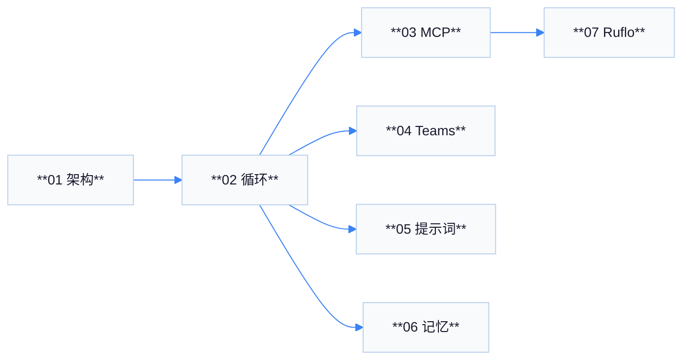

# Claude 客户端源码分析 — 总索引

本目录为 **Claude Code（Tengu）** 客户端源码的结构化读书笔记，源码快照位于仓库内 **`review/claude/`**（相对路径下文中简称「客户端根目录」）。文档面向需要 **二次开发、集成 Ruflo V3、或排查 MCP/多代理行为** 的读者。

---

## 文档一览

| 文件 | 核心问题 | 主要图表 |
|------|----------|----------|
| [01-architecture-overview.md](./01-architecture-overview.md) | 目录结构、入口、`QueryEngine` 与 `queryLoop` 分层 | 分层架构图、请求生命周期状态图 |
| [02-agentic-loop.md](./02-agentic-loop.md) | 模型调用与 `tool_use` / `tool_result` 如何闭环 | 大型时序图、`runToolUse` 流程图、Stop Hook 时序 |
| [03-mcp-integration.md](./03-mcp-integration.md) | 作为 MCP 客户端与服务端时的协议边界 | 发现/调用时序图、连接拓扑图 |
| [04-agent-teams.md](./04-agent-teams.md) | InProcess / Tmux / iTerm 后端与邮箱 | 架构图、创建团队时序图、后端选择流程图 |
| [05-system-prompt.md](./05-system-prompt.md) | 有效系统提示如何拼装 | 优先级决策流、`getSystemPrompt` 装配流 |
| [06-memory-design.md](./06-memory-design.md) | 多种记忆载体如何汇入 `queryLoop` | 记忆子系统架构图、记忆进模型路径图 |
| [07-ruflo-dependency.md](./07-ruflo-dependency.md) | Ruflo 依赖 Claude 的哪些硬能力 | 依赖关系图、Ruflo 工具嵌入时序图、控制面/执行面流图 |

---

## 各文档章节导览

### 01 — 整体架构概览

- 概述与技术栈（TypeScript / React-Ink）
- `src/` 顶层目录表
- 核心运行时组件表（`query`、`QueryEngine`、`runTools`…）
- 服务层与入口表
- **Mermaid**：入口 → 循环 → 服务 → 工具 → 存储
- **Mermaid**：`stream_request_start` 到 `Done` 的状态机
- 数据流、REPL/deps、源码路径速查、术语、与后续文档映射、附录 A–E

### 02 — Agentic 循环机制

- `queryLoop` 步骤表
- `partitionToolCalls` / 并发语义
- **Mermaid**：完整 Agentic 时序图
- **Mermaid**：`runToolUse` 简化流程图
- **Mermaid**：Stop Hook 决策时序
- 其它阶段表（compact、token budget、summary）、环境变量、权限失败路径、`StreamingToolExecutor` 分流、误解澄清、附录 A–H

### 03 — MCP 集成机制

- 客户端表（`fetchToolsForClient`、`callMCPTool`、传输）
- **Mermaid**：tools/list 与 tools/call 时序
- 服务端 `entrypoints/mcp.ts` 表与流程图
- 双向角色对比、`runToolUse` 遥测、工具名解析、OAuth、Elicitation、附录 A–J

### 04 — Agent Teams

- 三后端表、`teammateMailbox` 路径与锁
- Task 工具与 `getTaskListId`
- TeamCreate / 权限桥 / 队友追加提示
- **Mermaid**：架构、创建团队时序、后端选择流程
- 故障排查、附录 A–G

### 05 — 系统提示词设计

- `buildEffectiveSystemPrompt` 优先级 **Mermaid** 流程图
- `getSystemPrompt` 动态段表
- CLAUDE.md 分层与 `@include`
- 用户上下文与 `queryContext` 引用
- **Mermaid**：提示词来源汇聚
- Proactive、缓存、附录 A–J

### 06 — 记忆模块设计

- 多种记忆对照表
- **Mermaid**：记忆子系统、记忆进模型路径
- TodoWrite vs Task、Session Memory、遥测事件、附录 A–K

### 07 — Ruflo V3 依赖

- 能力映射表（7 条）
- **Mermaid**：依赖关系、嵌入回合时序、控制面/执行面
- 概念辨析、配置清单、风险分工、集成验证、附录 A–J

---

## 阅读路径推荐

| 目标 | 顺序 |
|------|------|
| 快速懂主循环 | 01 → 02 |
| 接 Ruflo MCP | 01 → 03 → 07 |
| 多代理排错 | 04 → 02 → 06 |
| 规则未生效 | 05 → 06 |

---

## 图表主题约定

所有 Mermaid 图在开头包含用户指定的 **`%%{init: {'theme': 'base', 'themeVariables': {...}}}%%`**，并补充浅色 **`primaryColor` / `mainBkg` / `clusterBkg`** 等变量，保证 **背景淡、对比足够、文字可读**。节点与参与者标签使用 **`**加粗**`** 或 `<b>`（视渲染器支持），以突出层级。

---

## 术语速查

| 术语 | 解释 |
|------|------|
| **Agentic loop** | 模型输出 `tool_use` → 客户端执行 → `tool_result` → 再调模型，直到结束 |
| **MCP** | Model Context Protocol；JSON-RPC 语义上的工具发现与调用 |
| **Tengu** | 内部代号；对外 MCP Server 名可见 `claude/tengu` |
| **memdir** | 自动记忆目录及相关入口提示加载 |
| **transcript** | 会话消息持久化序列，用于恢复与 compact 边界 |

---

## 源码根路径对照

| 说明 | 绝对路径示例 |
|------|----------------|
| 客户端快照 | `/Users/huaquan.liang/Documents/GitHub/ruflo/review/claude/` |
| 客户端 `src` | `.../review/claude/src/` |
| 本文档目录 | `/Users/huaquan.liang/Documents/GitHub/ruflo/claude-review/` |

---

## 行数与维护

- 正文各篇目标 **200–400 行**（含表格与 Mermaid），便于打印与评审。
- 上游 **`review/claude`** 更新后，优先核对：**`query.ts` 循环**、**`client.ts` MCP`**、**`entrypoints/mcp.ts`** 三处是否出现行为变更。

---

## 许可与声明

文档内容为 **源码阅读笔记**，不替代 Anthropic 官方文档。若引用图表至外部材料，请保留 **源码路径** 与 **快照日期** 上下文。

---

## 常见问题（FAQ）

| 问题 | 指向 |
|------|------|
| 工具并行策略由谁决定？ | `02` → `partitionToolCalls` / `isConcurrencySafe` |
| Ruflo 工具名前缀规则？ | `03` → `mcp__server__tool` |
| 队友为何看不到我说的话？ | `04` → 必须用 `SendMessage` |
| CLAUDE.md 谁覆盖谁？ | `05` → 自顶向下加载、近 CWD 优先 |
| Todo 存在哪里？ | `06` → transcript 内 `TodoWrite` |
| `swarm_init` 会自动起进程吗？ | `07` → 控制面记录 vs Claude 执行面 |

---

## 与官方仓库的关系

| 对象 | 说明 |
|------|------|
| `review/claude` | 本仓库内 ** vendored / 快照式 ** 客户端树，便于离线阅读 |
| 上游 | 以 Anthropic 发布的 **Claude Code** 为准；API 与工具名可能随版本变化 |

---

## 文档统计（自检）

| 文件 | 大约行数（含图表） | Mermaid 图数量 |
|------|---------------------|----------------|
| 00-index | 本文件 | 1 |
| 01 | 200+ | 2 |
| 02 | 200+ | 3 |
| 03 | 190+ | 3 |
| 04 | 200+ | 3 |
| 05 | 195+ | 3 |
| 06 | 195+ | 2 |
| 07 | 198+ | 3 |

---

## 贡献说明（本仓库协作者）

若你更新了 **`review/claude`** 快照：

1. 通读 **`query.ts`** 顶部 import 与 **`while (true)`** 内是否有新 `feature()` 门控。  
2. 检查 **`services/mcp/client.ts`** 是否新增传输类型。  
3. 将差异摘要追加到各篇 **附录** 或新增 **「变更记录」** 小节（保持中文）。

---

## 交叉引用：核心源文件 → 文档

| 源文件（`src/` 下） | 首选文档 |
|---------------------|----------|
| `query.ts` | 02 |
| `services/mcp/client.ts` | 03 |
| `entrypoints/mcp.ts` | 03 |
| `utils/swarm/backends/registry.ts` | 04 |
| `utils/teammateMailbox.ts` | 04 |
| `utils/systemPrompt.ts` | 05 |
| `constants/prompts.ts` | 05 |
| `utils/claudemd.ts` | 05、06 |
| `memdir/*` | 06 |
| `QueryEngine.ts` | 01、02 |

---

*索引版本：与仓库 `review/claude` 目录结构对齐整理。*
