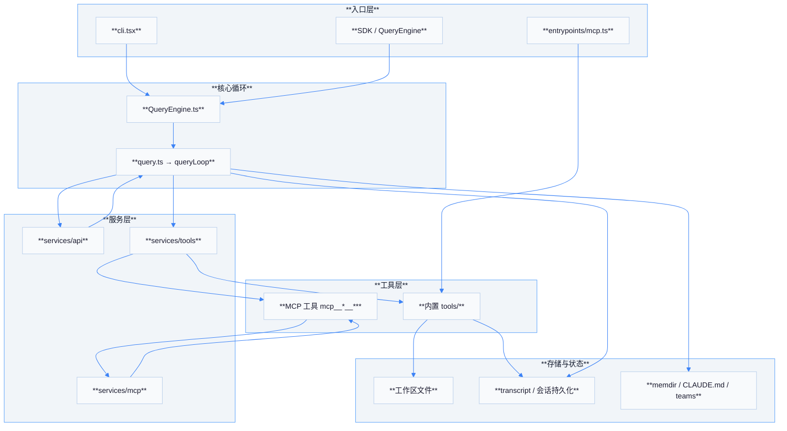
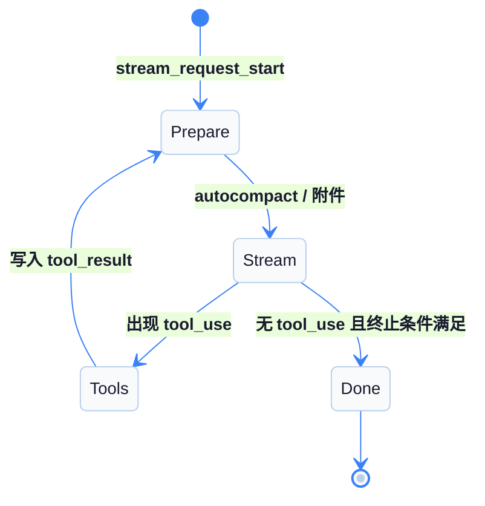

# 01 — 整体架构概览

## 概述

**Claude Code**（源码树中常以 *Tengu* 为产品名）是 Anthropic 官方的终端侧 Claude 客户端，采用 **TypeScript** 实现，交互界面基于 **React + Ink**（终端 UI）。核心能力是将用户输入、系统提示、工具定义与对话历史组装后调用 **Anthropic Messages API**，并在流式响应中解析 **`tool_use`**，再经统一编排执行内置工具或 MCP 工具，形成 **Agentic 闭环**。

| 维度 | 说明 |
|------|------|
| 语言与 UI | TypeScript；`screens/`、`components/` 等与 Ink/React 相关 |
| 主循环 | `src/query.ts` 中 `query` / `queryLoop`，对接 API 与工具执行 |
| 查询引擎封装 | `src/QueryEngine.ts`：SDK/非交互路径上组装上下文、调用 `query()`、会话与用量 |
| 工具注册 | `src/tools.ts`、`src/Tool.js`（bundler 侧）与各类 `tools/*` |
| LLM 调用 | `services/api/`（如 `claude.ts`、流式采样、重试与错误处理） |
| MCP | `services/mcp/client.ts`（客户端）；`entrypoints/mcp.ts`（对外 MCP Server） |

## 顶层目录结构（`src/`）

| 目录 | 职责摘要 |
|------|----------|
| `entrypoints/` | CLI（`cli.tsx`）、MCP 服务端（`mcp.ts`）、SDK 等入口 |
| `services/` | API、MCP、工具流式执行（`StreamingToolExecutor`）、压缩等 |
| `tools/` | 各工具实现（Read、Bash、Task、MCP 相关等） |
| `utils/` | 消息、权限、CLAUDE.md、队友、任务、附件等通用逻辑 |
| `hooks/` | React hooks 与权限门控（如 `useCanUseTool`） |
| `commands/` | 斜杠命令与子命令 UI/逻辑 |
| `screens/` | REPL 等主屏 |
| `constants/` | 提示词片段、`prompts.ts` 等 |
| `types/` | 消息、会话等类型 |

## 核心运行时组件关系

| 组件 | 路径 | 作用 |
|------|------|------|
| `query` / `queryLoop` | `query.ts` | 每轮：整理消息 → 调用模型 → 处理 `tool_use` 或结束 |
| `QueryEngine` | `QueryEngine.ts` | 更高层会话驱动：用户输入处理、系统提示获取、`query` 调用链 |
| `runTools` | `services/tools/toolOrchestration.ts` | 按只读并发 / 写串行划分批次执行 `tool_use` |
| `runToolUse` | `services/tools/toolExecution.ts` | 单工具：解析、权限、调用、构造 `tool_result` |
| `StreamingToolExecutor` | `services/tools/StreamingToolExecutor.ts` | 流式场景下与 `runToolUse` 协同 |
| `getTools` | `tools.ts` | 聚合内置（及策略下 MCP）工具列表供模型与 MCP Server 使用 |

## 服务层与入口

| 层级 | 代表路径 | 说明 |
|------|----------|------|
| 入口 CLI | `entrypoints/cli.tsx` | 命令行启动、路由到主程序 |
| 入口 MCP Server | `entrypoints/mcp.ts` | 对外暴露 `ListTools` / `CallTool`，内部 `getTools()` |
| 初始化链 | 散布于 bootstrap、`init` 相关命令与状态 | 工作目录、会话、配置、MCP 连接等就绪 |
| API | `services/api/` | 模型调用、用量、错误分类与 compact 等 |
| MCP 客户端 | `services/mcp/client.ts` | `fetchToolsForClient`、`callMCPTool`，多传输 |
| 工具编排 | `services/tools/` | 与 `query.ts` 直接耦合的执行管线 |

## 分层架构图

## 数据流简表

| 方向 | 内容 |
|------|------|
| 下行 | 用户输入 + 附件 → `messages`；系统提示 + `userContext` / `systemContext` |
| 横向 | `toolUseContext` 携带 `options.tools`、`mcpClients`、权限与中止信号 |
| 上行 | 流式 `assistant` 消息；`tool_result` 用户消息写回 `messages` 进入下一轮 |

## 交互界面与入口补充

| 文件 | 角色 |
|------|------|
| `screens/REPL.tsx` | 主交互循环 UI；组装 `buildEffectiveSystemPrompt`、挂载 `MCPConnectionManager`、驱动用户输入进入 `QueryEngine` / `query` 链路 |
| `entrypoints/cli.tsx` | CLI 参数解析与分发；是多数用户态命令的真实入口 |
| `main.tsx` | 与全局启动、模式分支相关的大型模块（含非交互路径说明，与 `buildEffectiveSystemPrompt` 使用场景交错） |
| `query/deps.ts` | **`QueryDeps`**：便于测试与渐进替换 `autocompact`、`microcompact`、`callModel` 等 |
| `query/config.ts` | **`buildQueryConfig()`**：在 `queryLoop` 入口快照配置，避免循环内重复读取不稳定源 |

## 请求生命周期简图

## 源码路径速查（相对 `review/claude/src/`）

| 主题 | 路径 |
|------|------|
| 主循环 | `query.ts` |
| SDK 侧封装 | `QueryEngine.ts` |
| 工具元数据与查找 | `Tool.js` / `tools.ts` |
| Anthropic 调用 | `services/api/claude.ts` 及周边 |
| MCP 客户端实现 | `services/mcp/client.ts` |
| MCP React 上下文 | `services/mcp/MCPConnectionManager.tsx` |
| 对外 MCP Server | `entrypoints/mcp.ts` |
| 工具并发策略 | `services/tools/toolOrchestration.ts` |
| 单工具执行 | `services/tools/toolExecution.ts` |

## 与后续文档的对应关系

| 文档 | 本文档中埋点 |
|------|----------------|
| `02-agentic-loop.md` | `queryLoop`、`runTools` |
| `03-mcp-integration.md` | `services/mcp` 与 `entrypoints/mcp.ts` |
| `04-agent-teams.md` | `utils/swarm/*`、队友邮箱 |
| `05-system-prompt.md` | `utils/systemPrompt.ts`、`constants/prompts.ts` |
| `06-memory-design.md` | transcript、memdir、`sessionRestore` |
| `07-ruflo-dependency.md` | MCP 客户端 + `queryLoop` 组合 |

## 术语对照

| 术语 | 含义 |
|------|------|
| **Tengu** | 内部产品代号，MCP Server `name` 可见 `claude/tengu` |
| **tool_use** | Anthropic Messages API 中 assistant 内容块类型，触发客户端执行工具 |
| **tool_result** | user 角色消息中的结果块，与 `tool_use_id` 对应 |
| **ToolUseContext** | 贯穿一轮查询的上下文：工具列表、MCP 连接、中止信号、内容替换状态等 |

## 扩展阅读（源码内注释线索）

- `query.ts` 文件顶部对 **thinking** 块与消息顺序的约束注释，有助于理解为何循环内要保持特定消息形状。
- `entrypoints/mcp.ts` 内 **TODO** 表明对外 MCP Server 未来可能再次透出子 MCP 工具链，阅读时需注意版本差异。

## 附录 A：`Message` 类型族（概念）

| `type` 字段（概念） | 在循环中的角色 |
|---------------------|----------------|
| `user` | 用户输入、`tool_result`、系统注入的 meta 消息 |
| `assistant` | 模型输出，可含 `text` / `tool_use` / `thinking` 等块 |
| `attachment` | 记忆预取、hook 停止续写、队友邮件等侧车内容 |
| `tombstone` / 摘要类 | compact 或 UI 辅助，减少有效历史长度 |

## 附录 B：`ToolUseContext.options` 关键字段

| 字段 | 作用 |
|------|------|
| `tools` | 当前可见工具列表（内置 + MCP 映射） |
| `mcpClients` | 已连接 MCP 会话句柄 |
| `mainLoopModel` | 主模型名，影响部分工具内部策略 |
| `isNonInteractiveSession` | headless/SDK 行为分支（如跳过部分 UI 摘要） |

## 附录 C：压缩子系统索引

| 模块目录 | 职责 |
|----------|------|
| `services/compact/autoCompact.js` | 超阈值自动压缩 |
| `services/compact/compact.js` | 构建 compact 后消息 |
| `services/compact/reactiveCompact.js` | 对 prompt-too-long 等错误的反应式压缩 |
| `services/compact/snipCompact.js` | 历史 snip（feature 门控） |

## 附录 D：CLI 与打印模式

`cli/print.ts` 等路径处理 **管道/非交互** 输出：同样最终依赖 **`query`** 与工具层，但 UI 组件（Ink）被剥离或简化，适合脚本化 CI 与自动化评测。

## 附录 E：与本仓库 Ruflo 的目录关系

| 路径 | 说明 |
|------|------|
| `review/claude/` | 本文分析所指的 **Claude 客户端快照** |
| `v3/`、`ruflo/` | **Ruflo / claude-flow** 包源码，通过 MCP 与 Claude 对话层协作 |

## 小结

Claude 客户端可概括为：**入口** 负责启动形态（交互 CLI / 对外 MCP / SDK），**`queryLoop`** 负责与模型和工具的闭环，**服务层** 封装网络、MCP 与工具执行策略，**工具层** 混合内置实现与 MCP 远程调用，**存储层** 覆盖仓库文件、会话 transcript、规则文件与团队目录等持久载体。
