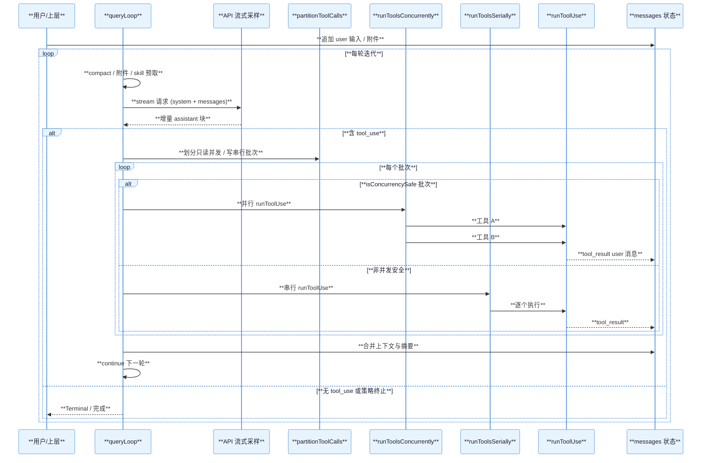
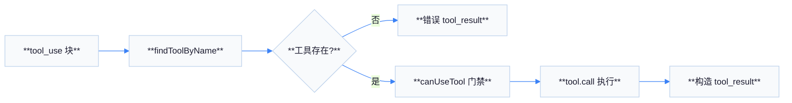
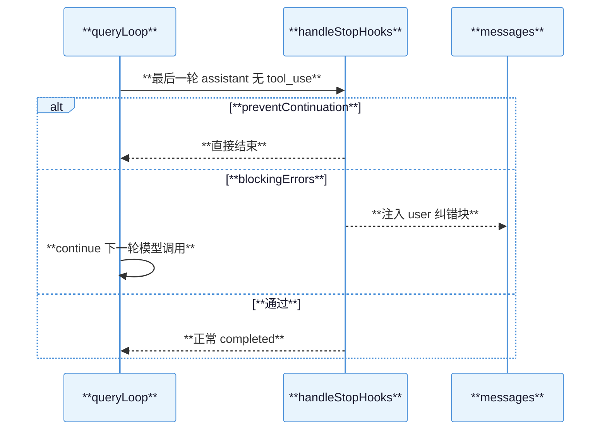

# 02 — Agentic 循环机制

## 目标

理解单轮或多轮对话中，模型输出 **`tool_use`** 后如何被消费、如何生成 **`tool_result`** 并再次请求模型，直到无工具调用或满足终止条件。实现主干在 **`src/query.ts`** 的 **`queryLoop`**，工具管线在 **`services/tools/toolOrchestration.ts`** 与 **`toolExecution.ts`**。

## 流程概要（对应 `queryLoop` 逻辑）

| 步骤 | 行为 |
|------|------|
| 1 | 用户或上层已把输入整理为 `messages`；每轮开始可做 snip / microcompact / autocompact、附件与 skill 预取 |
| 2 | 组装 `fullSystemPrompt`，发起流式 **`callModel`**（经 `deps` 与 API 层） |
| 3 | 流式累积 `assistant` 消息；若内容含 **`tool_use`** 块，进入工具阶段 |
| 4 | **`runTools`** 或 **`StreamingToolExecutor.getRemainingResults()`** 执行工具，产出带 **`tool_result`** 的 user 类消息 |
| 5 | 将工具结果并入 `messages`，可选生成 tool-use summary；若未中止则 **`continue`** 回到步骤 2 |
| 6 | 若无 `tool_use` 且满足完成条件（含 stop hook、token budget 等），返回 **`Terminal`** |

## 关键代码职责

| 符号 | 文件 | 职责 |
|------|------|------|
| `queryLoop` | `query.ts` | `while (true)` 状态机式迭代；维护 `State`（messages、compact、turnCount 等） |
| `partitionToolCalls` | `toolOrchestration.ts` | 按工具 `isConcurrencySafe` 将连续只读工具合并为一批并发执行 |
| `runToolsConcurrently` / `runToolsSerially` | 同上 | 只读批次并行（上限 `CLAUDE_CODE_MAX_TOOL_USE_CONCURRENCY`）；写或非标并发安全则串行 |
| `runToolUse` | `toolExecution.ts` | 查找工具、中止检查、**`canUseTool`** 权限、执行 `tool.call`、yield `tool_result` 消息 |
| `StreamingToolExecutor` | `StreamingToolExecutor.ts` | 在流式工具场景与 `runToolUse` 衔接（`query.ts` 根据条件二选一） |

## 并发与一致性

- **`partitionToolCalls`** 对每个 `tool_use` 用 **`findToolByName`** 与 **`inputSchema.safeParse`** 后调用 **`tool.isConcurrencySafe(parsed.data)`**；解析失败则视为不安全。
- 并发批次内通过 **`contextModifier`** 队列在批次结束后顺序应用，避免竞态下上下文错乱。
- 串行路径在每步直接更新 **`currentContext`**。

## 大型时序图：Agentic Loop

## `runToolUse` 简流程

## 与 Ruflo 的衔接点（预览）

- 模型所见的 **`mcp__<server>__<tool>`** 名称在 **`runToolUse`** 中仍走同一套权限与执行路径，由 MCP 层解析服务器并 **`callMCPTool`**（详见 `03-mcp-integration.md`）。

## `queryLoop` 内其它关键阶段（与工具并列）

| 阶段 | 代码锚点行为 | 目的 |
|------|----------------|------|
| **queryTracking** | 每轮递增 `depth`、分配 `chainId` | 遥测与工具错误日志串联整条调用链 |
| **applyToolResultBudget** | 工具结果体积裁剪与持久化钩子 | 防止超大 `tool_result` 撑爆上下文 |
| **snip / microcompact / autocompact** | `deps` 与 feature 门控 | 在调用模型前尽量压缩历史 |
| **context collapse** | `CONTEXT_COLLAPSE` feature | 投影折叠视图，减少有效 token |
| **stop hooks** | `handleStopHooks` | 在「无 tool 的 assistant 结束后」拦截或注入纠错消息 |
| **token budget** | `TOKEN_BUDGET` feature + `checkTokenBudget` | 长任务下自动续写 nudge |
| **tool use summary** | `generateToolUseSummary` | 面向 UI 的 Haiku 级摘要（主线程） |

## 环境变量：工具并发

| 变量 | 作用 |
|------|------|
| `CLAUDE_CODE_MAX_TOOL_USE_CONCURRENCY` | 覆盖默认 **10** 的并发上限；解析失败则回退默认 |

## `runToolUse` 权限与失败路径摘要

| 分支 | 结果形状 |
|------|----------|
| 未知工具名 | `tool_use_error` 的 **`tool_result`**，`is_error: true` |
| `abortController` 已中止 | 记录取消事件并短路与中止一致的消息 |
| `canUseTool` 拒绝 | 由权限层生成说明性结果（具体文案因模式而异） |
| MCP 鉴权失败 | 客户端层 **`McpAuthError`** 等会触发重连/刷新令牌 UI 路径 |

## 与 `StreamingToolExecutor` 的分流

`query.ts` 在工具执行开始前根据 **`streamingToolExecutor`** 是否非空，在：

- **`streamingToolExecutor.getRemainingResults()`**（流式工具结果已与流交错准备），与  
- **`runTools(...)`**（标准批处理）

之间二选一。二者最终都应把 **`tool_result`** 归一为 user 消息并进入 `normalizeMessagesForAPI` 过滤。

## 辅助时序：Stop Hook 决策

## 调试与日志关键词

| 日志/事件前缀 | 含义 |
|----------------|------|
| `tengu_streaming_tool_execution_*` | 是否走流式工具执行器 |
| `tengu_tool_use_error` | 工具名解析、MCP 元数据、请求 ID |
| `query_checkpoint` | `queryProfiler` 各阶段耗时（若启用） |

## 常见误解澄清

| 误解 | 实际情况 |
|------|----------|
| 「每轮只调一次模型」 | 一轮 **用户输入** 可触发 **多轮** 模型调用（每批 `tool_use` 后都会再调） |
| 「所有工具都能并行」 | 仅 **`isConcurrencySafe` 为真** 且能被稳定解析输入的工具可进入并发批次 |
| 「`tool_result` 立即出现在流里」 | 批处理路径下需等待该批 **`runTools`** 迭代完成；流式路径可能更早增量展示 |

## 附录 A：`normalizeMessagesForAPI` 的意义

工具执行阶段产出的消息需经 **`normalizeMessagesForAPI`** 过滤与规范化后，才能安全送回 Anthropic API（剔除不可序列化字段、处理附件形状等）。若跳过此步，可能触发 **400** 或 **schema** 校验错误。

## 附录 B：`assistantMessages` 与多段 `tool_use`

同一轮 assistant 消息可包含 **多个** `tool_use` 块。**`partitionToolCalls`** 按出现顺序切批：连续只读工具合并；一旦出现写工具或非标并发安全工具，批次边界重置。

## 附录 C：`taskBudget`（API 层）

`QueryParams.taskBudget` 注释说明其与 **客户端 tokenBudget +500k 续写** 不同：属于 **beta `task_budget`** 头/参数族，用于整轮 Agentic 任务的 **API 侧**预算计数；compact 后需 **`taskBudgetRemaining`** 补偿服务器可见窗口变短导致的低估。

## 附录 D：`yieldMissingToolResultBlocks`

当会话异常中断、assistant 已发出 `tool_use` 但未执行工具时，`query.ts` 中 **`yieldMissingToolResultBlocks`** 可生成 **占位 `tool_result`**，避免下一轮 API 请求因缺少配对结果而被拒。

## 附录 E：与 `sideQuery` / `hooks` 的边界

**`executePostSamplingHooks`**、**`executeStopFailureHooks`** 等在采样后或失败路径运行，用于遥测与学习；它们 **不替代** `tool_use` 执行，但可改变 **是否继续循环**（与 stop hook 协同）。

## 附录 F：性能关注点

| 点 | 说明 |
|----|------|
| 并发上限 | 防止同时打开过多 Shell/MCP 连接压垮本机 |
| `applyToolResultBudget` | 防止单轮工具输出撑满 200k/1M 窗口 |
| `skillPrefetch` / `memoryPrefetch` | 与模型调用并行隐藏 I/O 延迟 |

## 附录 G：`query` 生成器对外协议

外部调用方（SDK）通过 **`for await...of query(...)`** 消费 **流事件**、**Message** 与最终 **Terminal**。理解这一点有助于把 **「一次用户发送」** 映射为 **多条异步事件**，而非单次 Promise。

## 附录 H：与 `cowork/desktop` 注释

`query.ts` 内关于 **max_output_tokens** 错误的注释提到 **SDK 调用方** 可能在收到 `error` 字段时立刻结束会话；因此客户端 **withhold** 中间错误直至恢复失败 —— 集成第三方 Host 时应复用同一语义。

## 小结

**`queryLoop`** 是 Agentic 心脏：**API 流式输出** 与 **工具执行** 严格交替；**`partitionToolCalls`** 在正确性前提下最大化只读并行；**`runToolUse`** 统一内置与 MCP 工具的权限与结果形状。
