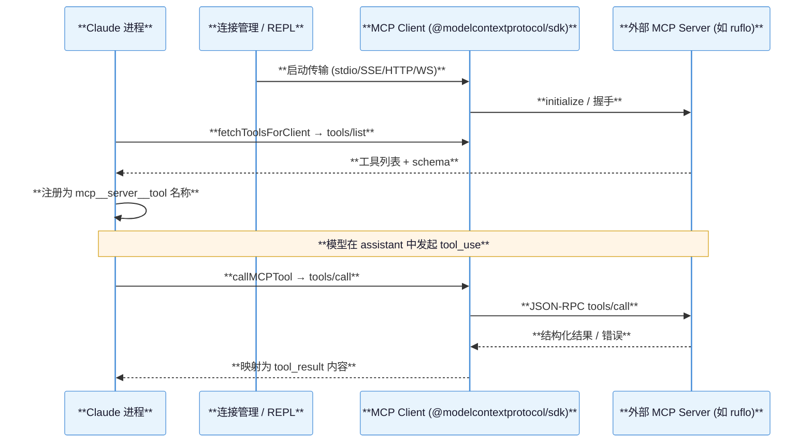
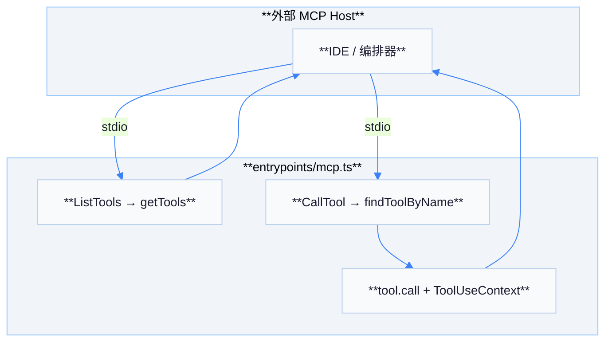
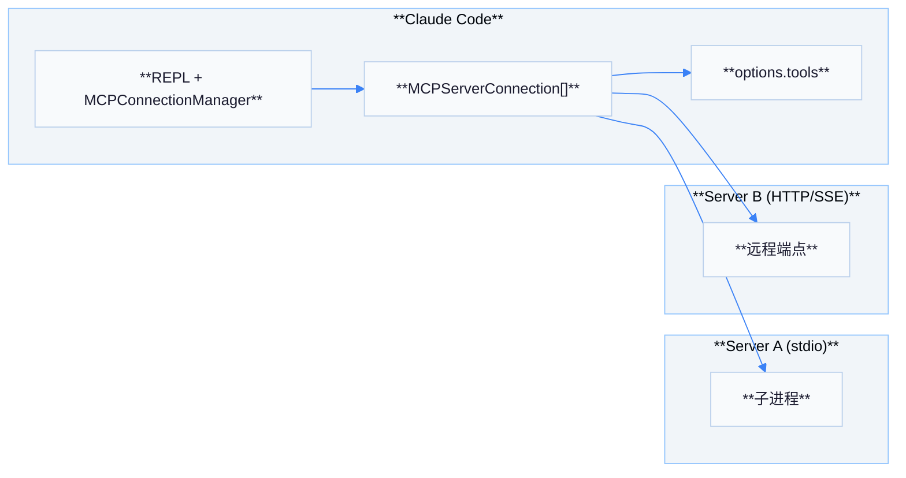

# 03 — MCP 集成机制

Model Context Protocol（MCP）在 Claude 客户端中以两种互补角色出现：**作为客户端**连接用户配置的外部 MCP 服务器（例如 Ruflo）；**作为服务端**在 `claude mcp` 等场景下向外部 Host 暴露内置工具。

## A. Claude 作为 MCP 客户端

| 项目 | 说明 |
|------|------|
| 核心模块 | `src/services/mcp/client.ts` |
| 发现工具 | **`fetchToolsForClient`**（memoize/LRU）；对各已连接 server 走 MCP **`tools/list`** |
| 调用工具 | **`callMCPTool`**（及带 URL elicitation 重试的包装）对应 MCP **`tools/call`** |
| 工具命名 | **`mcp__<server>__<tool>`**；解析见 `mcpStringUtils.ts` 的 **`mcpInfoFromString`**（约定 server 名中不宜含 `__`） |
| 连接 UI 与生命周期 | `MCPConnectionManager.tsx`、`useManageMCPConnections.ts` 等与重连、启用/禁用联动 |
| 传输 | SDK 与自定义封装：`StdioClientTransport`、`SSEClientTransport`、`StreamableHTTPClientTransport`、`WebSocketTransport`（`mcpWebSocketTransport.ts`）等 |

### 客户端发现与调用时序

## B. Claude 作为 MCP 服务端

| 项目 | 说明 |
|------|------|
| 入口 | `src/entrypoints/mcp.ts` → **`startMCPServer`** |
| 传输 | `@modelcontextprotocol/sdk/server` + **`StdioServerTransport`** |
| 能力 | **`ListToolsRequestSchema`**：调用 **`getTools(toolPermissionContext)`**，并把 Zod schema 转为 JSON Schema |
| 执行 | **`CallToolRequestSchema`**：`findToolByName` 后构造精简 **`ToolUseContext`**（含 `mcpClients: []` 等）执行工具 |
| 备注 | 源码注释 **TODO: Also re-expose any MCP tools** — 当前侧重内置工具透出 |

### 服务端 List / Call 流程

## 双向角色对比

| 方向 | 谁发起连接 | 典型用途 |
|------|------------|----------|
| 客户端 | Claude 进程连接配置的 MCP Server | 调用 Ruflo、数据库、浏览器等扩展能力 |
| 服务端 | 外部 Host 连接 Claude 暴露的 stdio Server | 在第三方产品中复用 Claude 内置工具集 |

## `toolExecution` 中的 MCP 元数据

**`runToolUse`** 会根据工具名解析 **`getMcpServerType`** / **`getMcpServerBaseUrlFromToolName`**，用于日志与遥测（如 `tengu_tool_use_error` 上的 `mcpServerType`），便于区分 stdio 与远程传输问题。

## 工具名构造与规范化

| 函数/模块 | 作用 |
|-----------|------|
| `buildMcpToolName` | 将 server 与 tool 拼为模型可见全名 |
| `normalizeNameForMCP` | 处理非法字符，避免 JSON-RPC 与文件系统冲突 |
| `mcpInfoFromString` | 从全名反解 server/tool；**已知限制**：server 名含 `__` 时解析歧义 |

## OAuth 与 401

`client.ts` 中与 **`UnauthorizedError`**、**`checkAndRefreshOAuthTokenIfNeeded`**、**`handleOAuth401Error`** 协作：当远程 MCP 需要 OAuth 时，工具层捕获 **`McpAuthError`** 后可把连接标为 **`needs-auth`** 并触发 UI 重新登录（具体流程随 Host 不同）。

## Elicitation 与大型输出

| 能力 | 说明 |
|------|------|
| **URL elicitation 重试** | `callMCPToolWithUrlElicitationRetry` 包装普通 `callMCPTool` |
| **二进制落盘** | `mcpOutputStorage.ts` 将过大或二进制内容转为文件引用消息 |
| **截断** | `mcpValidation.ts` 估算大小并截断，防止结果冲爆上下文 |

## MCP Skills（可选 feature）

当 **`MCP_SKILLS`** feature 开启时，`fetchMcpSkillsForClient` 可被拉取，用于把远端技能元数据纳入客户端技能发现路径（与 `skills/mcpSkills.js` 模块协作）。

## 架构图：客户端连接拓扑

## 与 `entrypoints/mcp.ts` 的差异表

| 维度 | 客户端 | 服务端 (`mcp.ts`) |
|------|--------|-------------------|
| 传输方向 | Claude 主动连出 | 外部进程连入 stdio |
| `mcpClients` | 非空数组 | 显式 `[]` |
| 工具来源 | 远端 `tools/list` | 本地 `getTools()` |
| 权限上下文 | 完整会话权限 | `getEmptyToolPermissionContext()` |

## 附录 A：`MCPServerConnection` 状态机（概念）

| `type` | 含义 |
|--------|------|
| `connected` | 已握手，可 `tools/list` / `tools/call` |
| `needs-auth` | OAuth 或 token 失效，等待用户操作 |
| `disabled` | 用户或策略关闭，不参与工具聚合 |
| `error` | 启动失败或崩溃，UI 展示重连 |

## 附录 B：Resources / Prompts（可选 MCP 能力）

除 **Tools** 外，`client.ts` 还包含 **ListResources**、**ReadResource**、**ListPrompts** 等 schema 处理（与 `ListMcpResourcesTool` 等内置工具打通）。阅读时可搜索 **`ListResourcesResultSchema`** 追踪完整链路。

## 附录 C：`SdkControlClientTransport`

对 **SDK 控制类** MCP 配置使用专用传输 **`SdkControlClientTransport`**，与常规 stdio/HTTP 区分，便于在企业环境做策略插入（详见同目录 `SdkControlTransport.ts`）。

## 附录 D：安全日志

**`getLoggingSafeMcpBaseUrl`** 在遥测中替换敏感 query 片段，避免把 token 打进 **`tengu_tool_use_error`** 的 URL 字段。

## 附录 E：与 `Tool.js` 的衔接

内置 **`MCPTool`** 将远端 schema 包装为 **`Tool`** 接口：`prompt` 函数可异步拉取描述；执行时 **`runToolUse`** 走 MCP 分支而非本地 `call`。

## 附录 F：故障排查

| 症状 | 排查 |
|------|------|
| 工具列表缺项 | 服务器 `tools/list` 是否报错；`fetchToolsForClient.cache` 是否需失效 |
| 调用超时 | 传输类型（HTTP vs stdio）与代理 **`getProxyFetchOptions`** |
| 图片过大 | **`maybeResizeAndDownsampleImageBuffer`** 是否触发 |

## 附录 G：`recursivelySanitizeUnicode`

在把 MCP 结果写回消息前对字符串做 **Unicode 净化**，降低 **畸形字符** 导致 API 拒收或终端渲染崩溃的概率。

## 附录 H：`markClaudeAiMcpConnected`

`claudeai.ts` 内 **`markClaudeAiMcpConnected`** 与官方 Claude.ai 生态联动：当使用托管 MCP 端点时设置标志，影响后续 **OAuth** 与 **遥测** 分支（详见同目录模块）。

## 附录 I：`useManageMCPConnections` 深度

`useManageMCPConnections.ts` 体量较大：除连接外还处理 **配置热重载**、**重试退避**、**工具缓存失效**。阅读时建议从 **`fetchToolsForClient.cache.delete`** 断点入手。

## 附录 J：与 `cli/print.ts` 的 headless 路径

非交互 **`print`** 模式在启动 MCP 子进程时使用与 REPL **相同的 client.ts 实现**，差异仅在 **无 Ink UI** 的错误呈现与用户授权回退策略。

## 附录 K：`classifyMcpToolForCollapse`

`tools/MCPTool/classifyForCollapse.ts` 决定 MCP 工具结果在 **上下文折叠** 时归入哪一类摘要策略，避免把 **大型 JSON** 重复保留在多轮中。

## 附录 L：`clearKeychainCache`（401 恢复）

macOS 路径下 OAuth 刷新可能涉及 **钥匙串缓存清理**（`clearKeychainCache`），与 **`handleOAuth401Error`** 组合实现无感重登。

## 附录 M：`getMcpServerHeaders`

`headersHelper.ts` 为出站 MCP HTTP/SSE 请求注入 **鉴权/追踪** 头；企业代理场景下与 **`getProxyFetchOptions`** 叠加使用。

## 小结

- **客户端路径**：**`fetchToolsForClient` + `callMCPTool`** 将外部能力编译进模型工具表并接回 **`tool_result`**。
- **服务端路径**：**`mcp.ts`** 用 **`getTools`** 将同一套内置工具暴露给外部 MCP Host。
- **命名空间**：**`mcp__`** 前缀是客户端侧与权限、遥测、折叠策略共享的协议面。
