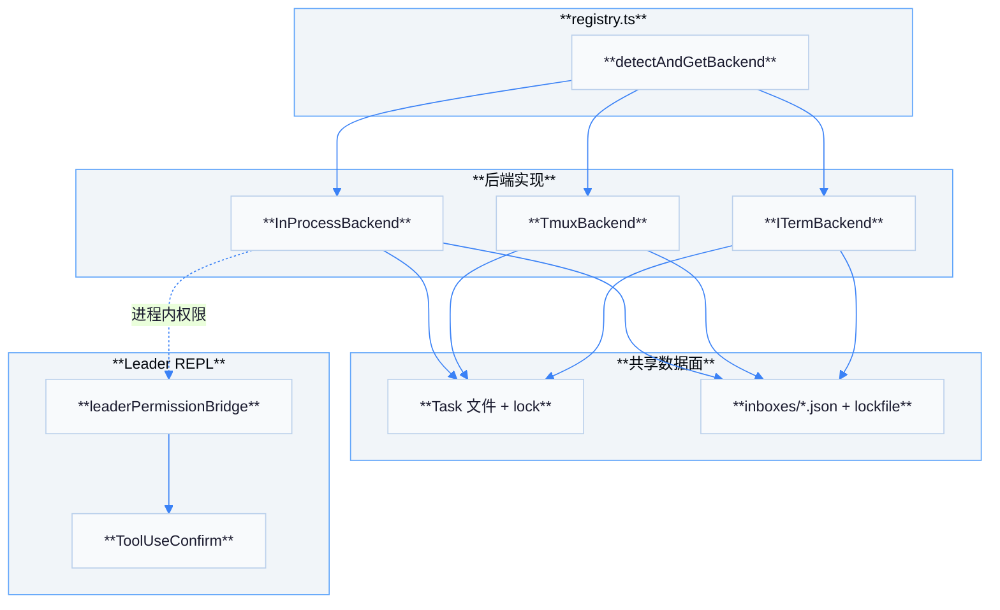
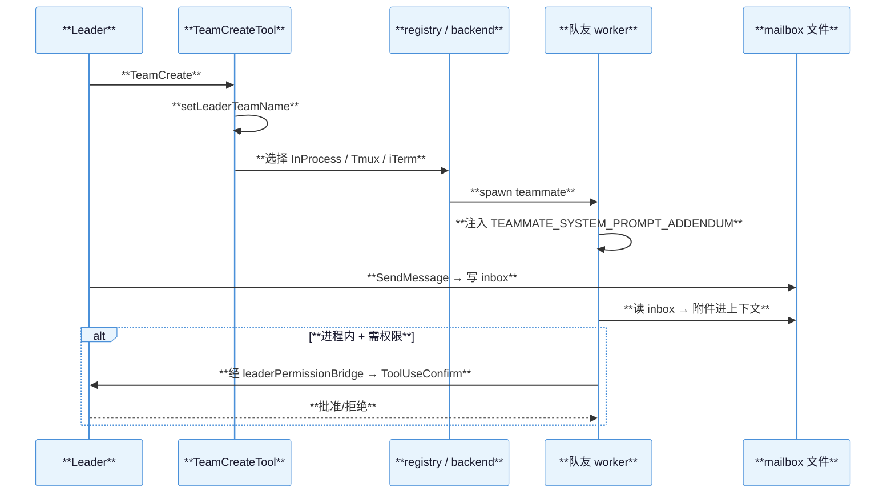
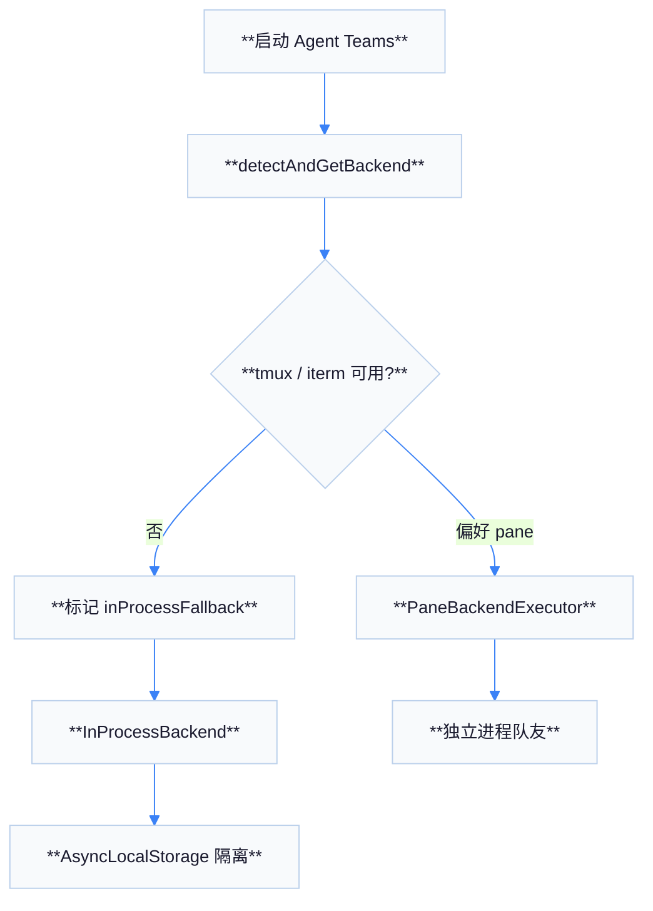

# 04 — Agent Teams 协作机制

Agent Teams 允许多个「队友」并行工作：根据环境与配置选择 **进程内** 或 **终端窗格（tmux / iTerm2）** 后端；协作除共享任务系统外，还通过 **文件邮箱** 传递结构化消息。

## 三种后端

| 后端 | 模块 | 特点 |
|------|------|------|
| **InProcessBackend** | `utils/swarm/backends/InProcessBackend.ts` | 与主进程共享运行时；**AsyncLocalStorage** 等机制隔离队友上下文 |
| **TmuxBackend** | `utils/swarm/backends/TmuxBackend.ts` | 独立 pane/进程；依赖 tmux 可用性检测 |
| **ITermBackend** | `utils/swarm/backends/ITermBackend.ts` | iTerm2 + it2 CLI 等检测 |

**`registry.ts`**（`utils/swarm/backends/registry.ts`）在启动时 **`detectAndGetBackend()`**（及 **`ensureBackendsRegistered`** 动态注册类），缓存后端选择；若 pane 后端不可用可 **回落到 in-process**（`inProcessFallbackActive` 等标志同步 UI）。

## 邮箱机制（`teammateMailbox.ts`）

| 项目 | 说明 |
|------|------|
| 路径 | **`~/.claude/teams/{team}/inboxes/{agent}.json`**（经 `getTeamsDir`、`sanitizePathComponent`） |
| 格式 | JSON 列表，元素含 `from`、`text`、`timestamp`、`read`、`summary` 等 |
| 并发 | **`lockfile`** 异步锁 + 退避重试，避免多进程同时写损坏 |
| 能力 | 私信、广播、权限相关消息、shutdown 等（与 `SendMessage` 工具常量配合） |

## Task 工具与持久化

| 工具 | 作用 |
|------|------|
| **TaskCreate / TaskList / TaskUpdate / TaskGet** | 团队共享任务列表，文件 + 锁持久化 |
| **getTaskListId**（`utils/tasks.ts`） | Leader 在 **TeamCreate** 后 **`setLeaderTeamName`**，使任务文件与团队名对齐 |

## 团队创建与权限桥

| 步骤 | 说明 |
|------|------|
| **TeamCreateTool** | 创建团队并注册 leader 团队名（影响 **`getTaskListId`**） |
| **spawn teammates** | 由后端执行器启动子会话（进程内 runner 或 pane） |
| **leaderPermissionBridge.ts** | 将 REPL 的 **`setToolUseConfirmQueue`** / **`setToolPermissionContext`** 注册给进程内队友，使队友走 **ToolUseConfirm** 而非独立 badge |

## 队友系统提示追加

**`utils/swarm/teammatePromptAddendum.ts`** 中 **`TEAMMATE_SYSTEM_PROMPT_ADDENDUM`**：明确要求使用 **`SendMessage`** 与队友通信，纯文本回复对其他队友不可见。

## 架构图

## 时序图：创建团队并 spawn

## `SendMessage` 与常量

| 符号 | 位置 | 用途 |
|------|------|------|
| `SEND_MESSAGE_TOOL_NAME` | `tools/SendMessageTool/constants.js` | 与邮箱读写、XML 标签解析共享同一工具名来源 |
| `TEAMMATE_MESSAGE_TAG` | `constants/xml.ts` | 将队友消息嵌入附件/可见上下文 |

## InProcess 运行器链路（概念）

| 模块 | 作用 |
|------|------|
| `inProcessRunner.ts` | 在同进程内调度队友执行循环 |
| `spawnInProcess.ts` | 创建子代理会话的入口之一 |
| `permissionSync.ts` | 在队友与 leader 之间同步权限模式（若启用） |

## 检测辅助函数（`detection.ts`）

| 函数 | 含义 |
|------|------|
| `isInsideTmux` / `isTmuxAvailable` | 决定是否可走 tmux pane 路径 |
| `isInITerm2` / `isIt2CliAvailable` | iTerm2 集成能力探测 |
| `isInsideTmuxSync` | 同步快速判断，供不可异步场景 |

## 流程图：后端选择（简化）

## `getTaskListId` 行为摘要

| 状态 | 返回值倾向 |
|------|------------|
| Leader 已 `setLeaderTeamName` | **团队名** 作为稳定命名空间，多队友共享同一任务文件 |
| 无团队 | 回落到 **session** 相关 id，保证单会话隔离 |

## 与 `stopHooks` 的交叉

`query/stopHooks.ts` 会读取 **`listTasks(getTaskListId())`**，在特定停止策略下把未完成任务反馈给模型或 UI，这说明 **Task 列表不仅是展示**：还参与「是否允许结束本轮」的判定。

## 安全与路径净化

| 实践 | 位置 |
|------|------|
| `sanitizePathComponent` | `utils/tasks.ts` 等，防止团队名/代理名穿越目录 |
| `lockfile` 退避 | `teammateMailbox.ts` 内 **`LOCK_OPTIONS`** |

## 故障排查表

| 现象 | 可能原因 |
|------|----------|
| 队友收不到消息 | 未使用 **`SendMessage`**；或 inbox 路径与 `getTeamName()` 不一致 |
| 权限框不出现 | 非 in-process 后端；或 **`leaderPermissionBridge`** 未注册 |
| 任务不同步 | Leader 未执行 **TeamCreate**；**`getTaskListId`** 仍用 session id |

## 附录 A：`TEAM_LEAD_NAME` 与常量

`utils/swarm/constants.ts` 中的 **`TEAM_LEAD_NAME`** 等在 UI 与邮箱路由中标识 leader 角色；与 `getAgentName()` / `getTeamName()`（`teammate.ts`）配合，保证 **跨进程** 命名一致。

## 附录 B：`teammateContext.ts`

用于在当前执行上下文缓存队友元数据（颜色、显示名等），供 Ink 组件渲染与日志区分，不改变工具协议本身。

## 附录 C：`spawnUtils.ts` 与自动记忆门控

注释提及 **REMOTE && !MEMORY_DIR** 与 **auto-memory** 门控关系：云端或受限环境可能禁用某些文件记忆路径，spawn 前需检测避免写本地失败。

## 附录 D：`TeamDeleteTool` 清理

`TeamDeleteTool` 会清理 leader 团队名等状态，使 **`getTaskListId()`** 回落，避免已删除团队的僵尸任务文件继续被读取。

## 附录 E：`useTasksV2.ts`

React hook **`useTasksV2`** 轮询 **`getTaskListId()`** 对应磁盘任务文件，为 UI 提供实时列表；与工具层 **`TaskCreateTool`** 写入同一数据源。

## 附录 F：与 `PermissionModeSchema` 的关系

邮箱与部分消息负载携带 **权限模式** 枚举（SDK schema），用于在队友进程恢复会话时 **重建** 与用户会话等价的权限视图。

## 附录 G：测试建议

| 场景 | 建议 |
|------|------|
| 仅验证协议 | 优先 **InProcess**，减少 tmux/iterm 环境依赖 |
| 验证跨进程 | 启用 tmux，在双 pane 下互发 **`SendMessage`** |
| 验证任务 | Leader **TeamCreate** 后双方 **`TaskList`** 应一致 |

## 小结

- **后端选择** 集中在 **`registry.ts`**，影响进程模型与通信介质。
- **Task + mailbox** 构成跨进程一致性的两大文件系统协议面。
- **Leader** 通过 **权限桥** 在进程内模式下为队友提供与主会话一致的确认 UI。
