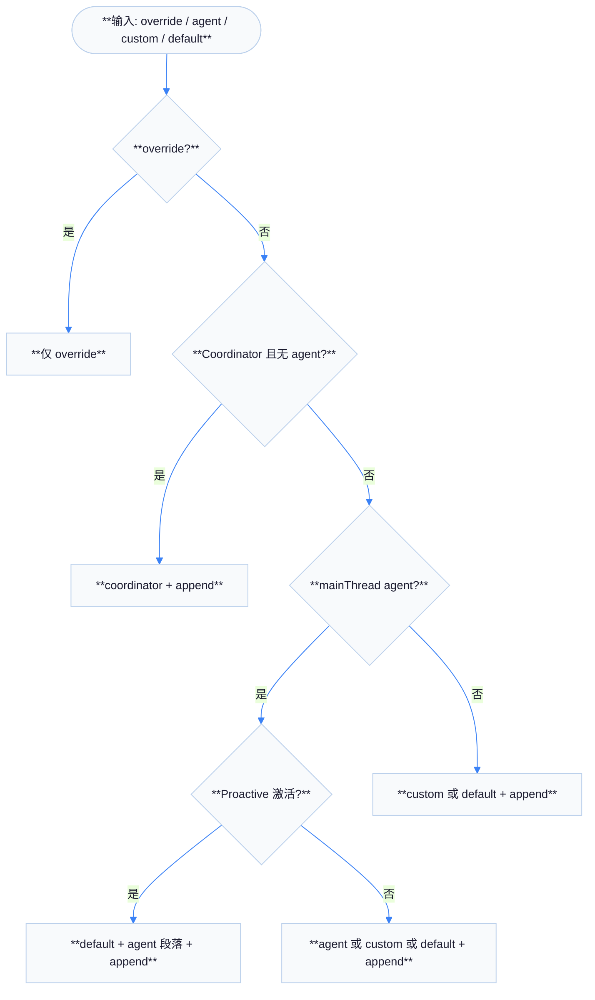
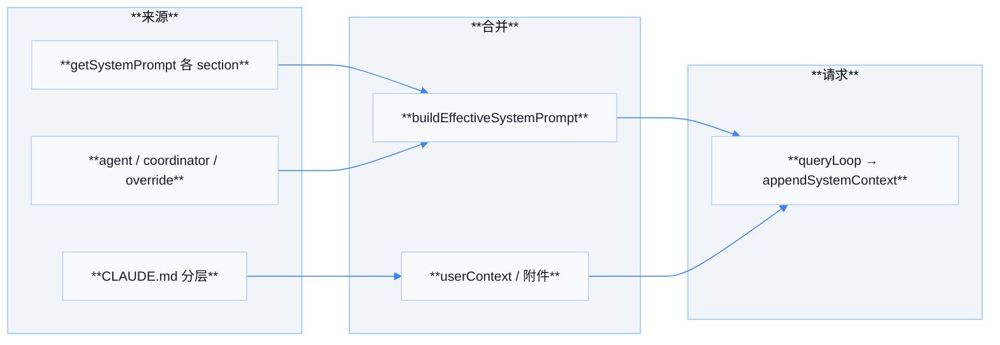
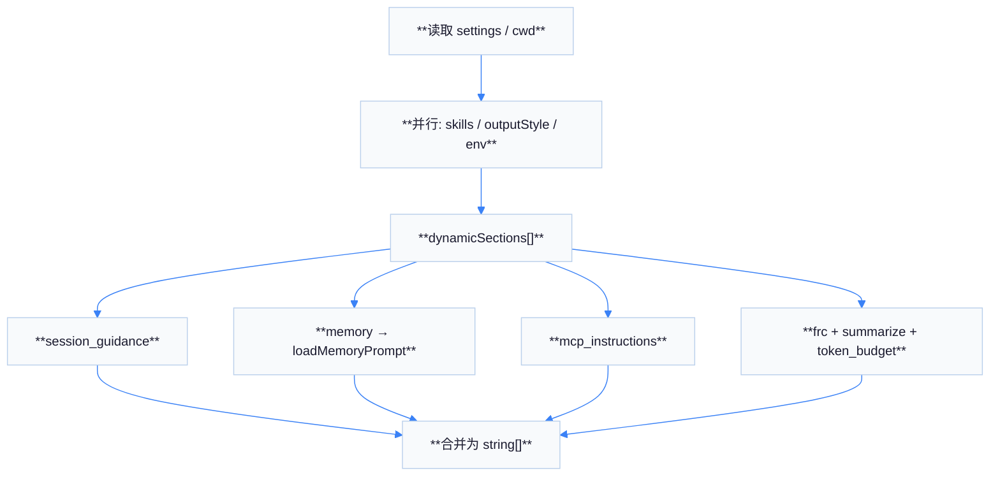

# 05 — 系统提示词设计

系统提示词决定模型在 Claude Code 中的默认行为边界。实际生效内容由 **`buildEffectiveSystemPrompt`**（`utils/systemPrompt.ts`）与 **`getSystemPrompt`**（`constants/prompts.ts`）及 **CLAUDE.md 加载**（`utils/claudemd.ts`）等共同构成。

## `buildEffectiveSystemPrompt` 优先级链

| 优先级 | 条件 | 结果 |
|--------|------|------|
| 0 | **`overrideSystemPrompt`** 存在 | 仅使用该字符串（替换其余主提示） |
| 1 | Coordinator 模式开启（feature + 环境变量）且无主线程 agent | **协调者**专用提示 + 可选 **`appendSystemPrompt`** |
| 2 | 存在 **`mainThreadAgentDefinition`** | 内置 agent 可调 **`getSystemPrompt({ toolUseContext })`**；Proactive 模式下 **追加** 到默认而非替换 |
| 3 | **`customSystemPrompt`**（如 `--system-prompt`） | 在无 agent 时替代默认 |
| 4 | **`defaultSystemPrompt`** | 标准 Claude Code 提示（通常来自 `getSystemPrompt` 等） |
| 尾 | **`appendSystemPrompt`** | 非 override 时**总是附加**在末尾 |

## `getSystemPrompt` 默认块（`constants/prompts.ts`）

在非 **`CLAUDE_CODE_SIMPLE`** 路径下，通过 **`systemPromptSection`** 组合多段内容，主要包括：

| 段标识 | 内容方向 |
|--------|----------|
| `session_guidance` | 会话级行为与技能命令提示 |
| `memory` | **`loadMemoryPrompt()`**（memdir 入口说明等） |
| `env_info_simple` | CWD、日期、多工作目录等环境摘要 |
| `language` | 界面语言 |
| `output_style` | 输出风格配置 |
| `mcp_instructions` | MCP 使用说明（可被 delta 附件替代） |
| `scratchpad` | 草稿区指引 |
| `frc` | Function result clearing 等与模型能力相关说明 |
| `summarize_tool_results` | 工具结果摘要策略 |
| `token_budget` | （feature 开启时）长输出预算续写说明 |

另含 **tone/style**、**1M context**、**网络/安全** 等相关小节（随 feature 与 `USER_TYPE` 变化）。

## CLAUDE.md 分层（`claudemd.ts` 文件头注释）

| 顺序加载 | 范围 | 优先级直觉 |
|----------|------|------------|
| 1 Managed | 如 `/etc/claude-code/CLAUDE.md` | 全局托管 |
| 2 User | `~/.claude/CLAUDE.md` | 用户全局 |
| 3 Project | `CLAUDE.md`、`.claude/CLAUDE.md`、`.claude/rules/*.md` | 自 CWD 向上遍历，**越近 CWD 越后加载 → 越高优先级** |
| 4 Local | `CLAUDE.local.md` | 项目私有 |

**`@include`**：在叶子文本节点展开相对/绝对路径引用；循环引用会被禁止；不存在则忽略。

## 队友追加（`teammatePromptAddendum.ts`）

**`TEAMMATE_SYSTEM_PROMPT_ADDENDUM`** 强调：**必须用 `SendMessage`** 才能被团队看见；用户主要与 **Leader** 交互。

## 用户上下文（`queryContext` / `context` 相关）

会话侧常把 **CLAUDE.md 汇总**、**当前日期**、**git 快照** 等放入 **`userContext`** / 附件（具体拼接见 `fetchSystemPromptParts`、`utils/context` 等与 REPL/QueryEngine 调用链）。`utils/context.ts` 亦承载 **token/窗口** 等与上下文大小相关的常量与函数。

## 流程图：一次 REPL 轮次的提示词来源

## Proactive / Kairos 模式差异

当 **`feature('PROACTIVE') || feature('KAIROS')`** 且 **`isProactiveActive()`** 为真时：

- **`getSystemPrompt`** 走精简「自主 agent」路径（含 **CYBER_RISK**、环境、MCP 说明等）。
- **`buildEffectiveSystemPrompt`** 对 **内置主线程 agent** 采用 **追加** 策略，使其像队友一样「叠」在默认自主提示之上。

## `systemPromptSection` 与缓存

`constants/prompts.ts` 使用 **`systemPromptSection('key', () => ...)`** 包装各段，配合内部缓存 **`getSystemPromptSectionCache()`**（见 `constants/systemPromptSections.ts`）减少重复计算；对 **MCP 连接变化** 敏感的段使用 **`DANGEROUS_uncachedSystemPromptSection`**，避免缓存陈旧指令。

## `appendSystemContext` 与 `userContext`

在 `queryLoop` 中：

- **`fullSystemPrompt`** 使用 **`appendSystemContext(systemPrompt, systemContext)`** 将键值型系统上下文拼入（见 `utils/api.ts` 导出）。
- **`userContext`** 常来自 **`prependUserContext`** 一类路径，与 **git 状态、工作目录说明** 等结合（具体由 REPL / `QueryEngine` 调用链注入）。

## 流程图：`getSystemPrompt` 动态段装配

## 与 `analyzeContext` 的关系

`utils/analyzeContext.ts` 在部分分析路径中直接调用 **`buildEffectiveSystemPrompt`**，用于离线评估「若在此会话配置下，有效系统提示是什么」——说明 **有效提示** 不只是静态 `getSystemPrompt`，而是 **与 agent 定义、override、append 强绑定**。

## `CLAUDE_CODE_SIMPLE` 快速路径

设置环境变量 **`CLAUDE_CODE_SIMPLE`** 时，`getSystemPrompt` 直接返回极短身份 + CWD + 日期字符串，用于调试或最小复现；此时许多默认安全/风格段被省略，**不适合**作为生产安全基线参考。

## 队友与主线程提示边界

| 角色 | 提示组成 |
|------|----------|
| **主线程** | `buildEffectiveSystemPrompt` 完整结果 |
| **队友** | 主提示 + **`TEAMMATE_SYSTEM_PROMPT_ADDENDUM`** |

## 维护建议（阅读源码时）

1. 修改 **`getSystemPrompt`** 任一段落前，确认其是否在 **`systemPromptSection` 缓存**内，避免「改了字符串但线上仍缓存旧值」。
2. **MCP delta** 开启时，部分 MCP 说明改为 **附件** 注入，阅读 `attachments.ts` 相关注释以对照 `prompts.ts` 分支。

## 附录 A：`getSkillToolCommands`

`getSystemPrompt` 并行等待 **`getSkillToolCommands(cwd)`**，把可用 slash skill 命令摘要塞进 **session_guidance**，使模型知道何时应触发 **`$skill`** 工作流。

## 附录 B：`getOutputStyleConfig`

输出风格不仅改变语气，也可能影响 **是否默认使用列表/代码块** 等 UI 层渲染偏好（与 `settings` 联动）。

## 附录 C：`getLanguageSection`

界面语言设置进入系统提示，减少模型与用户终端语言混用；对多语言仓库文档仍建议显式要求输出语言。

## 附录 D：`getAntModelOverrideSection`

内部 **`USER_TYPE === 'ant'`** 路径可注入实验性模型覆盖说明；开源阅读者可忽略该段对终端用户的影响。

## 附录 E：`CYBER_RISK_INSTRUCTION`

Proactive 精简提示中包含 **网络风险** 相关固定段，提醒自主模式下的外连限制；与 Ruflo 文档中的安全章节目标一致但实现层级不同。

## 附录 F：`fetchSystemPromptParts`（`utils/queryContext.ts`）

`QueryEngine` 通过 **`fetchSystemPromptParts`** 聚合 **默认提示 + 插件 + 托管规则** 等片段，再喂给 **`buildEffectiveSystemPrompt`**：是 **比 `getSystemPrompt` 更靠外** 的拼装层。

## 附录 G：排错表

| 问题 | 检查 |
|------|------|
| 规则未生效 | CLAUDE.md **加载顺序**是否被更近目录文件覆盖 |
| 重复段落 | **appendSystemPrompt** 是否与 **custom** 内容重复 |
| MCP 说明缺失 | **delta** 模式是否改为附件路径 |

## 附录 H：`systemPromptType.ts`

**`asSystemPrompt`** 将 `string[]` 规范为 **`SystemPrompt` 品牌类型**，在类型层面防止与纯字符串系统提示混用，减少 **拼接顺序错误**。

## 附录 I：`commands/btw/btw.tsx` 注释链

`btw.tsx` 文档字符串说明 **哪些标志会改变** `buildEffectiveSystemPrompt`  extras（`--agent`、`--system-prompt` 等），是理解 **CLI 标志 → 提示词** 的捷径。

## 附录 J：`compact/compact.ts` 内的 `buildEffectiveSystemPrompt`

压缩命令路径会 **重新计算** 有效系统提示以确保 **compact 后** 的摘要与 **当前 agent 模式** 一致，避免压缩边界两侧 **规则漂移**。

## 附录 K：`getSessionStartDate`

`getSystemPrompt` 将 **会话开始日期** 写入环境与简单模式提示，帮助模型 **不依赖幻觉当前时间**；与 `userContext` 中的日期字段应保持一致语义。

## 附录 L：`SUMMARIZE_TOOL_RESULTS_SECTION`

常量段 **`SUMMARIZE_TOOL_RESULTS_SECTION`** 明确模型应对 **冗长工具输出** 做摘要再进入下一轮，降低 **重复粘贴** 造成的 token 浪费。

## 小结

- **策略优先级** 由 **`buildEffectiveSystemPrompt`** 统一裁决。
- **默认长提示** 由 **`getSystemPrompt`** 模块化拼装，便于缓存与按 feature 裁剪。
- **项目真相源** 在 **CLAUDE.md 分层** 与 **`@include`**；队友另有 **通信追加段**。
