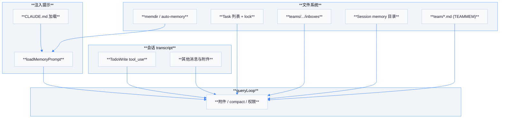
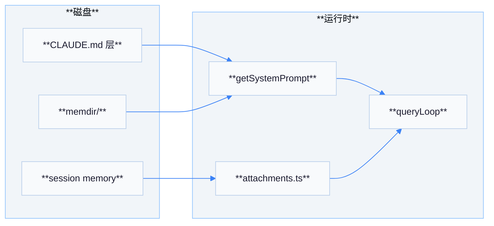

# 06 — 记忆模块设计

「记忆」在 Claude 客户端中不是单一数据库，而是 **多种存储介质的组合**：对话 transcript、文件系统、锁文件、以及专用目录（memdir、teams）。以下为与源码注释及路径一致的分层理解。

## 各记忆系统概览

| 机制 | 位置 / 入口 | 持久化与恢复 |
|------|-------------|--------------|
| **TodoWrite** | `tools/TodoWriteTool`；提醒逻辑见 `utils/messages.ts` | 状态在 **会话 transcript** 的 `tool_use` 中；**`sessionRestore.ts`** 可从 transcript 恢复（含 SDK 场景） |
| **Task 列表** | `utils/tasks.ts`、`tools/Task*Tool` | **文件 + lockfile**；**`getTaskListId()`** 绑定 session 或团队名 |
| **Team 文件记忆** | `memdir/teamMemPaths.ts`、`utils/teamMemoryOps.ts`（feature **TEAMMEM**） | **memdir** 下按项目隔离的 **team/** 树 |
| **邮箱** | `utils/teammateMailbox.ts` | **inbox JSON + lockfile**，见 `04-agent-teams.md` |
| **Session 记忆** | `utils/permissions/filesystem.ts` 中 **`getSessionMemoryDir` / `getSessionMemoryPath`**（summary.md） | 会话级摘要路径，权限系统可识别 **session memory** 读写 |
| **CLAUDE.md** | `utils/claudemd.ts` | **分层规则与项目记忆**，非向量库 |
| **Auto Memory / memdir** | `memdir/paths.ts`、`memdir/memdir.ts`、`loadMemoryPrompt` | 自动记忆目录与入口文档；**`sessionFileAccessHooks`** 等跟踪 memdir 访问遥测 |

## 架构图：记忆子系统

## TodoWrite 与 Task 的边界

| 对比项 | TodoWrite | Task 工具 |
|--------|-----------|-----------|
| 主要用途 | 会话内进度勾选、模型可见的简短清单 | 团队可共享的结构化任务（含持久 ID） |
| 典型存储 | transcript | 磁盘 JSON（与 **task list id** 关联） |
| 代码提示 | `messages.ts` 中温和提醒使用 TodoWrite | `tasks.ts` 注释：非交互模式可强制启用 Task |

## Session Memory 与权限

**`getSessionMemoryPath()`** 指向会话目录下的 **`summary.md`**。**`isSessionMemoryPath`** 在权限/分类器中用于将对此类路径的访问视为会话记忆读写（与任意仓库文件区分）。

## Auto Memory 与遥测

- **`memoryFileDetection.ts`**：统一判断路径是否属于 auto-memory、agent memory、session transcript 等。
- **`sessionFileAccessHooks.ts`**：在 Read/Grep/Glob/Edit/Write 等工具上打点 **`tengu_memdir_*`**，用于观察记忆文件使用形状。

## 压缩与上下文

**SessionMemory** 相关路径与 **compact**（`services/compact/*`）配合：长对话时 summary 与边界消息进入 **`messages`**，与 **Agentic 循环**（`query.ts`）中的 **autocompact / microcompact** 共同控制上下文长度（详见 `02-agentic-loop.md`）。

## `sessionRestore.ts` 与 TodoWrite

| 行为 | 说明 |
|------|------|
| 扫描 transcript | 查找最近一次 **`TodoWrite`** 的 `tool_use` 输入 |
| SDK / 非交互 | 可在恢复会话时 **重建 todo 列表状态**，使 headless 续跑与 UI 一致 |

## `memdir/paths.ts` 关键概念

| API | 用途 |
|-----|------|
| `getAutoMemPath` / `isAutoMemoryEnabled` | 自动记忆根目录是否存在与启用 |
| `getAutoMemEntrypoint` | 作为 `claudemd.ts` 与配置加载的交叉点 |
| `hasAutoMemPathOverride` | 允许覆盖默认记忆目录位置 |

## `memdir/memdir.ts` 与 `loadMemoryPrompt`

**`loadMemoryPrompt`** 在 `QueryEngine.ts` 与 `getSystemPrompt` 中均可能被引用：负责把自动记忆入口文档（经截断 **`truncateEntrypointContent`**）变成模型可读说明，从而与 **CLAUDE.md 规则** 形成「静态规则 + 动态记忆区」双轨。

## 团队记忆路径（feature **TEAMMEM**）

当功能开启时，`claudemd.ts` 通过 **`teamMemPaths`** 可选加载团队记忆文件，使 **同一仓库下多团队** 可挂载不同长期说明（与 `utils/teamMemoryOps.ts` 协同）。

## 流程图：记忆进入模型的路径

## `recordTranscript` 与 `flushSessionStorage`

`QueryEngine.ts` 导入的 **`recordTranscript`** / **`flushSessionStorage`**（`utils/sessionStorage.ts`）将会话消息与侧车文件持久化，使 **TodoWrite**、工具历史与 compact 边界在崩溃恢复后仍可重建。

## 权限与记忆路径白名单

`utils/permissions/filesystem.ts` 将 **auto-memory**、**session memory** 路径纳入专门判定，避免「记忆文件」与「普通仓库文件」在同一权限策略下被误杀或过度放行。

## 与 MCP 记忆的边界

| 存储 | 归属 |
|------|------|
| **memdir / CLAUDE.md** | 客户端本地文件系统 |
| **Ruflo MCP memory_*** | 远端 AgentDB / 混合后端（见 `07-ruflo-dependency.md`） |

二者可同时存在：模型既可能被 **附件** 注入本地记忆摘要，也可能通过 **`mcp__...__memory_*`** 工具读写远端向量记忆。

## 遥测事件（观察用）

| 事件 | 含义 |
|------|------|
| `tengu_memdir_accessed` | 某工具触碰 memdir |
| `tengu_memdir_file_read/edit/write` | 细分读写改 |

## 附录 A：`MAX_MEMORY_CHARACTER_COUNT`

`claudemd.ts` 中 **`MAX_MEMORY_CHARACTER_COUNT = 40000`** 建议单文件上限，超出可能截断或警告，避免提示词爆炸。

## 附录 B：`MEMORY_INSTRUCTION_PROMPT`

加载 CLAUDE 规则时前置 **强覆盖声明**（`MEMORY_INSTRUCTION_PROMPT`），明确 **用户/项目规则优先于默认行为**。

## 附录 C：`memory/types.ts` 与插件记忆

插件可声明 **agent memory** 范围；与 `loadPluginAgents.ts` 的 **`isAutoMemoryEnabled`** 交叉，决定是否挂载额外记忆目录。

## 附录 D：`pluginTelemetry` / `skillLoadedEvent`

记忆与技能加载会发遥测事件（`utils/telemetry/`），用于产品侧分析 **哪些规则最常被激活**，不影响终端功能。

## 附录 E：`compact` 与 transcript 一致性

自动 compact 会在 transcript 中插入 **边界/摘要消息**；恢复会话时必须使用同一套 **session id** 与存储后端，否则 **TodoWrite 扫描** 可能找不到最新块。

## 附录 F：`isTeamMemFile`

`teamMemoryOps` 借助 **`isTeamMemFile`** 判断某路径是否团队记忆，以区别于个人 auto-memory 文件，用于统计与权限。

## 附录 G：实践建议

| 目标 | 建议 |
|------|------|
| 项目规则共享 | 使用 **Project** 层 `CLAUDE.md` 入库 |
| 个人密钥/偏好 | 使用 **Local** 层 `CLAUDE.local.md`（勿提交） |
| 跨会话知识 | **memdir** + Ruflo MCP **memory_*** 互补 |

## 附录 H：`utils/config.ts` 与 `getAutoMemEntrypoint`

全局配置解析阶段即可能探测 **auto-memory 入口文件** 是否存在，以决定是否在首次启动就提示用户初始化 memdir 结构。

## 附录 I：`instructionsLoaded` hooks

`claudemd.ts` 在加载规则后可触发 **`executeInstructionsLoadedHooks`**（若启用），供插件或遥测记录 **规则集版本**，与记忆 **内容** 本身正交。

## 附录 J：`transcriptSearch.ts`

当会话极长时，用户或命令可能使用 **transcript 搜索** 定位某次 **TodoWrite** 或工具调用；该能力读只读存储，不改变 **记忆真相源** 位置。

## 附录 K：`toolResultStorage.ts` 与 memdir

工具结果持久化（`persistToolResult`）与 **memdir 访问钩子** 共享部分路径判断逻辑，避免把 **临时工具缓存** 误记为 **用户记忆访问**。

## 附录 L：`filterDuplicateMemoryAttachments`

`attachments.ts` 在合并附件时 **去重记忆类附件**，避免同一轮 **重复注入** `loadMemoryPrompt` 或 CLAUDE 规则导致提示词膨胀。

## 附录 M：`createAttachmentMessage`

附件消息类型与 **hook**、**队友收件箱**、**MCP delta** 等路径共享创建逻辑；理解该函数有助于追踪 **「记忆」何时以附件而非系统段出现**。

## 小结

- **短期会话状态**：transcript 内的 **TodoWrite** 与各类 **attachment**。
- **结构化协作状态**：**Task 文件** 与 **mailbox**。
- **项目与会话长期说明**：**CLAUDE.md**、**memdir**、**session memory 文件**。
- 这些载体由 **`loadMemoryPrompt`**、**附件管道** 与 **权限分类** 接入同一条 **`queryLoop`**。
