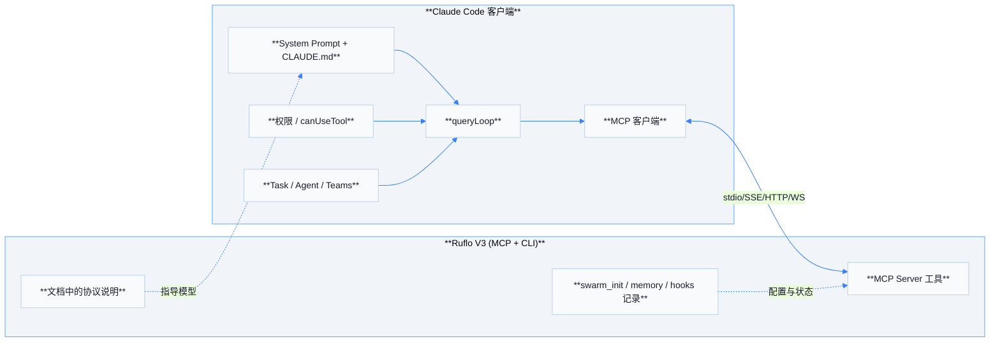
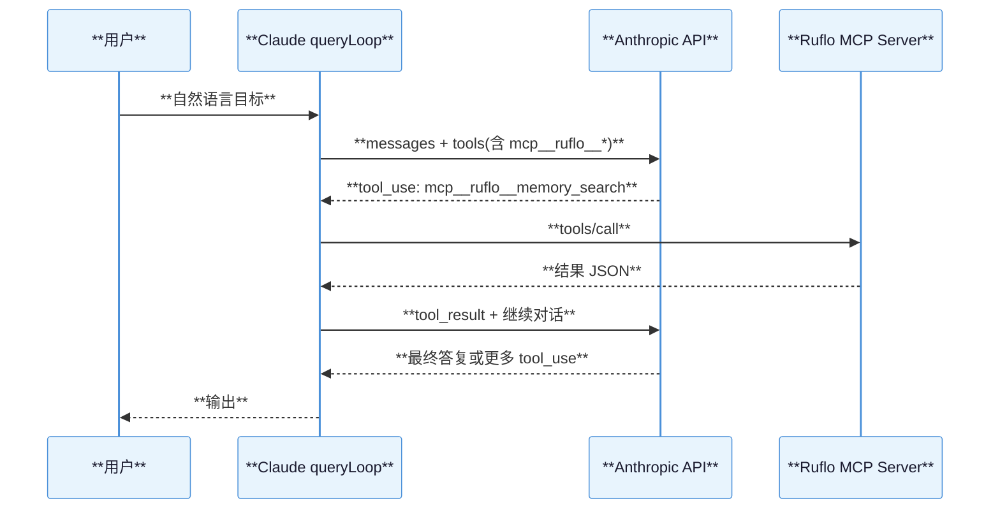
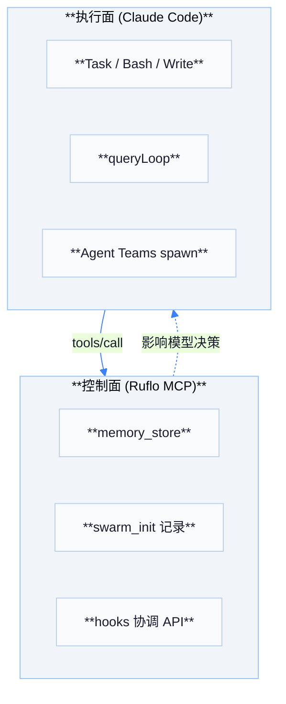

# 07 — Ruflo V3 依赖的 Claude 能力

Ruflo（Claude Flow v3）作为 **MCP 服务器与 CLI 编排层**，不替代 Claude 客户端的执行核心；它依赖下方 Claude Code 能力完成「真干活」与「真对话循环」。以下从协议与运行时角度归纳耦合点。

## 能力映射表

| # | Claude 能力 | Ruflo 侧用法 |
|---|-------------|--------------|
| 1 | **MCP 客户端**（`fetchToolsForClient` / `callMCPTool`） | 用户在 Claude Code 中配置 Ruflo MCP；模型通过 **`mcp__…__…`** 调用 swarm、memory 等工具 |
| 2 | **Task 工具**（`TaskCreate` 等） | Ruflo 的 **agent_spawn** 等多为**编排记录**；子代理的实际执行仍依赖 Claude **Task/Agent** 工具链 |
| 3 | **System Prompt + CLAUDE.md** | 仓库 **`CLAUDE.md`** 中的双模式/swarm 规则**驱动模型行为**；非由 MCP 单独执行 |
| 4 | **Agentic Loop**（`query.ts`） | 任意 MCP `tool_use` 自然嵌入 **多轮 tool 循环**，无需 Ruflo 自建循环 |
| 5 | **Agent Teams** | 官方 **Teammate** 与 Ruflo **swarm** 概念重叠；可并存：Teams 管进程/邮箱，Ruflo 管 MCP 工具与外部记忆 |
| 6 | **权限系统**（`canUseTool` / ToolUseConfirm） | 与 Ruflo **guidance gates** 互补：前者门禁 Bash/Write 等，后者约束编排策略 |
| 7 | **记忆扩展面** | Ruflo 经 MCP **memory_store/search** 等扩展模型可写可读的外部记忆；Claude 仍保留 transcript 与 memdir |

## 依赖关系图

## 时序：Ruflo 工具嵌入一轮 Agentic 回合

## 概念辨析（避免混淆）

| 术语 | 实际执行者 |
|------|------------|
| Ruflo **`swarm_init`**（MCP） | 在 MCP 层登记/协调；**不**等同于启动多个 OS 进程执行代码 |
| Claude **`Task` 工具** | 由 Claude Code 运行时调度子代理会话，是「子 Agent」的主要执行载体之一 |
| Claude **Agent Teams** | 官方多窗格/进程内队友与邮箱；与 Ruflo swarm **协议不同**但可协同使用 |

## 配置面：用户侧最小集合

| 配置项 | 作用 |
|--------|------|
| MCP Server 条目（如 `npx ruflo … mcp`） | 让 **`fetchToolsForClient`** 发现 Ruflo 工具 |
| `CLAUDE.md` / 项目规则 | 约束 **何时** 调用 `swarm_init`、`memory_*` 等 |
| 权限模式（accept/bypass 等） | 决定 Bash/Write/MCP 是否需人工确认 |

## 与 `CLAUDE.md`（本仓库）的叠合

Ruflo 文档中常见的 **Auto-Start Swarm**、**dual-mode** 描述，本质上是 **提示词工程 + 用户工作流**：Claude 客户端 **不会** 因 MCP 注册而自动启动终端外进程；是否调用 **`swarm_init`** 仍由 **模型在对话中决策**。

## 风险与治理分工

| 风险类型 | Claude 侧 | Ruflo 侧 |
|----------|-----------|----------|
| 任意代码执行 | Bash/Write 权限门 | guidance / 策略文档 |
| 数据外泄 | 网络与文件工具门控 | MCP 工具自身的 server 策略 |
| 成本爆炸 | `maxTurns`、compact、token budget | 工具实现内部限流（若有） |

## 流程图：控制面 vs 执行面

## 版本与源码树说明

本文档所引用的 Claude 客户端路径均相对于 **`review/claude/`** 目录；若上游 Anthropic 发布新版本，**文件行号与 feature 门控**可能漂移，但 **MCP 客户端/服务端二分** 与 **`queryLoop` 工具循环** 架构通常保持稳定。

## 集成验证清单

| 步骤 | 预期 |
|------|------|
| `claude mcp list`（或等价 UI） | 能看到 Ruflo server **connected** |
| 新开会话 | `tools/list` 同步后模型系统提示含 MCP 段或附件 |
| 发送「初始化 swarm」类指令 | 出现 **`mcp__...__swarm_init`** 之类 `tool_use`（名称以实际注册为准） |
| 检查 transcript | `tool_result` 与后续 assistant 文本连贯 |

## 延伸阅读顺序（与本目录）

1. `03-mcp-integration.md` — 理解 **tools/list** 与 **tools/call** 在客户端中的落点。  
2. `02-agentic-loop.md` — 理解 **为何一次用户请求会触发多轮 MCP 调用**。  
3. `04-agent-teams.md` — 若同时使用 **官方 Teams** 与 **Ruflo swarm**，先划分职责避免双重协调。

## 附录 A：MCP 工具命名示例（示意）

| 模型所见名称（示意） | 说明 |
|----------------------|------|
| `mcp__ruflo__memory_search` | 以实际 `tools/list` 为准 |
| `mcp__claude-flow__hooks_pre_task` | 取决于 server 注册名 |

**不要**在文档中写死工具名而不核对 **`fetchToolsForClient`** 输出。

## 附录 B：`CLAUDE.md` 与合规

若组织禁止外连，需同时约束：

- Claude **Bash/WebFetch** 类工具权限；
- Ruflo MCP 工具是否触发 **外部 sandbox**（视部署而定）。

## 附录 C：成本模型

| 消耗来源 | 归属 |
|----------|------|
| Anthropic API tokens | Claude 主循环 |
| MCP 调用副作用（如 spawn 云沙箱） | 具体工具实现 |

## 附录 D：与 `AGENTS.md` 的关系

本仓库根 **`AGENTS.md`** 面向 **Codex/多代理** 说明编排哲学；**`CLAUDE.md`** 面向 **Claude Code**。二者可同时存在，模型仅读取其 **各自客户端** 注入的规则集合。

## 附录 E：未来演进观察点

- **`entrypoints/mcp.ts` TODO**：对外 MCP 是否递归暴露子 MCP。
- **`MCP_SKILLS`**：远端技能是否成为与 Ruflo 插件生态的交汇点。

## 附录 F：一句话总结各能力依赖

| 能力 | 依赖句 |
|------|--------|
| MCP | 「Claude 必须是 **客户端**。」 |
| Swarm 文档 | 「Claude 必须 **读提示词并决定调用**。」 |
| 子代理 | 「Claude 必须有 **Task/Agent** 运行时。」 |
| 并行队友 | 「Claude **Agent Teams** 或 **多会话**。」 |

## 附录 G：双模式（Claude + Codex）文档边界

仓库 **`CLAUDE.md`** 中 **Dual-Mode** 段落描述跨产品协作；**Codex 不实现 `query.ts`**。分析 Claude 客户端时，应把 **「Claude Code 执行」** 与 **「Codex 执行」** 在 mentally 分离，仅 **MCP/CLI 命令** 为共享编排面。

## 附录 H：`npx ruflo` 与 `npx claude-flow` 别名

发布文档中 **ruflo** 与 **claude-flow** 可能指向 **同一 umbrella**；MCP 启动命令应以用户 **`mcp.json` / settings** 为准，本文不绑定具体包版本号。

## 附录 I：隐私与数据驻留

| 数据 | 默认位置 |
|------|----------|
| transcript | 用户本机 session 存储 |
| Ruflo memory MCP | 依 Ruflo 后端配置（本地 SQLite / 远端） |

合规评估需 **分别** 审计两者，不可假设「只用 Claude 则无云端记忆」。

## 附录 J：回归测试建议

在升级 **review/claude** 快照后，复跑：

1. 单工具 **MCP roundtrip**（list → call → result）。  
2. **多工具并发**（两个只读 MCP 工具同轮）。  
3. **TeamCreate + TaskCreate** 文件落盘路径。

## 附录 K：与 `hooks` 包（v3）的命名区分

Ruflo **`hooks pre-task`** 等 CLI 与 Claude Code **`executeStopFailureHooks`** 等 **同名不同物**；阅读文档时务必 **带包名/路径** 区分，避免把 **终端内 hook** 当成 **MCP 工具副作用**。

## 小结

Ruflo V3 将自身定位为 **可编排、可记忆、可治理** 的控制面；Claude Code 提供 **MCP 客户端、Agentic 循环、权限与提示词面**。集成成功的关键是：**MCP 工具名进入模型上下文** + **`CLAUDE.md` 约束模型如何组合调用** + **Task/Teams 承担实际并行执行**。
