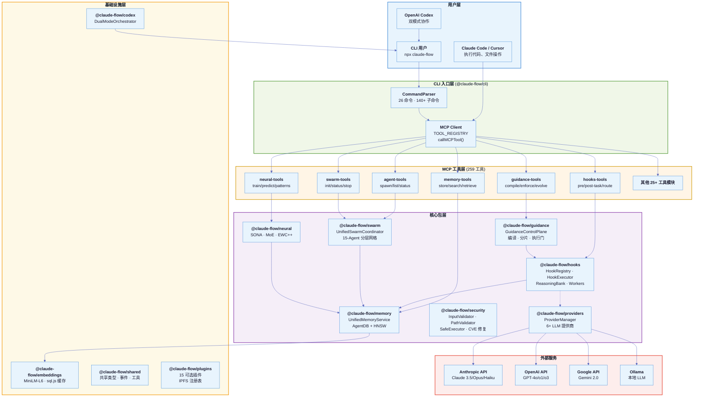
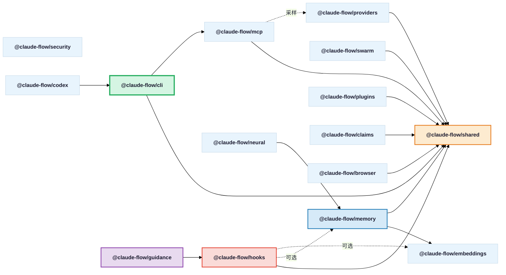

# Ruflo V3 架构总览

> **Ruflo v3.5** — 原名 "Claude Flow"，5,900+ 提交，20 个核心包，259 MCP 工具，60+ Agent 类型

## 1. 项目定位

Ruflo V3 是一个 **AI Agent 编排平台**，核心理念是：

- **Claude Code 执行，Ruflo 协调** — Ruflo 不直接生成代码，而是作为 Claude Code / Codex 的 **编排层** 和 **学习层**
- **MCP-First 设计** (ADR-005) — 所有业务逻辑通过 MCP 工具暴露，CLI 仅是薄包装
- **自进化智能** — 通过 SONA/ReasoningBank/EWC++ 实现跨会话的模式学习和自适应

## 2. 整体架构图

## 3. 包依赖关系图

## 4. 20 个核心包一览

| 包名 | 路径 | 职责 | 关键类/接口 |
|------|------|------|-----------|
| **@claude-flow/cli** | `v3/@claude-flow/cli/` | CLI 入口、命令注册、MCP 工具分发 | `CLI`, `CommandParser`, `TOOL_REGISTRY` |
| **@claude-flow/memory** | `v3/@claude-flow/memory/` | 统一内存服务、向量搜索 | `UnifiedMemoryService`, `AgentDBAdapter`, `HNSWIndex` |
| **@claude-flow/hooks** | `v3/@claude-flow/hooks/` | 钩子注册/执行、ReasoningBank、Workers | `HookRegistry`, `HookExecutor`, `ReasoningBank`, `WorkerManager` |
| **@claude-flow/swarm** | `v3/@claude-flow/swarm/` | Swarm 编排、拓扑管理、共识算法 | `UnifiedSwarmCoordinator`, `TopologyManager`, `ConsensusEngine` |
| **@claude-flow/security** | `v3/@claude-flow/security/` | 输入验证、路径安全、CVE 修复 | `InputValidator`, `PathValidator`, `SafeExecutor` |
| **@claude-flow/guidance** | `v3/@claude-flow/guidance/` | 治理控制面、规则编译、执行门 | `GuidanceControlPlane`, `GuidanceCompiler`, `EnforcementGates` |
| **@claude-flow/providers** | `v3/@claude-flow/providers/` | LLM 提供商抽象、负载均衡 | `ProviderManager`, `AnthropicProvider`, `OpenAIProvider` |
| **@claude-flow/neural** | `v3/@claude-flow/neural/` | 神经网络训练、模式学习 | SONA, MoE, EWC++ 算法 |
| **@claude-flow/embeddings** | `v3/@claude-flow/embeddings/` | 向量嵌入、sql.js 缓存 | MiniLM-L6 384 维、文档分块 |
| **@claude-flow/shared** | `v3/@claude-flow/shared/` | 共享类型、事件系统、工具 | 核心接口定义、事件总线 |
| **@claude-flow/plugins** | `v3/@claude-flow/plugins/` | 插件系统、IPFS 注册表 | `PluginManager`, `PluginRegistry` |
| **@claude-flow/codex** | `v3/@claude-flow/codex/` | Claude + Codex 双模式编排 | `DualModeOrchestrator`, `CollaborationTemplates` |
| **@claude-flow/mcp** | `v3/@claude-flow/mcp/` | MCP 协议、传输层、会话管理 | `MCPServer`, `SamplingManager` |
| **@claude-flow/claims** | `v3/@claude-flow/claims/` | 基于声明的授权 | Claims API |
| **@claude-flow/browser** | `v3/@claude-flow/browser/` | 浏览器自动化 | Browser Agent |
| **@claude-flow/deployment** | `v3/@claude-flow/deployment/` | 部署管理 | Deploy/Rollback |
| **@claude-flow/integration** | `v3/@claude-flow/integration/` | 集成桥接（agentic-flow） | Token Optimizer |
| **@claude-flow/testing** | `v3/@claude-flow/testing/` | 测试工具、Mock、V2 兼容 | Fixtures, Helpers |
| **@claude-flow/aidefence** | `v3/@claude-flow/aidefence/` | AI 防御 | 安全实体/服务 |
| **@claude-flow/performance** | `v3/@claude-flow/performance/` | 性能基准、分析框架 | Benchmark Suite |
