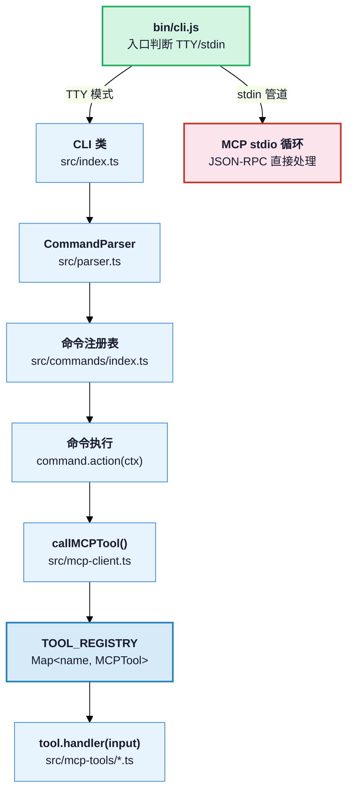
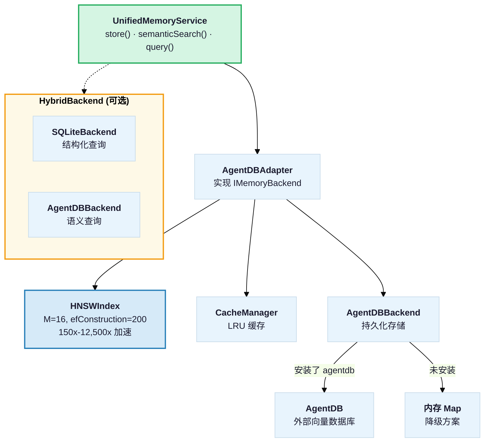
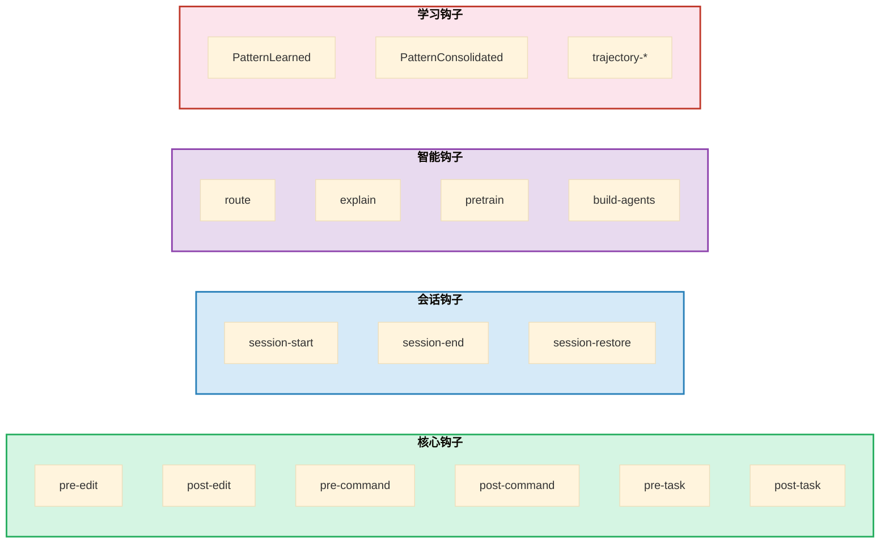
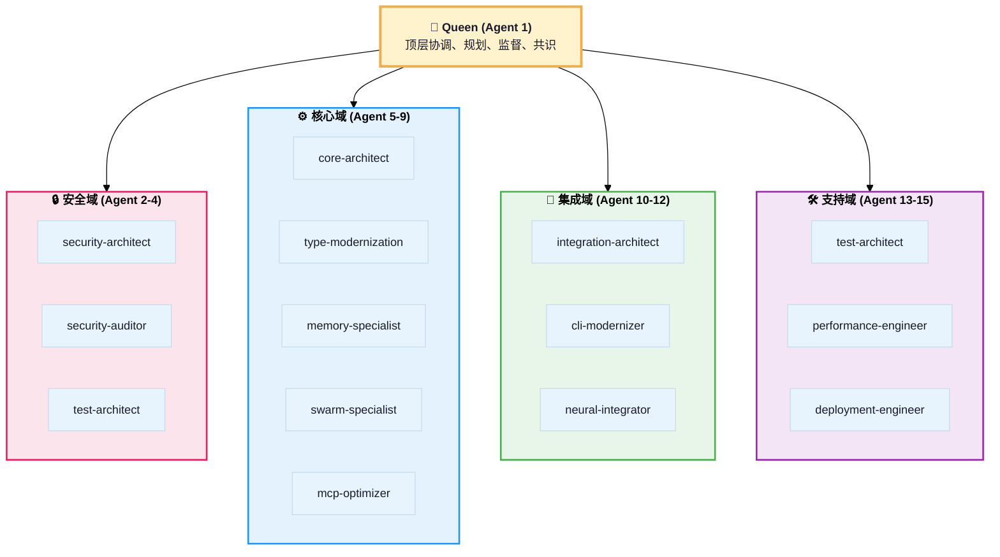
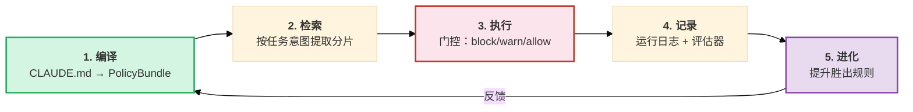

# Ruflo V3 模块深度解析

## 1. CLI 入口层 — @claude-flow/cli

### 1.1 命令系统

CLI 使用 **自定义 CommandParser**（非 Commander/Yargs），通过声明式 `Command` 对象注册命令：



### 1.2 MCP-First 设计 (ADR-005)

核心原则：**所有业务逻辑都在 MCP 工具处理器中**，CLI 命令仅做参数映射和输出格式化。

```
用户输入 → CommandParser 解析 → callMCPTool('tool_name', input) → TOOL_REGISTRY 查找 → handler 执行 → 返回结果
```

`TOOL_REGISTRY` 注册了 **31 个工具模块**，包括：

| 工具模块 | MCP 工具名称 | 功能 |
|---------|------------|------|
| agent-tools | `agent_spawn`, `agent_list`, `agent_status` ... | Agent 生命周期管理 |
| swarm-tools | `swarm_init`, `swarm_status`, `swarm_shutdown` | Swarm 编排控制 |
| memory-tools | `memory_store`, `memory_search`, `memory_retrieve` | 内存读写搜索 |
| hooks-tools | `hooks_pre-task`, `hooks_route`, `hooks_intelligence_*` | 钩子与路由 |
| neural-tools | `neural_train`, `neural_predict`, `neural_patterns` | 神经网络训练 |
| guidance-tools | `guidance_compile`, `guidance_enforce` | 治理控制 |
| agentdb-tools | AgentDB 控制器操作 | V3 数据库控制 |
| autopilot-tools | 自动驾驶模式 | 持续完成流 |

### 1.3 双入口模式

- **TTY 模式**：`new CLI().run()` → 交互式命令行
- **Pipe 模式**：`bin/cli.js` 检测到 stdin 非 TTY → 启动 JSON-RPC stdio MCP 循环
  - 直接作为 MCP 服务器对 Claude Code 暴露 259 个工具

---

## 2. 统一内存系统 — @claude-flow/memory

### 2.1 架构分层



### 2.2 HNSW 索引实现

`HNSWIndex` 是一个完整的 TypeScript HNSW 图实现：
- **M 参数**: 每层最大连接数（默认 16）
- **efConstruction**: 构建时搜索宽度（默认 200）
- **efSearch**: 查询时搜索宽度（默认 100）
- 使用 `BinaryMinHeap` / `BinaryMaxHeap` 进行高效 Top-K 搜索
- 支持增量插入，发射 `point:added` 事件

### 2.3 命名空间

每个 `MemoryEntry` 都有 `namespace: string`，支持按命名空间隔离数据：
- `patterns` — 学习到的成功模式
- `tasks` — 任务执行记录
- `solutions` — 问题解决方案
- `default` — 默认命名空间

### 2.4 查询 API

```typescript
// 语义搜索
const results = await memory.semanticSearch('authentication patterns', 5);

// 流式查询构建器
const entries = await memory.query(
  query()
    .semantic('security vulnerabilities')
    .inNamespace('security')
    .withTags(['critical'])
    .threshold(0.8)
    .limit(10)
    .build()
);
```

---

## 3. 钩子系统 — @claude-flow/hooks

### 3.1 钩子事件类型



### 3.2 ReasoningBank

ReasoningBank 是钩子系统的 **核心学习组件**：

| 功能 | 实现 |
|------|------|
| **模式存储** | 向量化存储到 AgentDB，HNSW 索引加速 |
| **语义搜索** | 基于 MiniLM-L6 (384 维) 嵌入的相似度匹配 |
| **Agent 路由** | `AGENT_PATTERNS` 正则匹配 + 向量相似度 |
| **领域指导** | `DOMAIN_GUIDANCE` 模板库（安全/测试/性能等） |
| **模式晋升** | 短期记忆 → 长期记忆（基于使用次数和质量阈值） |

### 3.3 12 个后台 Worker

| Worker | 优先级 | 触发器 |
|--------|-------|--------|
| `ultralearn` | normal | 深度知识获取 |
| `optimize` | high | 性能优化 |
| `consolidate` | low | 内存整合 |
| `predict` | normal | 预测性预加载 |
| `audit` | critical | 安全分析 |
| `map` | normal | 代码库映射 |
| `preload` | low | 资源预加载 |
| `deepdive` | normal | 深度代码分析 |
| `document` | normal | 自动文档生成 |
| `refactor` | normal | 重构建议 |
| `benchmark` | normal | 性能基准测试 |
| `testgaps` | normal | 测试覆盖率分析 |

---

## 4. Swarm 编排 — @claude-flow/swarm

### 4.1 15-Agent 分层网格结构



### 4.2 核心组件

| 组件 | 类 | 职责 |
|------|---|------|
| **统一协调器** | `UnifiedSwarmCoordinator` | 合并了 4 个遗留系统，15-Agent 域路由 |
| **Queen 协调器** | `QueenCoordinator` | Hive-Mind 中央编排，任务分析与委派 |
| **拓扑管理器** | `TopologyManager` | mesh/hierarchical/centralized/hybrid 拓扑 |
| **消息总线** | `MessageBus` | 1000+ msgs/sec，Agent 间通信 |
| **Agent 池** | `AgentPool` | 工作负载均衡，1-15 Agent 弹性伸缩 |
| **共识引擎** | `ConsensusEngine` | Raft/Byzantine/Gossip 算法 |
| **联邦中心** | `FederationHub` | 临时 Agent 协调 |
| **注意力协调** | `AttentionCoordinator` | Flash/MoE/GraphRoPE 注意力 |

### 4.3 共识算法

| 算法 | 容错能力 | 适用场景 |
|------|---------|---------|
| **Raft** | f < n/2 | 领导者选举，状态复制（默认） |
| **Byzantine** | f < n/3 | 容忍恶意节点 |
| **Gossip** | 最终一致 | 大规模弱一致性传播 |

### 4.4 拓扑类型

| 类型 | 说明 | 推荐场景 |
|------|------|---------|
| `hierarchical` | Queen 直接控制 Worker | 6-8 Agent 反漂移 |
| `mesh` | 全连接对等网络 | 去中心化 |
| `hierarchical-mesh` | 混合模式（推荐） | 10+ Agent |
| `centralized` | 中央协调器 | 简单任务 |
| `hybrid` | 动态切换 | 自适应负载 |

---

## 5. 安全模块 — @claude-flow/security

### 5.1 安全组件

| 组件 | 类 | 功能 |
|------|---|------|
| **输入验证** | `InputValidator` | Zod schema 验证（`SafeStringSchema`, `SpawnAgentSchema` 等） |
| **路径验证** | `PathValidator` | 防止路径遍历，可选符号链接解析 |
| **安全执行器** | `SafeExecutor` | 命令白名单，`execFile` 替代 `exec`，拦截注入 |
| **密码哈希** | `PasswordHasher` | bcrypt 哈希 |
| **令牌生成** | `TokenGenerator` | 安全随机令牌 |
| **CVE 注册表** | `CVE_REGISTRY` | 已知漏洞与修复映射 |

### 5.2 安全架构

采用 DDD 分层：
- `domain/` — `SecurityContext`, `SecurityDomainService`
- `application/` — `SecurityApplicationService`
- 在系统边界处验证所有输入

---

## 6. 治理控制面 — @claude-flow/guidance

### 6.1 五步治理流水线



### 6.2 CLAUDE.md 编译

`GuidanceCompiler` 将 CLAUDE.md 解析为：
1. **Constitution** — 前 30-60 行不可协商的核心规则
2. **Rule Shards** — 按意图/风险/域/路径/工具类标记的规则分片
3. **Manifest** — 机器可读的规则 ID、触发器、验证器

解析模式：
- `RULE_ID_PATTERN` — 匹配 `R001:` 或 `[R001]`
- `RISK_PATTERN` — 匹配 `(critical)`, `[high-risk]`
- `DOMAIN_TAG_PATTERN` — 匹配 `@security`, `@testing`
- `TOOL_TAG_PATTERN` — 匹配 `[edit]`, `[bash]`
- `INTENT_TAG_PATTERN` — 匹配 `#bug-fix`, `#feature`

### 6.3 钩子集成

```
PreCommand  → EnforcementGates.evaluateCommand()  (危险操作 + 秘密检测)
PreToolUse  → EnforcementGates.evaluateToolUse()   (工具白名单 + 秘密检测)
PreEdit     → EnforcementGates.evaluateEdit()      (diff 大小 + 秘密检测)
PreTask     → ShardRetriever.retrieve()            (注入相关规则分片)
PostTask    → RunLedger.finalizeEvent()            (记录运行完成)
```

门控决策分级：`block > require-confirmation > warn > allow`

---

## 7. LLM 提供商 — @claude-flow/providers

### 7.1 统一消息模型

```typescript
interface LLMMessage {
  role: 'system' | 'user' | 'assistant' | 'tool';
  content: string | LLMContentPart[];
  toolCalls?: LLMToolCall[];
}

interface LLMRequest {
  messages: LLMMessage[];
  model?: LLMModel;
  temperature?: number;
  maxTokens?: number;
  tools?: LLMTool[];      // 工具定义
  toolChoice?: 'auto' | 'none' | 'required';
  costConstraints?: { maxCost?: number };
}
```

### 7.2 提供商适配

| 提供商 | 类 | system 消息处理 |
|-------|---|---------------|
| **Anthropic** | `AnthropicProvider` | 提取首个 `role:'system'` 到顶层 `system` 字段 |
| **OpenAI** | `OpenAIProvider` | 直接在 messages 数组中传递 |
| **Google** | `GoogleProvider` | 折叠到 Gemini 特定格式 |
| **Ollama** | `OllamaProvider` | 本地 LLM 适配 |
| **Cohere** | `CohereProvider` | Command-R 系列适配 |

### 7.3 ProviderManager

- **负载均衡**: round-robin / least-loaded / latency-based / cost-based
- **降级策略**: 自动切换 fallback 提供商
- **缓存**: 可配置的响应缓存
- **成本优化**: 按请求成本约束，自动选择经济模型

---

## 8. 双模式协作 — @claude-flow/codex

`DualModeOrchestrator` 实现 Claude + Codex 并行协作：

```mermaid
%%{init: {'theme': 'base', 'themeVariables': {'fontSize': '14px', 'fontFamily': 'Arial'}}}%%
graph TB
    ORCH["<b>DualModeOrchestrator</b>"]

    subgraph SHARED["<b>共享内存</b><br/>npx claude-flow memory store/search"]
        MEM["collaboration 命名空间"]
    end

    subgraph CLAUDE["<b>🔵 Claude Workers</b>"]
        ARCH["Architect (设计)"]
        TEST["Tester (测试)"]
        REV["Reviewer (审查)"]
    end

    subgraph CODEX_W["<b>🟢 Codex Workers</b>"]
        CODE["Coder (实现)"]
        OPT["Optimizer (优化)"]
    end

    ORCH -->|spawn(command, '-p', prompt)| CLAUDE
    ORCH -->|spawn(command, '-p', prompt)| CODEX_W
    CLAUDE --> MEM
    CODEX_W --> MEM

    style ORCH fill:#fff3cd,stroke:#f0ad4e,stroke-width:2px
    style SHARED fill:#e3f2fd,stroke:#2196f3,stroke-width:2px
    style CLAUDE fill:#e8f5e9,stroke:#4caf50,stroke-width:2px
    style CODEX_W fill:#f3e5f5,stroke:#9c27b0,stroke-width:2px
```

协调方式：**基于进程** — 通过 `spawn()` 启动 headless 实例，共享命名空间 + 提示词中嵌入指令调用 `npx claude-flow memory search|store`。
