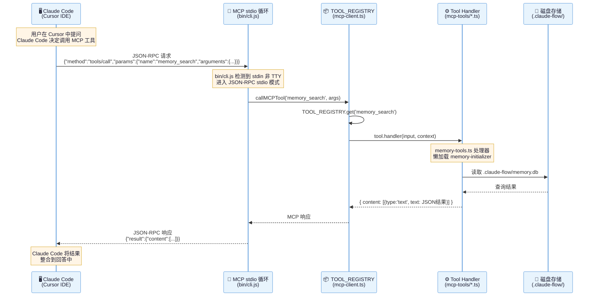
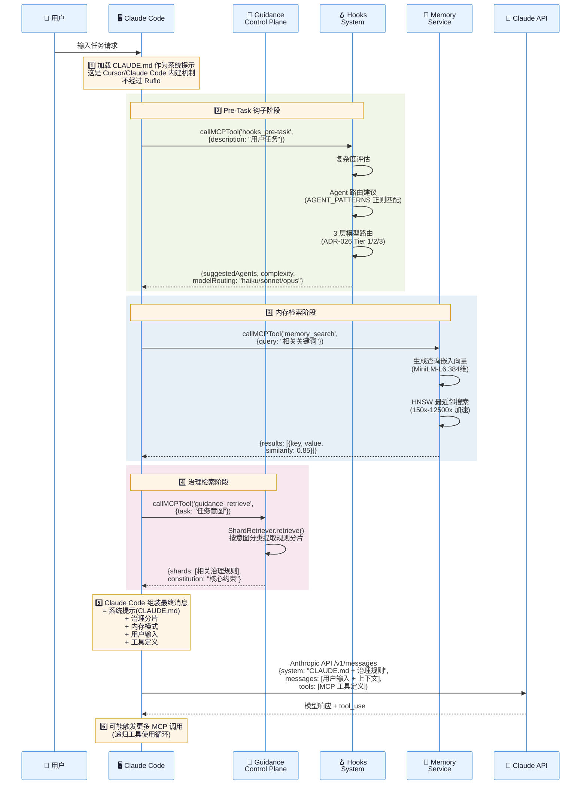
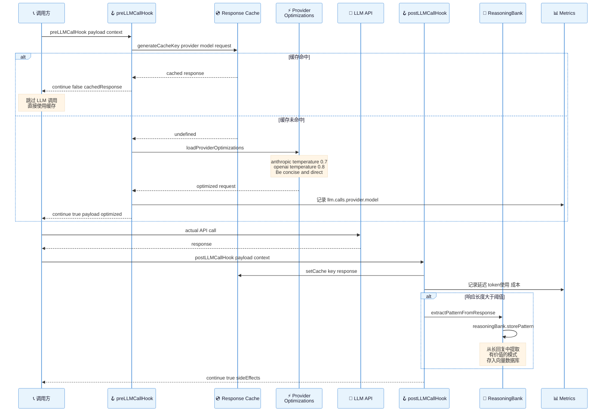
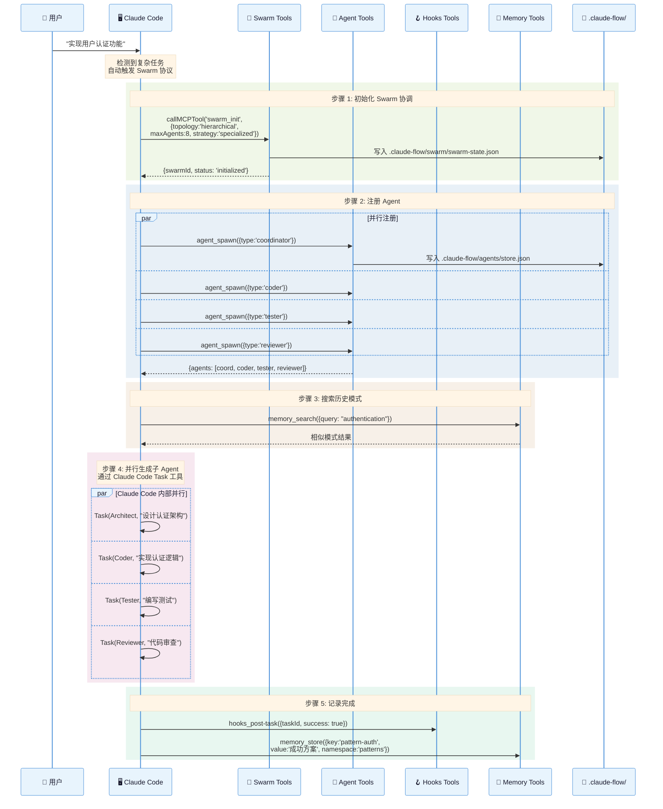
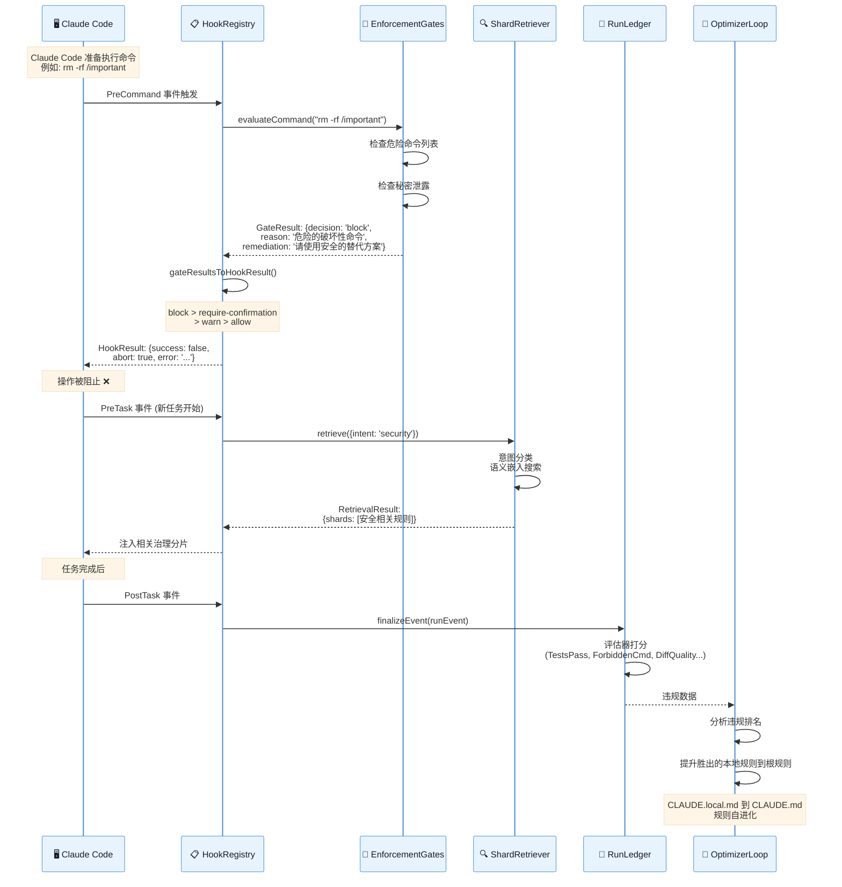
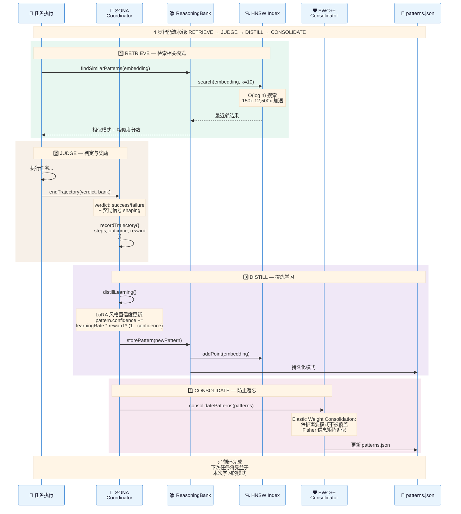
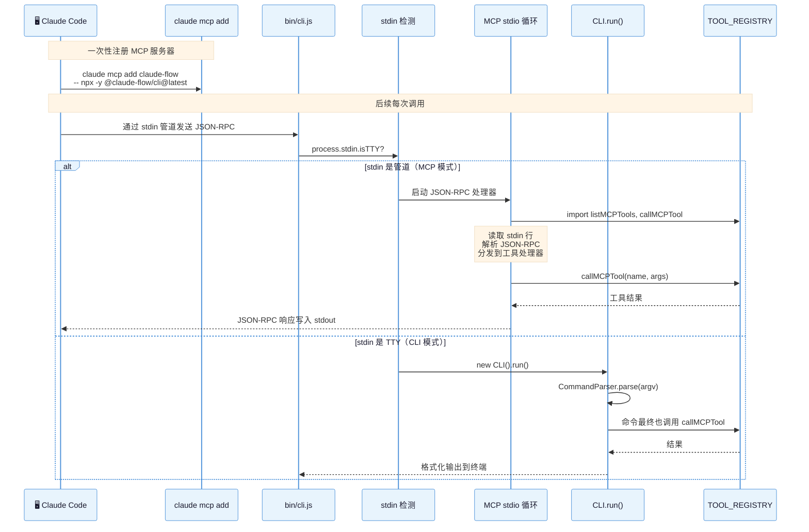
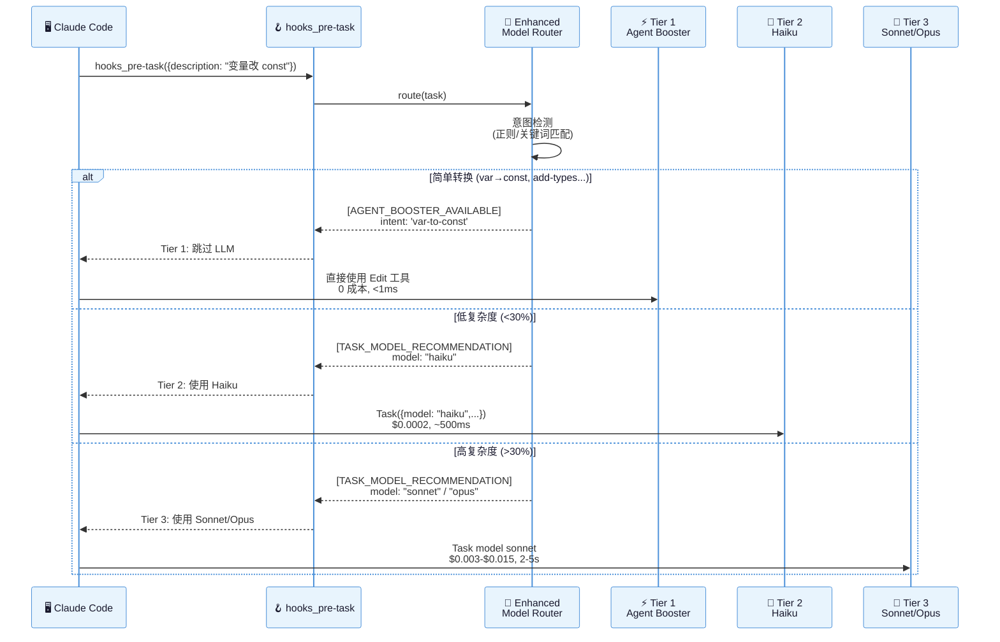
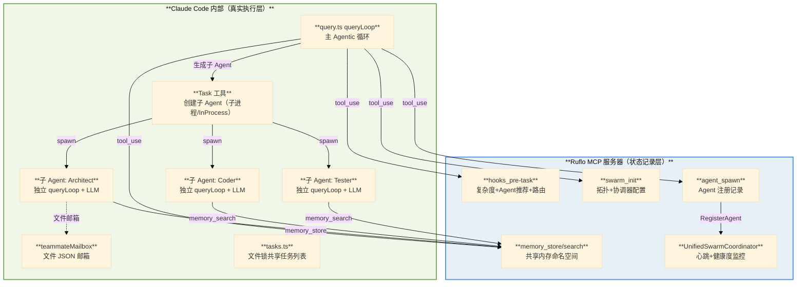

# Ruflo V3 时序图详解

## 1. Claude Code 发起 MCP 工具调用（核心流程）

这是最核心的交互流程：Claude Code 通过 MCP 协议调用 Ruflo 的工具。



## 2. 提示词注入与上下文构建流程

展示 Claude Code 如何通过 Ruflo 构建增强的上下文和提示词。



## 3. LLM 调用的钩子拦截流程

展示 Hooks 系统如何在 LLM 调用前后进行优化和学习。



## 4. Agent Swarm 编排流程

展示从 Claude Code 发起 Swarm 到 Agent 并行执行的完整流程。



## 5. 治理门控执行流程

展示 Guidance 如何在操作执行前进行安全门控检查。



## 6. 自进化学习循环（SONA Pipeline）



## 7. MCP 工具注册与双入口路由



## 8. 3 层模型路由决策流程（ADR-026）



## 9. 完整端到端流程：用户发送"开发一个数据库系统"（深度解析版）

本节展示从用户一句话到最终交付的 **全链路运作机制**，深度剖析以下核心问题：

1. **Swarm 只是记录配置** — Claude 如何做任务拆分和分配？
2. **哪些 Agent 是 Claude 内部的**？它们怎么跟 MCP 交互？
3. **Agent 如何使用 LLM**？怎么注入提示词与上下文历史？
4. **Agent 间如何共享传递信息**？协调者是不是也有个 Agent？
5. **任务依赖、进度检测、失败处理、持续决策**的完整机制

---

### 9.1 架构真相：谁负责什么

> **核心真相**：Ruflo MCP 工具**只负责状态记录与建议**（Agent 注册、内存、模式搜索），**不执行代码**。
> 真正的任务拆分、Agent 创建、LLM 调用都由 **Claude Code 客户端内部**完成。



---

### 9.2 Claude Code 如何做任务拆分和分配

**任务拆分不是算法自动完成的，而是 LLM 推理决策的结果。** 整个过程如下：

1. Claude Code 加载 **CLAUDE.md** 作为 system prompt，其中包含完整的编排规则（如"检测到复杂任务时自动触发 Swarm 协议"）
2. Claude Code 的 **queryLoop**（`query.ts`）将用户消息 + 系统提示 + MCP 工具定义发给 Claude API
3. LLM 基于系统提示中的规则**推理判断**：这是复杂任务 → 应该调 `hooks_pre-task` → 应该初始化 Swarm → 应该创建多个子 Agent
4. LLM 返回 `tool_use` 块，Claude Code 的 **`runTools`** 执行这些 MCP 调用
5. MCP 工具返回建议（推荐 Agent 类型、复杂度、模型路由），**LLM 读取这些建议做出最终决策**
6. LLM 决定生成 N 个 **Task 工具调用**，每个 Task 包含完整的子任务描述

**关键：`CLAUDE.md` 中的规则（如 Agent 路由表、复杂度检测、Swarm 配方）是"驱动 LLM 行为的提示词"，不是可执行代码。**

---

### 9.3 子 Agent 的真实身份

**子 Agent 是 Claude Code 的 Task 工具创建的子进程或同进程实例**，不是 MCP 中的记录。

| 概念 | MCP 侧（Ruflo） | Claude 内部 |
|------|------------------|-------------|
| `agent_spawn` | JSON 注册记录 + 路由元数据 | — |
| Task 工具 | — | 创建真实子 Agent（`runAgent` → `queryLoop`） |
| 子 Agent 进程 | — | InProcess（同进程 AsyncLocalStorage 隔离）或 Tmux/iTerm 独立进程 |
| 子 Agent 的 LLM | — | 每个子 Agent 独立调用 Claude API，有自己的 `messages[]` |

**子 Agent 的提示词注入方式**（源码：`utils/swarm/inProcessRunner.ts`）：
1. **系统提示** = `buildEffectiveSystemPrompt()`，优先级链：override > coordinator > agent定义 > default
2. **default** 部分由 `getSystemPrompt()` 拼装，包含：session guidance + memory prompt + env + MCP 工具说明 + token budget
3. **队友追加段** = `TEAMMATE_SYSTEM_PROMPT_ADDENDUM`（强调必须用 `SendMessage` 通信）
4. **首条用户消息** = 主 Agent 给出的**完整任务描述 + 上下文**（含 MCP 搜索到的历史模式）

---

### 9.4 完整时序图（深度版）

```mermaid
%%{init: {'theme': 'base', 'themeVariables': {'fontSize': '12px', 'fontFamily': 'Arial', 'actorBkg': '#e8f4fd', 'actorTextColor': '#1a1a2e', 'actorBorder': '#4a90d9', 'noteBkgColor': '#fff5e6', 'noteTextColor': '#1a1a2e', 'noteBorderColor': '#d4a017'}}}%%
sequenceDiagram
    participant U as 👤 用户
    participant CC as 🖥️ Claude Code<br/>queryLoop
    participant LLM as 🤖 Claude API
    participant HOOK as 🪝 Hooks MCP
    participant MEM as 🧠 Memory MCP
    participant SW as 🐝 Swarm MCP
    participant AG as 🤖 Agent MCP
    participant COORD as 📋 Coordinator<br/>(Go后台goroutine)
    participant W1 as 🏗️ Architect<br/>子Agent(Task)
    participant W2 as 💻 Coder<br/>子Agent(Task)
    participant W3 as 🧪 Tester<br/>子Agent(Task)
    participant DISK as 💾 存储层

    U->>CC: "开发一个数据库系统"

    Note over CC: ❶ 系统上下文加载<br/>① buildEffectiveSystemPrompt()<br/>  = getSystemPrompt(tools, model) + claudemd<br/>② 发现所有 MCP 工具 (tools/list)<br/>③ 构建 messages = [system + user_input]

    rect rgb(240, 247, 232)
    Note over CC,MEM: ❷ Agentic Loop 第1轮 — LLM 推理 + 预处理
    CC->>LLM: callModel({system, messages, tools})
    Note over LLM: LLM 读取 CLAUDE.md 中的规则:<br/>"复杂任务自动触发 Swarm 协议"<br/>"AUTO-INVOKE SWARM when 3+ files"<br/>判定: 这是复杂任务 → 先调 hooks

    LLM-->>CC: tool_use: hooks_pre-task<br/>{description: "开发数据库系统"}
    Note over CC: runTools() 执行 MCP 调用

    CC->>HOOK: hooks_pre-task(description)
    HOOK->>HOOK: defaultPreTaskHandler:<br/>① 关键词匹配 → suggested_agents<br/>② 复杂度评估 → 0.85 (HIGH)<br/>③ ADR-026 路由 → tier:3 sonnet/opus<br/>④ ReasoningBank 模式检索<br/>⑤ 风险识别: 涉及数据库变更
    HOOK-->>CC: {suggested_agents, complexity:0.85,<br/>model_routing:{tier:3, model:"sonnet/opus"},<br/>risks, patterns}

    Note over CC: tool_result 回到 messages<br/>进入下一轮 queryLoop

    CC->>LLM: [system + user + hook结果]
    LLM-->>CC: tool_use: memory_search<br/>{query: "数据库系统 存储引擎 索引"}

    CC->>MEM: memory_search(query, namespace=patterns)
    MEM->>DISK: HNSW 向量搜索 / SQLite
    DISK-->>MEM: 匹配结果
    MEM-->>CC: {results: [{key:"pattern-db",<br/>value:"B+Tree+WAL", score:0.78}]}
    end

    rect rgb(232, 240, 247)
    Note over CC,AG: ❸ Agentic Loop 第2轮 — Swarm 初始化 + Agent 注册
    CC->>LLM: [system + user + hook + memory结果]
    Note over LLM: LLM 根据 hooks 建议决定:<br/>1. 初始化 hierarchical swarm<br/>2. 注册 3 个 Agent<br/>3. 创建 3 个带依赖的 task

    LLM-->>CC: tool_use x7: swarm_init +<br/>agent_spawn x3 + task_create x3

    par 并行 MCP 调用 (partitionToolCalls 只读并行)
        CC->>SW: swarm_init(topology=hierarchical,<br/>maxAgents=8, strategy=specialized)
        SW->>COORD: NewUnifiedSwarmCoordinator<br/>→ Initialize → healthMonitorLoop
        SW->>DISK: 写入 swarm-state.json
        SW-->>CC: {swarmId, status: initialized}
    and
        CC->>AG: agent_spawn(type=architect, name=arch)
        AG->>AG: 生成 agentId, 写 agents/store.json
        AG->>COORD: coord.RegisterAgent(agent)
        AG-->>CC: {agentId:arch-1, coordinator_sync:synced}
    and
        CC->>AG: agent_spawn(type=coder, name=coder)
        AG->>COORD: coord.RegisterAgent(agent)
        AG-->>CC: {agentId:code-1}
    and
        CC->>AG: agent_spawn(type=tester, name=tester)
        AG->>COORD: coord.RegisterAgent(agent)
        AG-->>CC: {agentId:test-1}
    end

    Note over CC: 串行创建任务 (带依赖关系)

    CC->>SW: task_create(title=设计存储引擎架构)
    SW->>HOOK: hookExec.Execute(PreTask)
    SW-->>CC: {taskId:task-1, analysis:{...}}

    CC->>SW: task_create(title=实现核心代码,<br/>depends_on=[task-1])
    SW-->>CC: {taskId:task-2, depends_on:[task-1]}

    CC->>SW: task_create(title=编写测试套件,<br/>depends_on=[task-1])
    SW-->>CC: {taskId:task-3, depends_on:[task-1]}
    end

    rect rgb(247, 232, 240)
    Note over CC,W3: ❹ 任务拆分 — Claude Code Task 工具生成子 Agent
    CC->>LLM: [全部 MCP 结果 + 继续推理]
    Note over LLM: LLM 产出 3 个 Task 工具调用<br/>每个 Task 包含完整的子任务提示词:<br/>= 任务描述 + 历史模式 + 约束规则<br/>Task 工具是 Claude 内建的, 不走 MCP

    LLM-->>CC: tool_use: Task x3

    par Claude Code 内部 Task 并行生成
        Note over W1: 【Architect 子 Agent 内部流程】<br/>① spawnInProcess/Tmux<br/>② 独立 queryLoop + 独立 LLM 会话<br/>③ system prompt = default + teammate追加段<br/>④ 首条消息 = 主 Agent 给的任务描述

        CC->>W1: Task("设计数据库存储引擎架构,<br/>参考历史模式: B+Tree+WAL,<br/>存入 memory namespace=collaboration")

        W1->>LLM: 独立 callModel<br/>{system: 子Agent专用prompt,<br/> messages: [任务描述]}
        LLM-->>W1: B+Tree 存储引擎方案

        Note over W1: 子 Agent 也有自己的 agentic loop<br/>可调用 MCP 工具

        W1->>MEM: memory_store(key=db-design,<br/>value=B+Tree+WAL方案,<br/>namespace=collaboration)
        MEM->>DISK: SQLite 持久化

        W1->>SW: task_assign(id=task-1, agent_id=arch-1)
        Note over SW: 验证无依赖阻塞 → Agent→Busy

        W1->>SW: task_update(id=task-1, progress=100)
        W1->>SW: task_complete(id=task-1)
        Note over SW: task→Succeeded, Agent→Idle

        W1-->>CC: 架构设计文档
    and
        CC->>W2: Task("按架构实现核心代码,<br/>先 memory_search 获取设计方案,<br/>namespace=collaboration")

        W2->>MEM: memory_search(query=db-design,<br/>namespace=collaboration)
        MEM-->>W2: Architect 存入的设计方案

        Note over W2: 尝试分配 task-2

        W2->>SW: task_assign(id=task-2, agent_id=code-1)
        Note over SW: 检查 depends_on:[task-1]<br/>若 task-1 未完成 → blocked:true<br/>Coder 轮询等待

        W2->>LLM: 根据设计方案生成代码
        LLM-->>W2: 存储引擎实现

        W2->>SW: task_update(id=task-2, progress=100)
        W2->>SW: task_complete(id=task-2)
        W2-->>CC: src/engine.ts src/index.ts
    and
        CC->>W3: Task("编写数据库系统测试套件,<br/>先 memory_search 获取设计方案")

        W3->>MEM: memory_search(query=数据库测试模式)
        MEM-->>W3: 历史测试模式

        W3->>SW: task_assign(id=task-3, agent_id=test-1)
        Note over SW: 检查 depends_on:[task-1]<br/>task-1 完成 → 允许分配

        W3->>LLM: 生成测试代码
        LLM-->>W3: 测试套件
        W3->>SW: task_complete(id=task-3)
        W3-->>CC: tests/engine.test.ts
    end
    end

    rect rgb(232, 247, 240)
    Note over CC,DISK: ❺ 协调器后台监控（与上述并行运行）
    Note over COORD: Go goroutine 后台运行:<br/>healthMonitorLoop (HeartbeatMS间隔)<br/>① 遍历 c.agents 检查 LastHeartbeat<br/>② 检查 stale agent (超过阈值)<br/>③ 计算 domainHealth / agentHealth<br/>④ 检测队列深度瓶颈<br/>⑤ 生成 HealthReport

    COORD->>COORD: tickHealth()<br/>status: 所有Agent=Idle<br/>无超时/无失败
    end

    rect rgb(247, 247, 232)
    Note over CC,DISK: ❻ 结果整合 + SONA 学习闭环
    Note over CC: 3 个子 Agent 全部返回<br/>queryLoop 收集所有 tool_result

    CC->>LLM: [system + 全部历史 + 3个Agent结果]
    LLM-->>CC: 综合回答 + 代码文件清单

    CC->>HOOK: hooks_post-task(success=true)
    HOOK->>HOOK: defaultPostTaskHandler:<br/>① SONA.RecordSignal(post_task_success)<br/>② 学习记录: patterns_updated, confidence

    CC->>MEM: memory_store(namespace=patterns,<br/>key=pattern-db-system,<br/>value=B+Tree+WAL成功方案)
    MEM->>DISK: 持久化成功模式
    end

    CC-->>U: 完成! 已创建数据库系统<br/>包含存储引擎 B+Tree索引 WAL日志<br/>以及完整测试套件

    Note over U,DISK: ━━━━━━━━━━ 用户反馈 ━━━━━━━━━━

    U->>CC: "查询性能太差了 需要优化"

    rect rgb(255, 243, 224)
    Note over CC,DISK: ❼ 反馈驱动 — 动态追加 Agent

    CC->>LLM: 用户反馈 + 完整历史上下文
    LLM-->>CC: tool_use: hooks_route

    CC->>HOOK: hooks_route(task=优化查询性能)
    HOOK->>HOOK: HashEmbed384 → RouteTask<br/>ReasoningBank 向量相似度搜索<br/>匹配: performance-engineer (0.89)
    HOOK-->>CC: {agent:performance-engineer,<br/>tier:3, confidence:0.89}

    CC->>MEM: memory_search(query=数据库性能优化)
    MEM-->>CC: 历史优化模式: 缓存+索引优化

    CC->>AG: agent_spawn(type=performance-engineer)
    AG->>COORD: coord.RegisterAgent(perf-agent)
    AG-->>CC: {agentId:perf-1, coordinator_sync:synced}

    Note over CC: LLM 决定创建新 Task<br/>携带历史模式 + 反馈上下文

    CC->>W2: Task("优化数据库查询性能,<br/>参考模式: 缓存+索引优化,<br/>用户反馈: 查询太慢")
    W2->>LLM: 优化请求 + 完整上下文
    LLM-->>W2: 查询计划缓存 + 索引提示优化
    W2-->>CC: 优化后的代码

    CC->>HOOK: hooks_post-task(success=true)
    HOOK->>HOOK: SONA.RecordSignal<br/>学习: performance优化模式
    CC->>MEM: memory_store(key=pattern-db-perf,<br/>value=查询计划缓存3x提升)
    end

    CC-->>U: 已优化! 添加了查询计划缓存<br/>预计提升3x查询性能
```



---

### 9.5 关键机制深度解析

#### A. Claude 如何做任务拆分

| 步骤 | 执行者 | 机制 | 源码位置 |
|------|--------|------|----------|
| 加载编排规则 | Claude Code | `CLAUDE.md` 中的 Swarm 配方和 Agent 路由表作为 system prompt | `utils/claudemd.ts` |
| 复杂度判定 | LLM | 基于 system prompt 中的规则推理，决定是否触发 Swarm | `query.ts` queryLoop |
| 预处理建议 | Ruflo MCP | `hooks_pre-task` 返回推荐 Agent、复杂度、模型路由 | `default_hooks.go` |
| 最终拆分决策 | LLM | 读取 MCP 建议，决定子任务数量和分配 | `query.ts` queryLoop |
| 子 Agent 创建 | Claude Code Task 工具 | `spawnInProcess` / `TmuxBackend`，每个子 Agent 有独立 queryLoop | `inProcessRunner.ts` |

#### B. 子 Agent 的 LLM 与提示词

```
子 Agent 提示词构成:
┌──────────────────────────────────────────────────┐
│ buildEffectiveSystemPrompt():                    │
│   ├── getSystemPrompt(tools, model)              │
│   │     ├── session guidance                     │
│   │     ├── loadMemoryPrompt() // memdir 记忆    │
│   │     ├── env info                             │
│   │     ├── MCP 工具说明                          │
│   │     ├── output style + FRC                   │
│   │     └── token budget                         │
│   ├── TEAMMATE_SYSTEM_PROMPT_ADDENDUM            │
│   │     └── "必须用 SendMessage 通信"              │
│   └── appendSystemPrompt (可选)                   │
├──────────────────────────────────────────────────┤
│ 首条用户消息 (主 Agent 传入):                      │
│   "设计数据库存储引擎架构,                          │
│    参考历史模式: B+Tree+WAL,                       │
│    存入 memory namespace=collaboration"            │
└──────────────────────────────────────────────────┘
```

每个子 Agent 有自己的 `messages[]` 状态，**独立调用 Claude API**，与主 Agent 完全隔离。

#### C. Agent 间信息共享

**三种通信方式**（按使用频率排序）：

| 方式 | 机制 | 适用场景 |
|------|------|----------|
| **共享内存命名空间** | `memory_store/search(namespace=collaboration)` via MCP | 任务数据传递：Architect 写设计，Coder 读设计 |
| **文件邮箱** | `teammateMailbox.ts`：`~/.claude/teams/{team}/inboxes/{agent}.json` | 控制面消息：权限请求、shutdown、进度通知 |
| **共享任务列表** | `tasks.ts`：文件+lockfile，`getTaskListId()` 保证团队一致 | 任务状态同步：leader 和 teammates 看到同一列表 |

**内存总线模式**：Architect 写入 `memory_store(key=db-design, namespace=collaboration)`，Coder 在稍后通过 `memory_search(namespace=collaboration)` 读取。这是**异步的**，不是实时消息传递。

#### D. 协调者角色

| 层面 | 角色 | 是否是 Agent | 实现 |
|------|------|-------------|------|
| **Claude 客户端** | 主 queryLoop | 不是独立 Agent，是主进程 | `query.ts` |
| **Ruflo MCP** | UnifiedSwarmCoordinator | Go 后台 goroutine，不是 MCP Agent | `pkg/swarm/coordinator.go` |
| **概念上的 Queen** | 健康监控 + 心跳检测 | 库内服务类，操作 coordinator 的 agents Map | `queen-coordinator.ts` (V3) / `coordinator.go` (Go) |

**协调器工作方式**：
1. `swarm_init` 创建 `UnifiedSwarmCoordinator`，启动后台 `healthMonitorLoop` goroutine
2. `agent_spawn` 调用 `coord.RegisterAgent()` 把 Agent 注册到协调器
3. 协调器按 `HeartbeatMS` 间隔 `tickHealth()`，遍历 `c.agents` 检查 `LastHeartbeat`
4. 协调器**不主动分配任务**，只做监控和状态报告
5. **真正的任务编排由 Claude Code 主 queryLoop（LLM 推理）驱动**

#### E. 任务依赖关系处理

```
task-1: 设计架构 (无依赖)
task-2: 实现代码 (depends_on: [task-1])
task-3: 编写测试 (depends_on: [task-1])

执行顺序:
  Level 0: [task-1]           ← Architect 立即执行
  Level 1: [task-2, task-3]   ← 等 task-1 完成后并行执行

task_assign 时的依赖检查:
  ① 遍历 td.DependsOn
  ② 依赖任务不存在 → missing_task_ids
  ③ 依赖任务未 Succeeded → pending_task_ids
  ④ 有阻塞 → 返回 blocked:true，不修改状态
```

#### F. 失败处理与状态流转

```
Agent 生命周期:
  idle → busy (task_assign) → idle (task_complete/cancel)
                             → stopped (agent_terminate)

Task 生命周期:
  pending → queued (task_assign) → succeeded (task_complete)
                                 → cancelled (task_cancel)
                                 → blocked (依赖未满足)

失败时:
  ① Claude LLM 收到子 Agent 错误返回
  ② LLM 推理决定: 重试/换 Agent/放弃
  ③ 可能: agent_spawn 新 Agent + task_create 新任务
  ④ hooks_post-task(success=false) → SONA 记录失败信号
```

---

### 9.6 阶段总览表

| 阶段 | 驱动者 | LLM 调用 | MCP 工具 | 内存操作 | 学习操作 |
|------|--------|----------|----------|---------|---------|
| **❶ 上下文加载** | Claude Code | — | tools/list | claudemd 加载 | — |
| **❷ 预处理** | Claude queryLoop | 主 LLM 推理 + tool_use | hooks_pre-task, memory_search | 查历史模式 | 路由建议 |
| **❸ Swarm 初始化** | Claude queryLoop | 主 LLM 决定拓扑 | swarm_init, agent_spawn x3, task_create x3 | — | Agent 注册 |
| **❹ 并行执行** | 子 Agent (Task) | 每个子 Agent 独立 LLM | memory_store/search, task_assign/complete | 共享命名空间 | — |
| **❺ 协调监控** | Coordinator goroutine | 不调 LLM | — | 心跳状态 | 健康度 |
| **❻ 整合学习** | Claude queryLoop | 主 LLM 综合 | hooks_post-task, memory_store | 存储模式 | SONA信号 |
| **❼ 反馈调整** | Claude queryLoop | 主 LLM 路由 | hooks_route, agent_spawn, memory_search | 搜索优化模式 | 新模式 |
