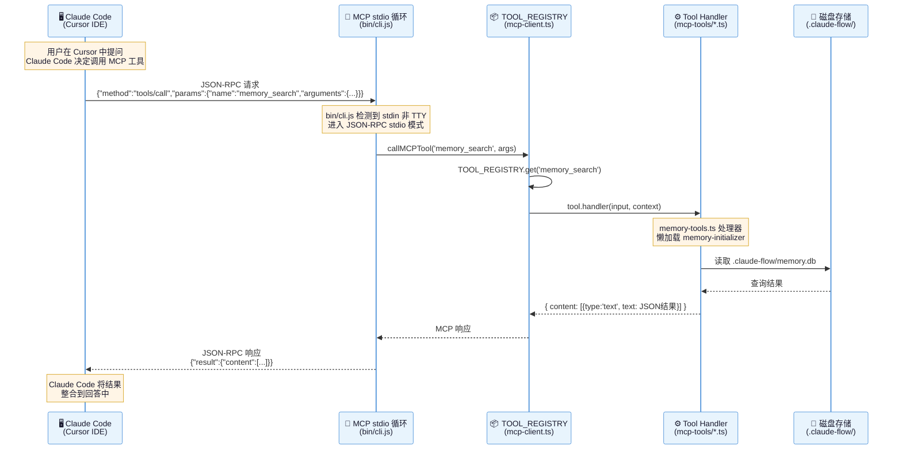
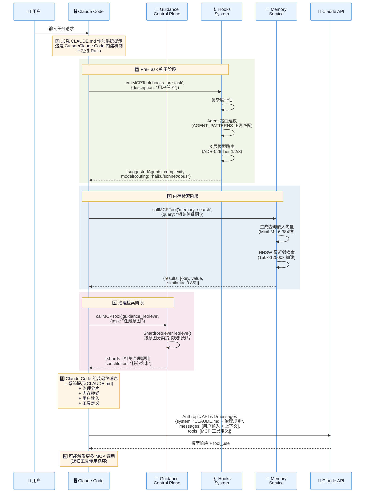
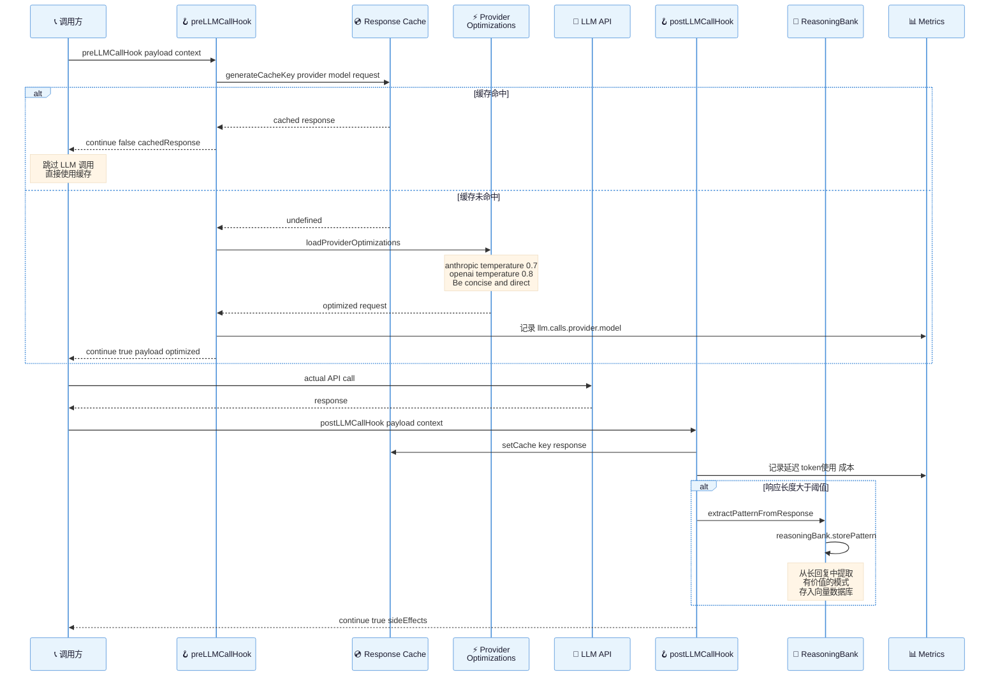
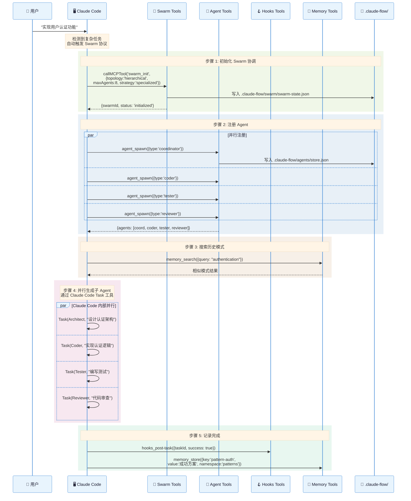
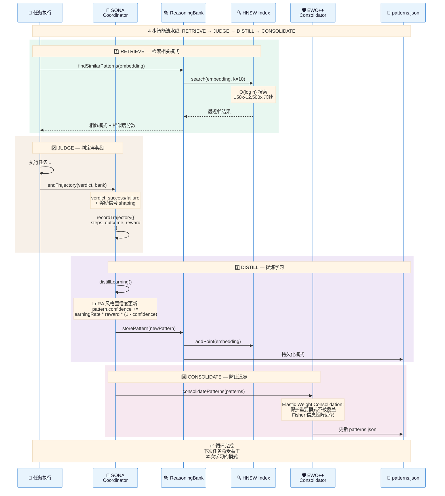
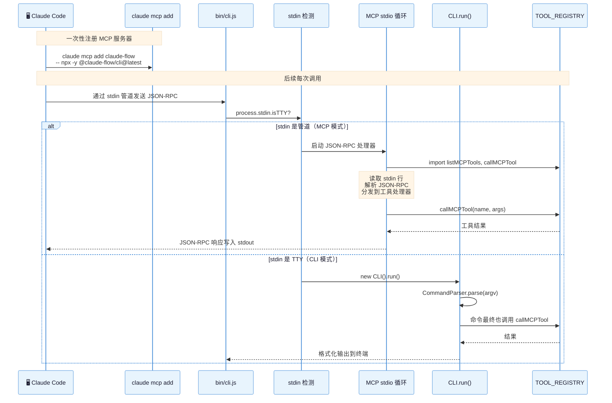
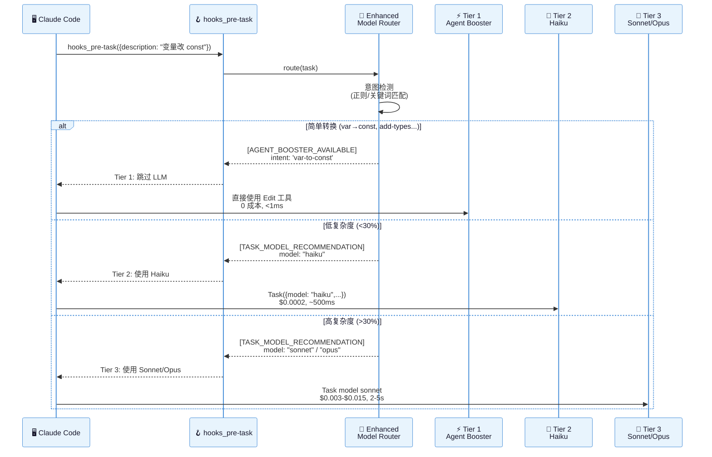
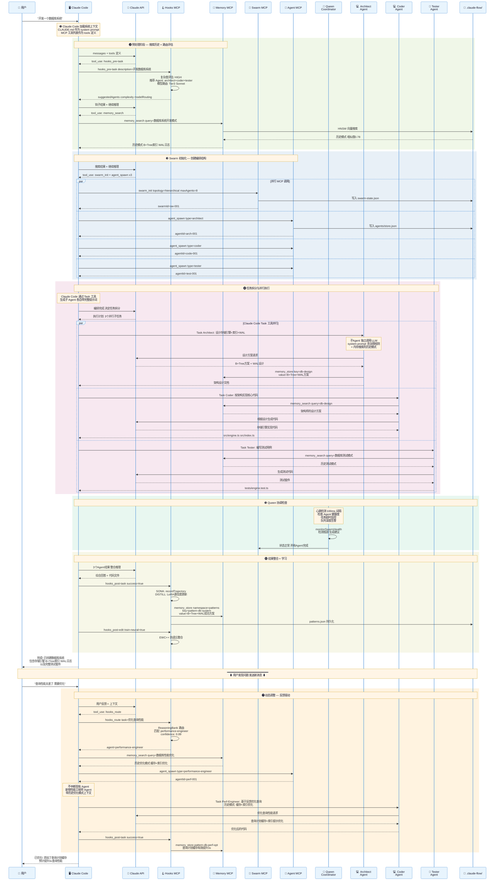

# Ruflo V3 时序图详解

## 1. Claude Code 发起 MCP 工具调用（核心流程）

这是最核心的交互流程：Claude Code 通过 MCP 协议调用 Ruflo 的工具。



## 2. 提示词注入与上下文构建流程

展示 Claude Code 如何通过 Ruflo 构建增强的上下文和提示词。



## 3. LLM 调用的钩子拦截流程

展示 Hooks 系统如何在 LLM 调用前后进行优化和学习。



## 4. Agent Swarm 编排流程

展示从 Claude Code 发起 Swarm 到 Agent 并行执行的完整流程。



## 5. 治理门控执行流程

展示 Guidance 如何在操作执行前进行安全门控检查。

```mermaid
%%{init: {'theme': 'base', 'themeVariables': {'fontSize': '13px', 'fontFamily': 'Arial', 'actorBkg': '#e8f4fd', 'actorTextColor': '#1a1a2e', 'actorBorder': '#4a90d9', 'noteBkgColor': '#fff5e6'}}}%%
sequenceDiagram
    participant CC as 🖥️ Claude Code
    participant HOOK_REG as 📋 HookRegistry
    participant GATES as 🚧 EnforcementGates
    participant RETRIEVER as 🔍 ShardRetriever
    participant LEDGER as 📔 RunLedger
    participant OPT as 🔄 OptimizerLoop

    Note over CC: Claude Code 准备执行命令<br/>例如: rm -rf /important

    CC->>HOOK_REG: PreCommand 事件触发

    HOOK_REG->>GATES: evaluateCommand("rm -rf /important")
    GATES->>GATES: 检查危险命令列表
    GATES->>GATES: 检查秘密泄露
    GATES-->>HOOK_REG: GateResult: {decision: 'block',<br/>reason: '危险的破坏性命令',<br/>remediation: '请使用安全的替代方案'}

    HOOK_REG->>HOOK_REG: gateResultsToHookResult()
    Note over HOOK_REG: block > require-confirmation<br/>> warn > allow

    HOOK_REG-->>CC: HookResult: {success: false,<br/>abort: true, error: '...'}

    Note over CC: 操作被阻止 ❌

    CC->>HOOK_REG: PreTask 事件 (新任务开始)
    HOOK_REG->>RETRIEVER: retrieve({intent: 'security'})
    RETRIEVER->>RETRIEVER: 意图分类<br/>语义嵌入搜索
    RETRIEVER-->>HOOK_REG: RetrievalResult:<br/>{shards: [安全相关规则]}
    HOOK_REG-->>CC: 注入相关治理分片

    Note over CC: 任务完成后

    CC->>HOOK_REG: PostTask 事件
    HOOK_REG->>LEDGER: finalizeEvent(runEvent)
    LEDGER->>LEDGER: 评估器打分<br/>(TestsPass, ForbiddenCmd, DiffQuality...)
    LEDGER-->>OPT: 违规数据

    OPT->>OPT: 分析违规排名
    OPT->>OPT: 提升胜出的本地规则到根规则
    Note over OPT: CLAUDE.local.md → CLAUDE.md<br/>规则自进化
```

## 6. 自进化学习循环（SONA Pipeline）



## 7. MCP 工具注册与双入口路由



## 8. 3 层模型路由决策流程（ADR-026）



## 9. 完整端到端流程：用户发送"开发一个数据库系统"

这张图展示了从用户一句话到最终交付的 **全链路运作机制**，包括任务拆分、Agent 安排、协调检查、Worker 通信、LLM 调用、内存学习，以及用户反馈后的动态调整。

> **核心原则**：用户的一句话 → Claude Code 识别复杂度 → 触发 Ruflo MCP 编排 → 并行 Agent 执行 → 持续学习 → 返回结果



### 关键机制解析

**一句话驱动整体流程**：用户只需说 "开发一个数据库系统"，Claude Code 基于 CLAUDE.md 系统提示中的编排规则，自动检测复杂度、查询历史、初始化 Swarm、拆分任务、并行执行、学习模式、返回结果。

| 阶段 | 驱动者 | LLM 调用方式 | 内存操作 | 学习操作 |
|------|--------|------------|---------|---------|
| **预处理** | Claude Code | 主 LLM 推理 + tool_use | memory_search 查历史 | — |
| **编排** | Claude Code via MCP | 主 LLM 决定拆分 | — | hooks_pre-task 路由 |
| **并行执行** | 子 Agent (Task) | 每个子 Agent 独立调用 LLM | memory_search/store 共享 | — |
| **协调检查** | Queen (定时器) | 不调用 LLM | 状态写入 swarm-state | 心跳+健康度 |
| **结果整合** | Claude Code | 主 LLM 综合推理 | — | SONA+EWC++ 学习 |
| **反馈调整** | Claude Code | 主 LLM 重新路由 | 搜索历史优化模式 | 存储新模式 |

**Agent 间通信**：通过 **共享内存命名空间** 实现 — Architect 写入 `db-design`，Coder 读取 `db-design`；不是直接消息传递，而是 **内存总线模式**。

**用户反馈调整**：不会销毁现有 Agent，而是 **新增专业 Agent** (performance-engineer) 并携带历史模式上下文，实现增量优化。
