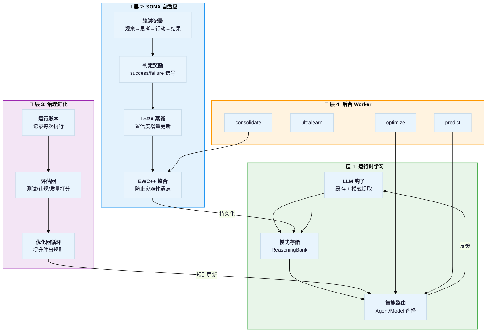
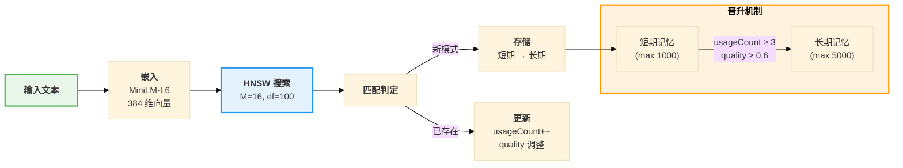
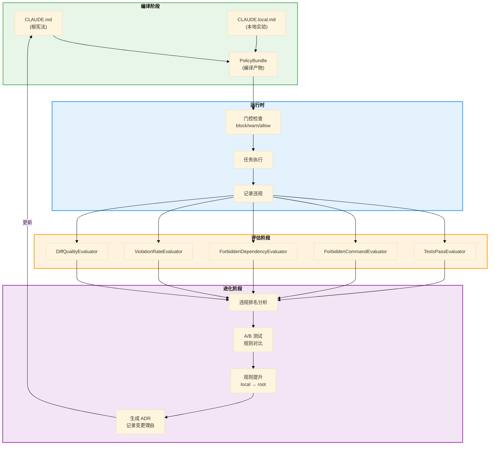
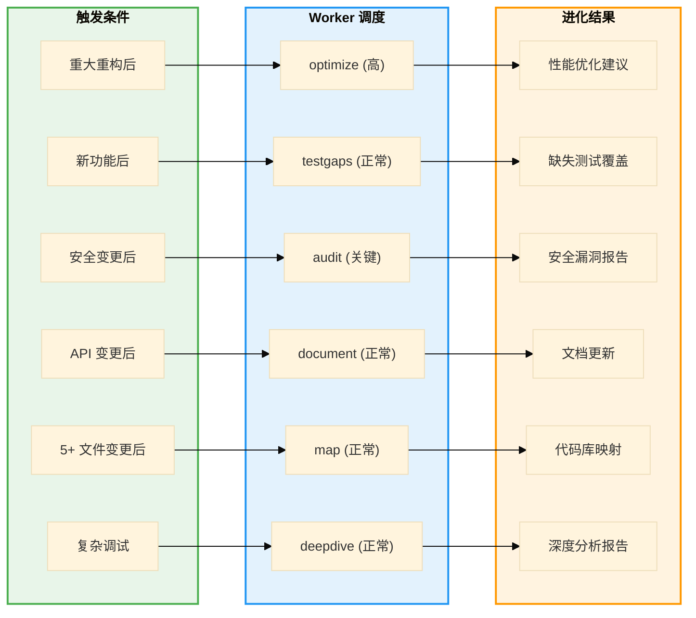
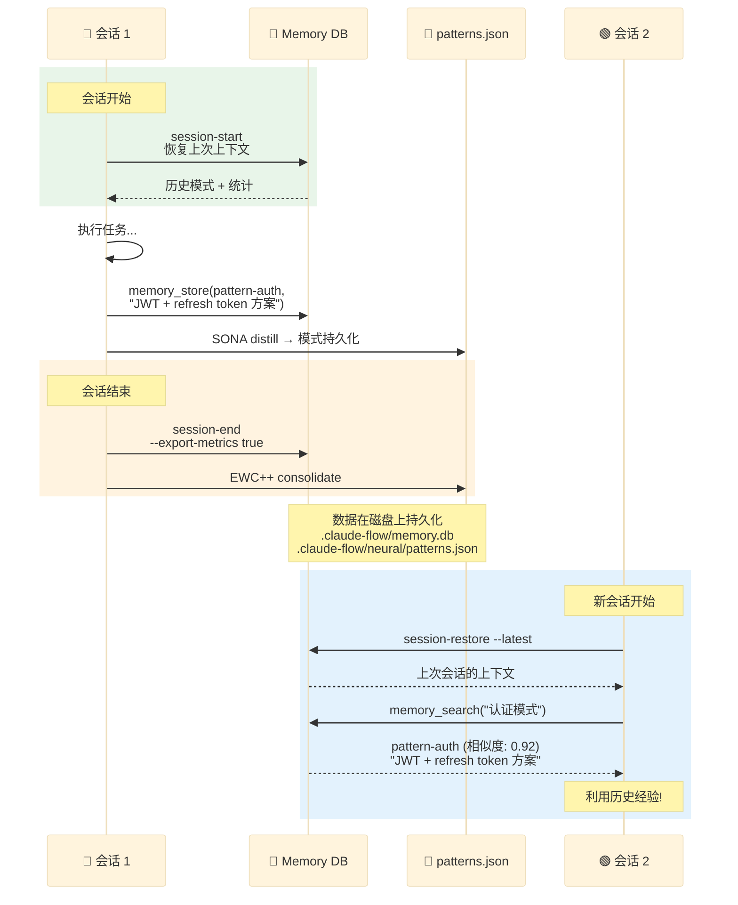

# Ruflo V3 自动进化机制详解

## 1. 进化机制总览

Ruflo V3 实现了多层次的 **自进化能力**，核心思路是：**从 Agent 执行结果中学习模式，跨会话积累经验，自动优化后续行为**。



---

## 2. 层 1: 运行时学习 — LLM 钩子

### 2.1 Pre-LLM 钩子

每次 LLM API 调用前执行：

```
1. 生成缓存键 = base64(provider + model + messages + temp + maxTokens)
2. 查询缓存 (TTL: 1小时, 最大 1000 条)
   - 命中 → 跳过 LLM 调用，返回缓存响应 ($0 成本!)
   - 未命中 → 继续
3. 加载提供商优化参数:
   - Anthropic: temperature=0.7, "Be concise and direct"
   - OpenAI: temperature=0.8, "Respond in structured format"
4. 应用优化到请求
5. 记录指标: llm.calls.{provider}.{model}
6. 存储请求到内存: llm:request:{correlationId}
```

### 2.2 Post-LLM 钩子

每次 LLM API 响应后执行：

```
1. 缓存响应 (LRU 淘汰)
2. 记录指标: 延迟、token 使用、成本
3. 如果响应较长:
   - 提取有价值的模式 (extractPatternFromResponse)
   - 存入 ReasoningBank 向量数据库
4. 记录到内存: llm:response:{correlationId}
```

### 2.3 ReasoningBank 模式学习



**关键配置**:
- `dimensions`: 384 (MiniLM-L6-v2)
- `hnswM`: 16 (每层最大连接数)
- `hnswEfConstruction`: 200 (构建精度)
- `hnswEfSearch`: 100 (搜索精度)
- `promotionThreshold`: 3 (使用 3 次晋升)
- `qualityThreshold`: 0.6 (质量阈值)
- `dedupThreshold`: 0.95 (去重阈值)

---

## 3. 层 2: SONA 自适应神经架构

### 3.1 SONA 四步流水线

SONA (Self-Optimizing Neural Architecture) 实现了一个本地模式学习系统：

| 步骤 | 操作 | 实现细节 |
|------|------|---------|
| **RETRIEVE** | 检索相关模式 | HNSW O(log n) 搜索，150x-12,500x 加速 |
| **JUDGE** | 评估判定 | success/failure verdict + 奖励信号 shaping |
| **DISTILL** | 提炼学习 | LoRA 风格置信度更新 |
| **CONSOLIDATE** | 防止遗忘 | EWC++ 弹性权重整合 |

### 3.2 轨迹记录

```typescript
interface TrajectoryStep {
  type: 'observation' | 'thought' | 'action' | 'result';
  content: string;
  embedding?: number[];
  metadata?: Record<string, unknown>;
  timestamp?: number;
}
```

每个任务执行被记录为一系列 **观察→思考→行动→结果** 的轨迹步骤。

### 3.3 LoRA 风格蒸馏

置信度更新公式：

```
pattern.confidence += learningRate × reward × (1 - confidence)
```

- `learningRate` — 默认 0.01 (LoRA rank)
- `reward` — 来自 verdict 的奖励信号 [-1, 1]
- `(1 - confidence)` — 确保置信度趋近但不超过 1.0

### 3.4 EWC++ 防遗忘

`EWCConsolidator` 使用弹性权重整合防止新学习覆盖旧的重要模式：

```
新权重 = 学习权重 + λ × F_i × (θ_old - θ_new)²
```

- `λ` (ewcLambda) — 正则化强度
- `F_i` — Fisher 信息矩阵对角线（重要性权重）
- 重要的旧模式受到更强的保护

### 3.5 持久化

所有学习结果持久化到：
- `.claude-flow/neural/patterns.json` — 模式库
- `.claude-flow/neural/stats.json` — 学习统计
- `.claude-flow/memory.db` — AgentDB 向量数据库

---

## 4. 层 3: 治理进化 — Guidance Optimizer

### 4.1 进化流水线



### 4.2 评估器

| 评估器 | 检查内容 |
|-------|---------|
| `TestsPassEvaluator` | 测试是否通过 |
| `ForbiddenCommandEvaluator` | 是否使用了禁止命令 |
| `ForbiddenDependencyEvaluator` | 是否引入了禁止依赖 |
| `ViolationRateEvaluator` | 违规率趋势 |
| `DiffQualityEvaluator` | diff 质量评分 |

### 4.3 规则进化路径

```
1. CLAUDE.local.md 中添加实验性规则
2. 运行时收集该规则的执行数据
3. OptimizerLoop 分析违规排名
4. 效果好的规则 → 提升到 CLAUDE.md (根宪法)
5. 效果差的规则 → 废弃或修改
6. 每次变更生成 ADR (Architecture Decision Record)
```

---

## 5. 层 4: 后台 Worker 持续优化

### 5.1 Worker 触发机制



### 5.2 Worker 执行模式

```bash
# 列出可用 Worker
npx claude-flow hooks worker list

# 手动触发
npx claude-flow hooks worker dispatch --trigger audit
npx claude-flow hooks worker dispatch --trigger optimize

# Worker 守护进程
npx claude-flow daemon start  # 启动后台 Worker 守护进程
npx claude-flow daemon status # 查看运行状态
```

---

## 6. 跨会话学习持久化

### 6.1 会话生命周期



### 6.2 模式传输

支持跨项目的模式传输（通过 IPFS）：

```bash
# 导出当前项目的模式到 IPFS
npx claude-flow hooks transfer store

# 从其他项目导入模式
npx claude-flow hooks transfer from-project --source /path/to/other
```

---

## 7. 进化机制总结

| 维度 | 机制 | 存储位置 | 生效范围 |
|------|------|---------|---------|
| **LLM 缓存** | 响应缓存 + 模式提取 | 内存 Map (运行时) | 当前会话 |
| **ReasoningBank** | HNSW 向量搜索 + 模式晋升 | .claude-flow/memory.db | 跨会话 |
| **SONA** | 轨迹 → 判定 → 蒸馏 → 整合 | .claude-flow/neural/ | 跨会话 |
| **治理进化** | 评估器 → 优化器 → 规则提升 | CLAUDE.md / CLAUDE.local.md | 永久 |
| **后台 Worker** | 定时/触发式优化分析 | 各自输出 | 持续 |
| **模式传输** | IPFS 跨项目共享 | IPFS 网络 | 跨项目 |
