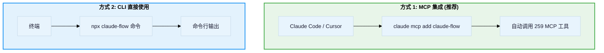

# Ruflo V3 使用方式指南

## 1. 两种使用方式

Ruflo V3 有两种主要使用方式，对应不同的场景：



---

## 2. 快速开始

### 2.1 安装与初始化

```bash
# 方式 1: 注册为 Claude Code 的 MCP 服务器
claude mcp add claude-flow -- npx -y @claude-flow/cli@latest

# 方式 2: 使用 init 向导
npx claude-flow init --wizard

# 系统诊断
npx claude-flow doctor --fix
```

### 2.2 核心命令速查

| 操作 | 命令 |
|------|------|
| **初始化项目** | `npx claude-flow init --wizard` |
| **系统诊断** | `npx claude-flow doctor --fix` |
| **启动守护进程** | `npx claude-flow daemon start` |
| **生成 Agent** | `npx claude-flow agent spawn -t coder --name my-coder` |
| **初始化 Swarm** | `npx claude-flow swarm init --topology hierarchical --max-agents 8` |
| **存储记忆** | `npx claude-flow memory store --key "key" --value "value" --namespace patterns` |
| **搜索记忆** | `npx claude-flow memory search --query "关键词"` |
| **路由任务** | `npx claude-flow hooks route --task "任务描述"` |
| **安全扫描** | `npx claude-flow security scan --depth full` |
| **性能基准** | `npx claude-flow performance benchmark --suite all` |

---

## 3. Swarm 编排使用

### 3.1 标准 Swarm 配方

**功能开发 (6 Agent):**
```bash
npx claude-flow swarm init --topology hierarchical --max-agents 8
npx claude-flow agent spawn --type coordinator --name lead
npx claude-flow agent spawn --type architect --name arch
npx claude-flow agent spawn --type coder --name impl-1
npx claude-flow agent spawn --type coder --name impl-2
npx claude-flow agent spawn --type tester --name test
npx claude-flow agent spawn --type reviewer --name review
npx claude-flow swarm start --objective "实现用户认证" --strategy development
```

**Bug 修复 (4 Agent):**
```bash
npx claude-flow swarm init --topology hierarchical --max-agents 4
npx claude-flow agent spawn --type coordinator --name lead
npx claude-flow agent spawn --type researcher --name debug
npx claude-flow agent spawn --type coder --name fix
npx claude-flow agent spawn --type tester --name verify
npx claude-flow swarm start --objective "修复登录异常" --strategy development
```

**安全审计 (3 Agent):**
```bash
npx claude-flow swarm init --topology hierarchical --max-agents 4
npx claude-flow agent spawn --type coordinator --name lead
npx claude-flow agent spawn --type security-architect --name audit
npx claude-flow agent spawn --type reviewer --name review
npx claude-flow swarm start --objective "安全审计" --strategy development
```

### 3.2 Agent 路由表

| 任务类型 | 推荐 Agent | 拓扑 |
|---------|-----------|------|
| Bug 修复 | coordinator, researcher, coder, tester | hierarchical |
| 新功能 | coordinator, architect, coder, tester, reviewer | hierarchical |
| 重构 | coordinator, architect, coder, reviewer | hierarchical |
| 性能 | coordinator, perf-engineer, coder | hierarchical |
| 安全 | coordinator, security-architect, auditor | hierarchical |
| 文档 | researcher, api-docs | mesh |

---

## 4. 内存系统使用

### 4.1 基本操作

```bash
# 初始化数据库
npx claude-flow memory init --force --verbose

# 存储数据
npx claude-flow memory store \
  --key "pattern-auth" \
  --value "JWT with refresh tokens, HTTP-only cookies" \
  --namespace patterns

# 语义搜索 (HNSW 向量搜索)
npx claude-flow memory search --query "认证最佳实践" --namespace patterns --limit 5

# 精确检索
npx claude-flow memory retrieve --key "pattern-auth" --namespace patterns

# 列表
npx claude-flow memory list --namespace patterns --limit 10
```

### 4.2 推荐工作流


---

## 5. Hooks 系统使用

### 5.1 任务生命周期钩子

```bash
# 任务开始前 - 获取路由建议和复杂度评估
npx claude-flow hooks pre-task --description "实现 OAuth 登录"

# 任务完成后 - 记录结果
npx claude-flow hooks post-task --task-id "task-123" --success true --store-results true

# 文件编辑后 - 训练模式
npx claude-flow hooks post-edit --file "src/auth.ts" --train-neural true
```

### 5.2 智能路由

```bash
# 获取最佳 Agent 推荐
npx claude-flow hooks route --task "优化数据库查询性能"
# 输出: recommended agent = performance-engineer, complexity = medium

# 解释路由决策
npx claude-flow hooks explain --topic "为什么选择这个 Agent"
```

### 5.3 会话管理

```bash
# 开始新会话 (恢复上次上下文)
npx claude-flow hooks session-start --session-id "my-session"

# 结束会话 (持久化学习)
npx claude-flow hooks session-end --generate-summary true --export-metrics true

# 恢复最近会话
npx claude-flow hooks session-restore --latest
```

### 5.4 神经网络训练

```bash
# 预训练 (从代码库引导)
npx claude-flow hooks pretrain --model-type moe --epochs 10

# 构建优化 Agent 配置
npx claude-flow hooks build-agents --agent-types coder,tester

# 查看学习指标
npx claude-flow hooks metrics --v3-dashboard
```

### 5.5 后台 Worker

```bash
# 列出所有 Worker
npx claude-flow hooks worker list

# 触发审计
npx claude-flow hooks worker dispatch --trigger audit

# 触发优化
npx claude-flow hooks worker dispatch --trigger optimize

# Worker 状态
npx claude-flow hooks worker status
```

---

## 6. 治理控制

### 6.1 CLAUDE.md 编译

治理系统自动编译 CLAUDE.md 为可执行的策略包：

```bash
# 编译治理规则
npx claude-flow guidance compile

# 检查执行状态
npx claude-flow guidance status
```

### 6.2 自定义规则

在 `CLAUDE.local.md` 中添加实验性规则：

```markdown
# 安全规则 @security [edit] #security (critical)
[R001] 所有数据库查询必须使用参数化查询 verify:lint-clean scope:src/db/**
[R002] 不允许 eval() 或 Function() 构造器 verify:lint-clean scope:src/**
```

标签说明：
- `@security` — 领域标签
- `[edit]` — 工具类标签
- `#security` — 意图标签
- `(critical)` — 风险等级
- `verify:lint-clean` — 验证器
- `scope:src/db/**` — 作用域

---

## 7. 安全功能

```bash
# 全面安全扫描
npx claude-flow security scan --depth full

# 安全审计
npx claude-flow security audit

# CVE 检查
npx claude-flow security cve

# 威胁分析
npx claude-flow security threats

# 生成报告
npx claude-flow security report
```

---

## 8. 性能监控

```bash
# 运行基准测试
npx claude-flow performance benchmark --suite all

# 性能分析
npx claude-flow performance profile --target "memory"

# 查看指标
npx claude-flow performance metrics

# 优化建议
npx claude-flow performance optimize

# 生成报告
npx claude-flow performance report
```

---

## 9. 插件系统

```bash
# 浏览可用插件 (IPFS 分布式注册表)
npx claude-flow plugins list

# 安装插件
npx claude-flow plugins install @claude-flow/plugin-code-intelligence

# 启用/禁用
npx claude-flow plugins enable @claude-flow/plugin-code-intelligence
npx claude-flow plugins disable @claude-flow/plugin-code-intelligence
```

### 可用插件分类

| 类别 | 插件 | 功能 |
|------|-----|------|
| **核心** | embeddings, security, claims, neural, plugins, performance | 基础能力 |
| **集成** | agentic-qe, prime-radiant, gastown-bridge, teammate, code-intelligence | 外部集成 |
| **领域** | healthcare-clinical, financial-risk, legal-contracts | 行业特化 |
| **高级** | quantum-optimizer, hyperbolic-reasoning, cognitive-kernel | 前沿算法 |

---

## 10. 双模式协作 (Claude + Codex)

```bash
# 使用预设模板
npx claude-flow-codex dual run feature --task "实现 OAuth 登录"
npx claude-flow-codex dual run security --target "./src"
npx claude-flow-codex dual run refactor --target "./src/legacy"

# 自定义多平台 Swarm
npx claude-flow-codex dual run \
  --worker "claude:architect:设计 API 架构" \
  --worker "codex:coder:实现 REST 端点" \
  --worker "claude:tester:编写集成测试" \
  --worker "codex:reviewer:代码质量审查" \
  --namespace "api-feature"

# 检查协作状态
npx claude-flow-codex dual status
```

---

## 11. 完整工作流示例

### 开发新功能的最佳实践

```bash
# 1. 搜索历史模式
npx claude-flow memory search --query "类似功能的实现方式" --namespace patterns

# 2. 获取路由建议
npx claude-flow hooks pre-task --description "实现用户个人资料编辑"

# 3. 初始化 Swarm
npx claude-flow swarm init --topology hierarchical --max-agents 8 --strategy specialized

# 4. 注册 Agent
npx claude-flow agent spawn --type architect --name arch
npx claude-flow agent spawn --type coder --name impl
npx claude-flow agent spawn --type tester --name test

# 5. (Claude Code Task 工具并行执行实际工作)

# 6. 完成后存储模式
npx claude-flow memory store --key "pattern-profile-edit" \
  --value "使用 form validation + optimistic update" \
  --namespace patterns

# 7. 训练神经模式
npx claude-flow hooks post-task --task-id "profile-edit" --success true --store-results true

# 8. 触发相关 Worker
npx claude-flow hooks worker dispatch --trigger testgaps
```
