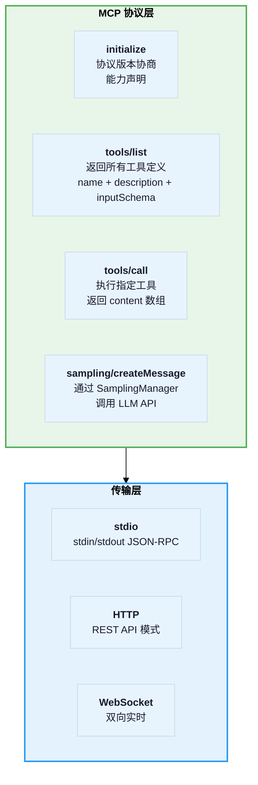

# Ruflo V3 MCP 接口与工具完整清单

## 1. MCP 协议实现

Ruflo V3 实现了 [Model Context Protocol (MCP)](https://modelcontextprotocol.io/) 的 **stdio 传输层**，作为 Claude Code 的工具提供者。

### 1.1 MCP 接口实现



### 1.2 注册方式

```bash
# 注册为 Claude Code MCP 服务器（推荐）
claude mcp add claude-flow -- npx -y @claude-flow/cli@latest

# 注册后 Claude Code 自动通过 stdin/stdout 与 Ruflo 通信
# bin/cli.js 检测 !process.stdin.isTTY → 进入 MCP stdio 循环
```

### 1.3 工具注册表架构

CLI 包中有 **两层工具注册**：

| 层 | 路径 | 命名风格 | 用途 |
|---|------|---------|------|
| **CLI MCP 工具** | `v3/@claude-flow/cli/src/mcp-tools/*.ts` | 下划线 (`agent_spawn`) | 主要工具集，被 `TOOL_REGISTRY` 直接注册 |
| **Monorepo MCP 工具** | `v3/mcp/tools/*.ts` | 斜线 (`agent/spawn`) | 独立 MCP 服务器的工具集，含 V2 兼容 |
| **Hooks 包 MCP** | `v3/@claude-flow/hooks/src/mcp/index.ts` | 斜线 (`hooks/route`) | Hooks 包自带的 MCP 工具子集 |

---

## 2. 完整工具清单（按模块分类）

### 2.1 Agent 管理 (7 工具)

| 工具名 | 描述 | 关键参数 |
|-------|------|---------|
| **`agent_spawn`** | 生成新 Agent，支持模型路由 | `agentType`, `agentId`, `config`, `domain`, `model`, `task` |
| **`agent_terminate`** | 终止 Agent | `agentId`, `force` |
| **`agent_status`** | 查询 Agent 状态 | `agentId` |
| **`agent_list`** | 列出所有 Agent | `status`, `domain`, `includeTerminated` |
| **`agent_pool`** | 管理 Agent 池 | `action`, `targetSize`, `agentType` |
| **`agent_health`** | Agent 健康检查 | `agentId`, `threshold` |
| **`agent_update`** | 更新 Agent 配置 | `agentId`, `status`, `health`, `taskCount`, `config` |

### 2.2 Swarm 编排 (4 工具)

| 工具名 | 描述 | 关键参数 |
|-------|------|---------|
| **`swarm_init`** | 初始化 Swarm（持久化状态） | `topology`, `maxAgents`, `strategy`, `config` |
| **`swarm_status`** | 查询 Swarm 状态 | `swarmId` |
| **`swarm_shutdown`** | 关闭 Swarm | `swarmId`, `graceful` |
| **`swarm_health`** | Swarm 健康检查 | `swarmId` |

### 2.3 Memory 内存 (7 工具)

| 工具名 | 描述 | 关键参数 |
|-------|------|---------|
| **`memory_store`** | 存储数据（含嵌入向量生成） | `key`, `value`, `namespace`, `tags`, `ttl`, `upsert` |
| **`memory_retrieve`** | 按键精确检索 | `key`, `namespace` |
| **`memory_search`** | 语义向量搜索 (HNSW) | `query`, `namespace`, `limit`, `threshold` |
| **`memory_delete`** | 删除条目 | `key`, `namespace` |
| **`memory_list`** | 列出条目 | `namespace`, `limit`, `offset` |
| **`memory_stats`** | 存储统计 | — |
| **`memory_migrate`** | 旧 JSON → sql.js 迁移 | `force` |

### 2.4 Hooks 钩子系统 (35 工具)

#### 核心生命周期钩子

| 工具名 | 描述 | 关键参数 |
|-------|------|---------|
| **`hooks_pre-edit`** | 编辑前上下文 | `filePath`, `operation`, `context` |
| **`hooks_post-edit`** | 编辑后学习 | `filePath`, `success`, `agent` |
| **`hooks_pre-command`** | 命令前风险评估 | `command` |
| **`hooks_post-command`** | 命令后记录 | `command`, `exitCode` |
| **`hooks_pre-task`** | 任务前评估+路由 | `taskId`, `description`, `filePath` |
| **`hooks_post-task`** | 任务后学习 | `taskId`, `success`, `agent`, `quality` |

#### 会话管理

| 工具名 | 描述 | 关键参数 |
|-------|------|---------|
| **`hooks_session-start`** | 启动/恢复会话 | `sessionId`, `restoreLatest`, `startDaemon` |
| **`hooks_session-end`** | 结束会话并持久化 | `saveState`, `exportMetrics`, `stopDaemon` |
| **`hooks_session-restore`** | 恢复指定会话 | `sessionId`, `restoreAgents`, `restoreTasks` |
| **`hooks_notify`** | 发送通知 | `message`, `target`, `priority`, `data` |
| **`hooks_init`** | 初始化 Hooks 配置 | `path`, `template`, `force` |

#### 智能路由

| 工具名 | 描述 | 关键参数 |
|-------|------|---------|
| **`hooks_route`** | 路由任务到最优 Agent | `task`, `context`, `useSemanticRouter` |
| **`hooks_explain`** | 解释路由决策 | `task`, `agent`, `verbose` |
| **`hooks_pretrain`** | 从代码库引导学习 | `path`, `depth`, `skipCache` |
| **`hooks_build-agents`** | 构建优化 Agent 配置 | `outputDir`, `focus`, `format`, `persist` |
| **`hooks_transfer`** | 模式传输 (IPFS) | `sourcePath`, `filter`, `minConfidence` |
| **`hooks_metrics`** | 学习指标看板 | `period`, `includeV3` |
| **`hooks_list`** | 列出已注册钩子 | — |

#### Intelligence 子系统

| 工具名 | 描述 | 关键参数 |
|-------|------|---------|
| **`hooks_intelligence`** | RuVector 智能控制 | `mode`, `enableSona`, `enableMoe`, `enableHnsw` |
| **`hooks_intelligence-reset`** | 重置智能状态 | — |
| **`hooks_intelligence_trajectory-start`** | 开始轨迹记录 | `task`, `agent` |
| **`hooks_intelligence_trajectory-step`** | 记录轨迹步骤 | `trajectoryId`, `action`, `result`, `quality` |
| **`hooks_intelligence_trajectory-end`** | 结束轨迹+触发学习 | `trajectoryId`, `success`, `feedback` |
| **`hooks_intelligence_pattern-store`** | 存储模式 | `pattern`, `type`, `confidence`, `metadata` |
| **`hooks_intelligence_pattern-search`** | 搜索模式 | `query`, `topK`, `minConfidence`, `namespace` |
| **`hooks_intelligence_stats`** | 智能统计 | `detailed` |
| **`hooks_intelligence_learn`** | 强制学习 | `trajectoryIds`, `consolidate` |
| **`hooks_intelligence_attention`** | 注意力查询 | `query`, `mode`, `topK` |

#### Worker 管理

| 工具名 | 描述 | 关键参数 |
|-------|------|---------|
| **`hooks_worker-list`** | 列出 Worker | `status`, `includeActive` |
| **`hooks_worker-dispatch`** | 触发 Worker | `trigger`, `context`, `priority`, `background` |
| **`hooks_worker-status`** | Worker 状态 | `workerId`, `includeCompleted` |
| **`hooks_worker-detect`** | 检测触发器 | `prompt`, `autoDispatch`, `minConfidence` |
| **`hooks_worker-cancel`** | 取消 Worker | `workerId` |

#### 模型路由

| 工具名 | 描述 | 关键参数 |
|-------|------|---------|
| **`hooks_model-route`** | 3 层模型路由 | `task`, `preferSpeed`, `preferCost` |
| **`hooks_model-outcome`** | 模型结果反馈 | `task`, `model`, `outcome` |
| **`hooks_model-stats`** | 模型路由统计 | — |

### 2.5 Task 任务管理 (7 工具)

| 工具名 | 描述 | 关键参数 |
|-------|------|---------|
| **`task_create`** | 创建任务 | `type`, `description`, `priority`, `assignTo`, `tags` |
| **`task_status`** | 任务状态 | `taskId` |
| **`task_list`** | 列出任务 | `status`, `type`, `assignedTo`, `priority`, `limit` |
| **`task_complete`** | 完成任务 | `taskId`, `result` |
| **`task_update`** | 更新任务 | `taskId`, `status`, `progress`, `assignTo` |
| **`task_assign`** | 分配任务 | `taskId`, `agentIds`, `unassign` |
| **`task_cancel`** | 取消任务 | `taskId`, `reason` |

### 2.6 Session 会话 (5 工具)

| 工具名 | 描述 | 关键参数 |
|-------|------|---------|
| **`session_save`** | 保存会话快照 | `name`, `description`, `includeMemory`, `includeTasks`, `includeAgents` |
| **`session_restore`** | 恢复会话 | `sessionId`, `name` |
| **`session_list`** | 列出会话 | `limit`, `sortBy` |
| **`session_delete`** | 删除会话 | `sessionId` |
| **`session_info`** | 会话详情 | `sessionId` |

### 2.7 Config 配置 (6 工具)

| 工具名 | 描述 | 关键参数 |
|-------|------|---------|
| **`config_get`** | 获取配置值 | `key`, `scope` |
| **`config_set`** | 设置配置值 | `key`, `value`, `scope` |
| **`config_list`** | 列出配置 | `scope`, `prefix`, `includeDefaults` |
| **`config_reset`** | 重置配置 | `scope`, `key` |
| **`config_export`** | 导出 JSON | `scope`, `includeDefaults` |
| **`config_import`** | 导入 JSON | `config`, `scope`, `merge` |

### 2.8 Hive-Mind 蜂巢 (9 工具)

| 工具名 | 描述 | 关键参数 |
|-------|------|---------|
| **`hive-mind_init`** | 初始化蜂巢 | `topology`, `queenId`, `prefix` |
| **`hive-mind_spawn`** | 生成蜂巢 Agent | `count`, `role`, `agentType` |
| **`hive-mind_status`** | 蜂巢状态 | `verbose` |
| **`hive-mind_join`** | 加入蜂巢 | `agentId` |
| **`hive-mind_leave`** | 离开蜂巢 | `agentId` |
| **`hive-mind_consensus`** | 发起共识 | `type`, `value`, `strategy`, `timeoutMs` |
| **`hive-mind_broadcast`** | 广播消息 | `message`, `priority`, `fromId` |
| **`hive-mind_shutdown`** | 关闭蜂巢 | `graceful`, `force` |
| **`hive-mind_memory`** | 蜂巢内存操作 | `action`, `key`, `value` |

### 2.9 Neural 神经网络 (6 工具)

| 工具名 | 描述 | 关键参数 |
|-------|------|---------|
| **`neural_train`** | 训练模型 | `modelId`, `modelType`, `epochs`, `learningRate`, `data` |
| **`neural_predict`** | 预测 | `modelId`, `input`, `topK` |
| **`neural_patterns`** | 模式管理 | `action`, `patternId`, `name`, `type`, `query`, `data` |
| **`neural_compress`** | 模型压缩 | `modelId`, `method`, `targetSize` |
| **`neural_status`** | 模型状态 | `modelId`, `detailed` |
| **`neural_optimize`** | 模型优化 | `modelId`, `target` |

### 2.10 System 系统 (7 工具)

| 工具名 | 描述 | 关键参数 |
|-------|------|---------|
| **`system_status`** | 系统总状态 | `verbose`, `components` |
| **`system_metrics`** | 性能指标 | `category`, `timeRange`, `format` |
| **`system_health`** | 健康检查 | `deep`, `components`, `fix` |
| **`system_info`** | 系统信息 | `include` |
| **`system_reset`** | 重置状态 | `component`, `confirm` |
| **`mcp_status`** | MCP 服务状态 | — |
| **`task_summary`** | 任务概览 | — |

### 2.11 Workflow 工作流 (10 工具)

| 工具名 | 描述 | 关键参数 |
|-------|------|---------|
| **`workflow_run`** | 运行工作流 | `template`, `file`, `task`, `options` |
| **`workflow_create`** | 创建工作流 | `name`, `description`, `steps` |
| **`workflow_execute`** | 执行工作流 | `workflowId`, `variables`, `startFromStep` |
| **`workflow_status`** | 工作流状态 | `workflowId`, `verbose` |
| **`workflow_list`** | 列出工作流 | `status`, `limit` |
| **`workflow_pause`** | 暂停 | `workflowId` |
| **`workflow_resume`** | 恢复 | `workflowId` |
| **`workflow_delete`** | 删除 | `workflowId` |
| **`workflow_cancel`** | 取消 | `workflowId`, `reason` |
| **`workflow_template`** | 模板管理 | `action`, `workflowId`, `templateId` |

### 2.12 其他工具模块

| 模块 | 工具数量 | 代表工具 |
|------|---------|---------|
| **Embeddings** | 7 | `embeddings_generate`, `embeddings_search`, `embeddings_hyperbolic` |
| **Performance** | 6 | `performance_benchmark`, `performance_profile`, `performance_optimize` |
| **Security (AIDefence)** | 6 | `aidefence_scan`, `aidefence_analyze`, `aidefence_is_safe` |
| **GitHub** | 5 | `github_repo_analyze`, `github_pr_manage`, `github_issue_track` |
| **Browser** | 23 | `browser_open`, `browser_click`, `browser_fill`, `browser_screenshot` |
| **AgentDB** | 15 | `agentdb_pattern-store`, `agentdb_route`, `agentdb_context-synthesize` |
| **Claims** | 12 | `claims_claim`, `claims_handoff`, `claims_steal`, `claims_board` |
| **Transfer/Store** | 11 | `transfer_store-search`, `transfer_ipfs-resolve`, `transfer_plugin-search` |
| **Terminal** | 5 | `terminal_create`, `terminal_execute`, `terminal_list` |
| **WASM Agent** | 10 | `wasm_agent_create`, `wasm_agent_prompt`, `wasm_gallery_list` |
| **RuVLLM** | 10 | `ruvllm_hnsw_create`, `ruvllm_sona_create`, `ruvllm_chat_format` |
| **Coordination** | 7 | `coordination_topology`, `coordination_consensus`, `coordination_orchestrate` |
| **Guidance** | 5 | `guidance_capabilities`, `guidance_recommend`, `guidance_workflow` |
| **Autopilot** | 10 | `autopilot_enable`, `autopilot_predict`, `autopilot_learn` |
| **Analyze** | 6 | `analyze_diff`, `analyze_diff-risk`, `analyze_file-risk` |
| **Progress** | 4 | `progress_check`, `progress_sync`, `progress_summary` |
| **DAA** | 8 | `daa_agent_create`, `daa_workflow_execute`, `daa_learning_status` |

### 2.13 V2 兼容工具 (15 工具)

Monorepo MCP 服务器同时注册了 V2 命名风格的兼容工具：

| 工具名 | 映射到 |
|-------|-------|
| `swarm_init` | → `swarm/init` |
| `agent_spawn` | → `agent/spawn` |
| `memory_usage` | → `memory/store` + `memory/search` |
| `neural_train` | → `neural/train` |
| `task_orchestrate` | → `tasks/create` |
| `benchmark_run` | → `performance/benchmark` |
| ... | (共 15 个) |

---

## 3. 工具统计

| 类别 | CLI 包工具数 | Monorepo 工具数 | 合计 |
|------|------------|---------------|------|
| Agent | 7 | 4 | 11 |
| Swarm | 4 | 3 | 7 |
| Memory | 7 | 3 | 10 |
| Hooks | 35 | 9 | 44 |
| Task | 7 | 8 | 15 |
| Session | 5 | 3 | 8 |
| Config | 6 | 3 | 9 |
| System | 7 | 4 | 11 |
| Hive-Mind | 9 | — | 9 |
| Neural | 6 | — | 6 |
| Worker | — | 8 | 8 |
| SONA | — | 14 | 14 |
| Federation | — | 8 | 8 |
| 其他 | 137 | 15 (V2) | 152 |
| **总计** | **~230** | **~82** | **~259+** |
