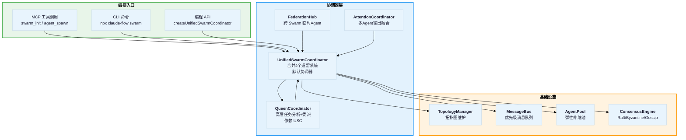
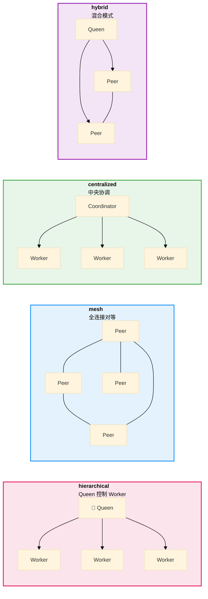
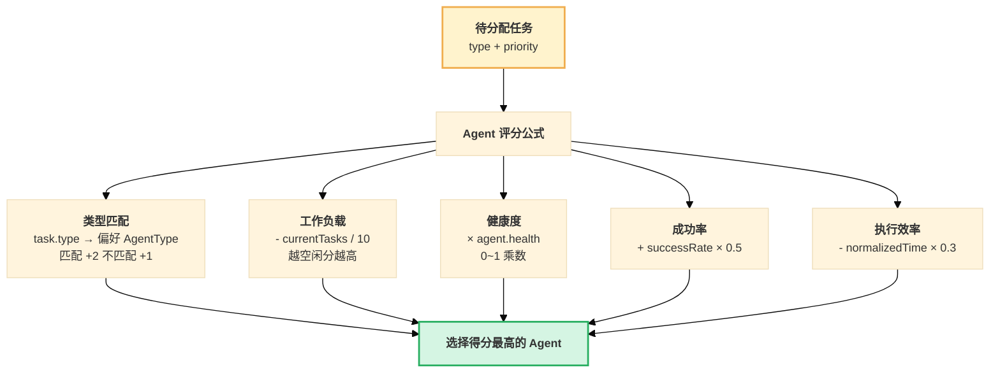
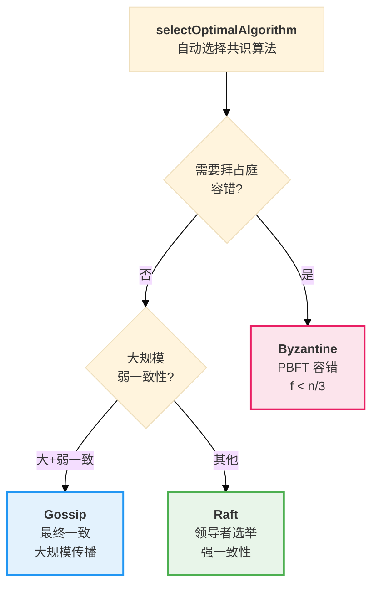
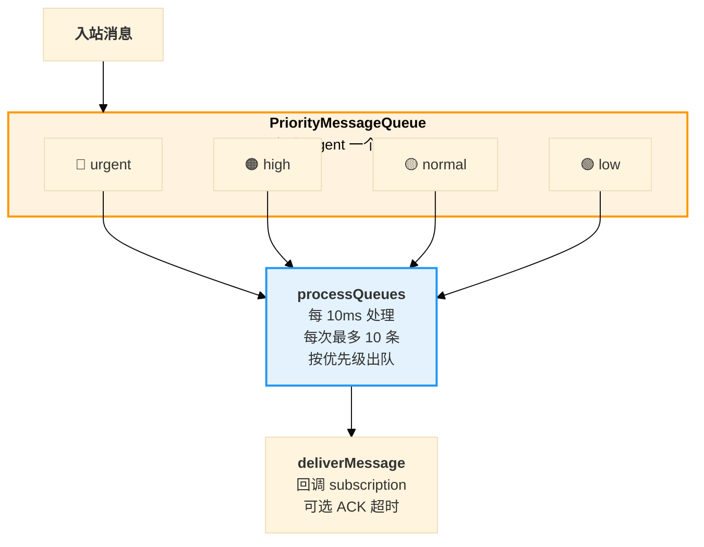
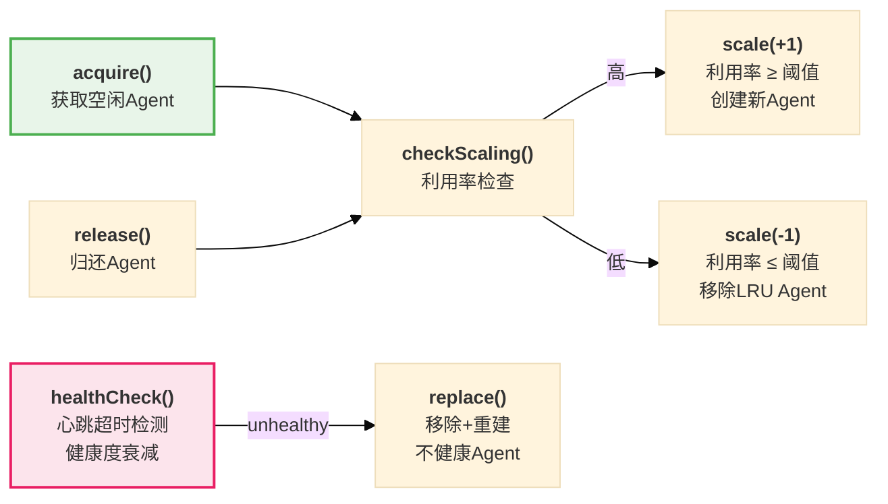

# Ruflo V3 编排系统详解

## 1. 编排系统总览

Ruflo V3 的编排系统是一个 **多层次、多模式** 的 Agent 协调框架，支持从简单的单 Agent 到 15 个 Agent 的分层网格编排。



---

## 2. 五种拓扑模式

### 2.1 拓扑模式对比



### 2.2 拓扑详细说明

| 拓扑 | 角色分配 | 连接规则 | 领导选举 | 推荐场景 |
|------|---------|---------|---------|---------|
| **hierarchical** | 首节点 Queen，其余 Worker | Worker 单向连 Queen | 缓存 Queen 节点 | **反漂移**，6-8 Agent，清晰指挥链 |
| **mesh** | 全部 Peer | 每个新节点连最多 10 个已有节点，双向 | 按角色排序取第一 | **去中心化**，平等协作，头脑风暴 |
| **centralized** | 首节点 Coordinator，其余 Worker | Worker 单向连 Coordinator（星型） | 缓存 Coordinator | **简单任务**，明确的调度中心 |
| **hybrid** | 保留请求角色 | Queen/Coordinator 连所有 + 最多 3 个随机 Peer 互连 | 按角色优先排序 | **10+ Agent**，兼顾控制与协作 |

### 2.3 拓扑行为细节

**分区管理** (mesh/hybrid)：
- 按 `ceil(maxAgents/10)` 分区
- 每个分区有 leader
- 跨分区通过 leader 路由

**再平衡** (5秒节流)：
- mesh: 补充到 `min(5, n-1)` 个邻居
- hierarchical: 确保每个 Worker 连接到 Queen
- centralized: 星型到 Coordinator
- hybrid: Worker 间有限互连 + 全部连 Coordinator

**最优路径**: BFS 广度优先搜索邻接图

---

## 3. 协调决策机制

### 3.1 任务分配算法

`UnifiedSwarmCoordinator.assignTask` 使用 **多维评分** 选择最优 Agent：



### 3.2 域路由 (15-Agent 模式)

```
Queen (Agent 1): coordination, planning, oversight, consensus
├── Security Domain (Agent 2-4): security-architecture, cve-remediation, security-testing
├── Core Domain (Agent 5-9): ddd-design, type-modernization, memory-unification, swarm-coordination, mcp-optimization
├── Integration Domain (Agent 10-12): integration, cli-modernization, neural-integration
└── Support Domain (Agent 13-15): testing, performance-engineering, deployment
```

每个域有独立的 `AgentPool`：
- 任务通过 `assignTaskToDomain(taskId, domain)` 路由到域池
- 域池满时任务进入 `domainTaskQueue` 排队
- Agent 完成任务后自动消费队列中的下一个任务

### 3.3 Queen 协调器的任务分解

`QueenCoordinator.analyzeTask` 的分解逻辑：

| 任务类型 | 子任务拆分 | 执行策略 |
|---------|-----------|---------|
| **coding** | design/core → implement/integration → test/support | pipeline |
| **architecture** | analyze/core → design/core → review/security | sequential |
| **security** | scan/security → fix/core → verify/support | sequential |
| **testing** | plan/core → implement/support → run/integration | pipeline |
| **简单任务** | 不拆分 | sequential |
| **复杂任务 (4+ 子任务)** | 按依赖关系分组 | parallel / fan-out-fan-in |

Agent 选择的 **加权评分**：

| 维度 | 权重 | 含义 |
|------|------|------|
| 能力匹配 | 0.30 | Agent 能力与任务需求的匹配度 |
| 负载 | 0.20 | 当前工作负载（越低越好） |
| 历史表现 | 0.25 | 历史成功率和质量 |
| 健康度 | 0.15 | Agent 健康检查分数 |
| 可用性 | 0.10 | 是否空闲可用 |

---

## 4. 共识算法详解

### 4.1 算法选择策略



### 4.2 Raft 实现

```
状态机: follower → candidate → leader
- 选举超时: 随机化，防止同时选举
- 投票: term 更高的 candidate 获得投票
- 多数 (floor((peers+1)/2)+1) 当选 leader
- 日志复制: leader append → 多数确认 → commit
- 心跳: leader 周期性 appendEntries 空消息
```

**适用场景**：需要强一致性的状态决策，如任务优先级变更、资源分配。

### 4.3 Byzantine (PBFT) 实现

```
流程: pre-prepare → prepare → commit
- Primary 轮换: viewNumber % nodeIds.length
- 准备门槛: 2f+1 个 prepare 消息
- 提交门槛: 2f+1 个 commit 消息
- 容忍 f < n/3 恶意节点
```

**适用场景**：不可信环境、安全关键决策、跨组织协作。

### 4.4 Gossip 实现

```
传播方式: 流行病式传播
- 邻居: 50% 概率互联
- 每轮: 向 fanout 个随机邻居传播
- 收敛: votes/total ≥ 0.9 且 approving ≥ threshold
- 反熵: 定期状态同步，last-writer-wins
- TTL/hops: 限制传播范围
```

**适用场景**：大规模松散协调、信息扩散、最终一致性场景。

---

## 5. 消息总线

### 5.1 优先级队列



### 5.2 消息特性

| 特性 | 实现 |
|------|------|
| **路由** | `message.to` 指定目标 Agent |
| **广播** | `to: 'broadcast'` 复制到所有订阅者（排除发送者） |
| **过滤** | 订阅时可指定 `MessageType[]` 过滤器 |
| **TTL** | 超过 TTL 的消息在出队时丢弃 |
| **ACK** | 可选的确认机制，超时降低 ackRate |
| **重试** | 投递失败重新入队，最多 retryAttempts 次 |
| **溢出** | 队列满时淘汰低优先级消息 |
| **吞吐量** | 目标 1000+ msgs/sec，60 样本滑动窗口统计 |

---

## 6. Agent 池管理

### 6.1 弹性伸缩



| 参数 | 默认值 | 作用 |
|------|--------|------|
| `minSize` | 1 | 池最小 Agent 数 |
| `maxSize` | 15 | 池最大 Agent 数 |
| `scaleUpThreshold` | 0.8 | 利用率 ≥ 80% 扩容 |
| `scaleDownThreshold` | 0.2 | 利用率 ≤ 20% 缩容 |
| `cooldownMs` | 10000 | 两次伸缩间隔 |
| `healthCheckIntervalMs` | 30000 | 健康检查间隔 |

---

## 7. Federation 跨 Swarm 协调

`FederationHub` 管理多个 Swarm 之间的协调：

| 功能 | 实现 |
|------|------|
| **Swarm 注册** | `registerSwarm` — 记录能力和端点 |
| **临时 Agent** | `spawnEphemeralAgent` — 带 TTL 的短期 Agent |
| **最优 Swarm 选择** | 按容量、心跳新鲜度、能力匹配评分 |
| **跨 Swarm 消息** | `sendMessage` / `broadcast` |
| **联邦共识** | `propose` / `vote` — 跨 Swarm 投票 |
| **同步** | 标记降级/失活 Swarm，清理过期提案 |

---

## 8. 注意力协调器 (高级)

`AttentionCoordinator` 用于 **多 Agent 输出融合**，将多个 Agent 的结果通过注意力机制加权合成：

| 模式 | 算法 | 特点 |
|------|------|------|
| **flash** | 分块注意力 | 2.49x-7.47x 加速，块大小 256 |
| **multi-head** | 8 头注意力 | 多视角评估，头均权重 |
| **linear** | ReLU 归一化 | O(n) 内存，线性复杂度 |
| **hyperbolic** | Poincaré 球距离 | 层次化权重 (Queen 2.0x) |
| **moe** | Top-K 专家 | 稀疏激活，按置信度选择 |
| **graphRope** | 图旋转位置编码 | BFS 距离 + 正弦编码 |

---

## 9. 使用场景推荐

| 场景 | 推荐拓扑 | Agent 数 | 共识 | 原因 |
|------|---------|---------|------|------|
| **Bug 修复** | hierarchical | 4 | raft | 小团队、快速迭代、清晰指挥 |
| **新功能开发** | hierarchical | 6-8 | raft | 反漂移、专业分工 |
| **大规模重构** | hybrid | 10-15 | raft | 需要域间协作 |
| **安全审计** | hierarchical | 3-4 | byzantine | 安全决策需容错 |
| **头脑风暴/设计** | mesh | 4-6 | gossip | 平等发言、创意碰撞 |
| **跨团队协作** | hybrid + federation | 15+ | gossip | 松耦合、最终一致 |
| **性能优化** | hierarchical | 3 | raft | 聚焦、快速执行 |
| **CI/CD 流水线** | centralized | 5 | raft | 明确步骤、顺序执行 |

### 初始化示例

```bash
# Bug 修复 (4 Agent, hierarchical)
npx claude-flow swarm init --topology hierarchical --max-agents 4 --strategy specialized

# 大规模重构 (15 Agent, hybrid)
npx claude-flow swarm init --topology hybrid --max-agents 15 --strategy specialized

# 设计探索 (mesh)
npx claude-flow swarm init --topology mesh --max-agents 6 --strategy balanced

# V3 模式 (全量 15 Agent)
npx claude-flow swarm init --v3-mode
```
