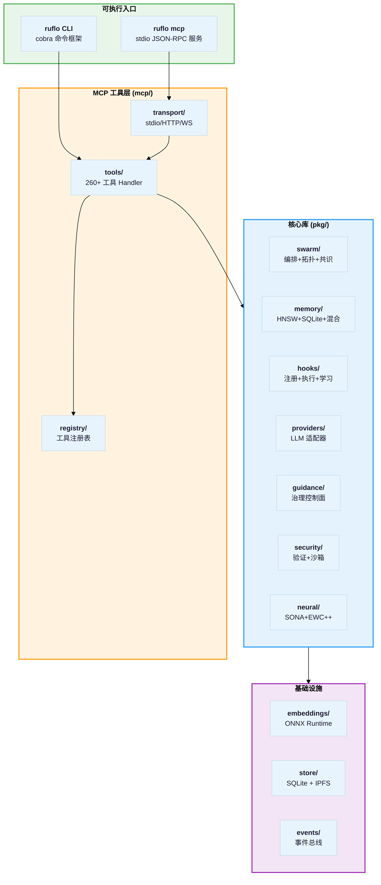
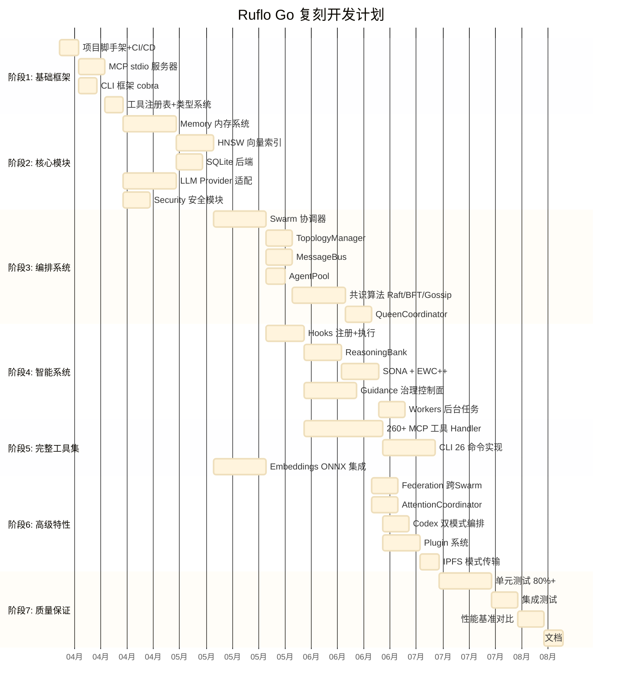

# Ruflo V3 Go 语言复刻实现方案

## 1. 项目概述

将 Ruflo V3 (TypeScript) 的全部能力用 **Go 语言** 百分百复刻。Go 的优势在于：
- **编译为单一二进制**：无需 Node.js 运行时，分发简单
- **原生并发**：goroutine + channel 天然适合 Agent 编排
- **高性能**：适合 HNSW 向量搜索、消息总线等计算密集模块
- **类型安全**：接口约束清晰

---

## 2. 整体架构



---

## 3. 目录结构设计

```
ruflo-go/
├── cmd/
│   └── ruflo/
│       └── main.go                   # 入口
├── internal/
│   ├── cli/                          # CLI 命令 (cobra)
│   │   ├── root.go
│   │   ├── agent.go
│   │   ├── swarm.go
│   │   ├── memory.go
│   │   ├── hooks.go
│   │   ├── neural.go
│   │   ├── session.go
│   │   ├── guidance.go
│   │   └── ...
│   └── config/                       # 配置管理
│       └── config.go
├── pkg/
│   ├── swarm/                        # 编排系统
│   │   ├── coordinator.go            # UnifiedSwarmCoordinator
│   │   ├── queen.go                  # QueenCoordinator
│   │   ├── topology.go               # TopologyManager
│   │   ├── messagebus.go             # MessageBus
│   │   ├── agentpool.go              # AgentPool
│   │   ├── federation.go             # FederationHub
│   │   ├── attention.go              # AttentionCoordinator
│   │   └── consensus/
│   │       ├── engine.go             # ConsensusEngine
│   │       ├── raft.go
│   │       ├── byzantine.go
│   │       └── gossip.go
│   ├── memory/                       # 内存系统
│   │   ├── service.go                # UnifiedMemoryService
│   │   ├── hnsw.go                   # HNSW 索引
│   │   ├── sqlite.go                 # SQLite 后端
│   │   ├── hybrid.go                 # 混合后端
│   │   ├── cache.go                  # LRU 缓存
│   │   └── types.go
│   ├── hooks/                        # 钩子系统
│   │   ├── registry.go               # HookRegistry
│   │   ├── executor.go               # HookExecutor
│   │   ├── reasoningbank.go          # ReasoningBank
│   │   ├── workers.go                # WorkerManager
│   │   ├── llm_hooks.go             # LLM pre/post hooks
│   │   └── types.go
│   ├── providers/                    # LLM 提供商
│   │   ├── manager.go                # ProviderManager
│   │   ├── anthropic.go
│   │   ├── openai.go
│   │   ├── google.go
│   │   ├── ollama.go
│   │   └── types.go
│   ├── guidance/                     # 治理控制面
│   │   ├── controlplane.go           # GuidanceControlPlane
│   │   ├── compiler.go               # GuidanceCompiler
│   │   ├── retriever.go              # ShardRetriever
│   │   ├── gates.go                  # EnforcementGates
│   │   ├── ledger.go                 # RunLedger
│   │   ├── optimizer.go              # OptimizerLoop
│   │   └── types.go
│   ├── security/                     # 安全模块
│   │   ├── validator.go              # InputValidator
│   │   ├── pathvalidator.go          # PathValidator
│   │   ├── executor.go               # SafeExecutor
│   │   └── types.go
│   ├── neural/                       # 神经学习
│   │   ├── sona.go                   # SONA Coordinator
│   │   ├── ewc.go                    # EWC++ Consolidator
│   │   ├── patterns.go               # Pattern Store
│   │   └── types.go
│   └── embeddings/                   # 向量嵌入
│       ├── service.go                # EmbeddingService
│       ├── onnx.go                   # ONNX Runtime 绑定
│       └── hash.go                   # Hash 嵌入 (降级方案)
├── mcp/                              # MCP 协议层
│   ├── server.go                     # MCP 服务器
│   ├── transport/
│   │   ├── stdio.go
│   │   ├── http.go
│   │   └── websocket.go
│   ├── registry.go                   # 工具注册表
│   └── tools/                        # 260+ 工具 Handler
│       ├── agent_tools.go
│       ├── swarm_tools.go
│       ├── memory_tools.go
│       ├── hooks_tools.go
│       ├── neural_tools.go
│       ├── task_tools.go
│       ├── session_tools.go
│       ├── system_tools.go
│       ├── guidance_tools.go
│       └── ...
├── api/                              # 类型定义 / protobuf
│   └── types.go
├── go.mod
├── go.sum
├── Makefile
└── README.md
```

---

## 4. 模块映射与技术选型

### 4.1 核心依赖

| TypeScript 原依赖 | Go 替代 | 说明 |
|------------------|---------|------|
| Node.js EventEmitter | `sync.Map` + channel | Go 原生并发 |
| Commander/自定义 Parser | **cobra** | Go 标准 CLI 框架 |
| sql.js / better-sqlite3 | **mattn/go-sqlite3** (CGo) 或 **modernc.org/sqlite** (纯 Go) | SQLite 绑定 |
| Zod | **go-playground/validator** | 结构体验证 |
| fetch / node-fetch | **net/http** | Go 标准库 |
| MiniLM-L6 ONNX | **yalue/onnxruntime_go** | ONNX Runtime Go 绑定 |
| JSON-RPC (stdin) | **sourcegraph/jsonrpc2** | JSON-RPC 2.0 库 |
| crypto | **crypto/sha256, crypto/rand** | Go 标准库 |
| fs/path | **os, filepath** | Go 标准库 |

### 4.2 模块 1:1 映射

| TypeScript 模块 | Go 包 | 核心接口 |
|----------------|------|---------|
| `@claude-flow/cli` | `internal/cli/` + `mcp/` | cobra.Command |
| `@claude-flow/memory` | `pkg/memory/` | `MemoryService` interface |
| `@claude-flow/hooks` | `pkg/hooks/` | `HookRegistry`, `HookExecutor` |
| `@claude-flow/swarm` | `pkg/swarm/` | `SwarmCoordinator` interface |
| `@claude-flow/security` | `pkg/security/` | `Validator` interface |
| `@claude-flow/guidance` | `pkg/guidance/` | `ControlPlane` interface |
| `@claude-flow/providers` | `pkg/providers/` | `LLMProvider` interface |
| `@claude-flow/neural` | `pkg/neural/` | `SONACoordinator`, `EWCConsolidator` |
| `@claude-flow/embeddings` | `pkg/embeddings/` | `EmbeddingService` interface |
| `@claude-flow/codex` | `pkg/codex/` | `DualModeOrchestrator` |
| `@claude-flow/plugins` | `pkg/plugins/` | `PluginManager` |

---

## 5. 关键模块实现方案

### 5.1 MCP 服务器 (stdio)

```go
// mcp/transport/stdio.go
type StdioTransport struct {
    reader  *bufio.Reader
    writer  *bufio.Writer
    registry *ToolRegistry
}

func (s *StdioTransport) Serve(ctx context.Context) error {
    for {
        line, err := s.reader.ReadBytes('\n')
        if err != nil { return err }

        var req jsonrpc2.Request
        json.Unmarshal(line, &req)

        switch req.Method {
        case "initialize":
            s.handleInitialize(req)
        case "tools/list":
            s.handleToolsList(req)
        case "tools/call":
            s.handleToolsCall(req)
        }
    }
}
```

### 5.2 HNSW 向量索引

```go
// pkg/memory/hnsw.go
type HNSWIndex struct {
    mu          sync.RWMutex
    nodes       map[uint64]*HNSWNode
    entryPoint  uint64
    maxLevel    int
    m           int     // 每层最大连接数
    efConstruct int     // 构建搜索宽度
    efSearch    int     // 查询搜索宽度
    distFunc    DistanceFunc
}

type HNSWNode struct {
    ID       uint64
    Vector   []float32
    Layers   [][]uint64  // 每层的邻居列表
    MaxLayer int
}

func (h *HNSWIndex) Search(query []float32, k int) []SearchResult {
    h.mu.RLock()
    defer h.mu.RUnlock()
    // 从顶层逐层贪心搜索到 layer 0
    // 在 layer 0 使用 ef 扩展搜索
    // 返回 Top-K
}

func (h *HNSWIndex) Insert(id uint64, vector []float32) {
    h.mu.Lock()
    defer h.mu.Unlock()
    // 随机层级 = floor(-ln(rand) * mL)
    // 逐层搜索最近邻 → 双向连接
}
```

### 5.3 Swarm 编排器

```go
// pkg/swarm/coordinator.go
type UnifiedSwarmCoordinator struct {
    mu            sync.RWMutex
    agents        map[string]*AgentState
    tasks         map[string]*TaskDefinition
    topology      *TopologyManager
    messageBus    *MessageBus
    agentPool     *AgentPool
    consensus     *ConsensusEngine
    domainPools   map[AgentDomain]*AgentPool
    taskQueues    map[AgentDomain]chan string
    events        chan SwarmEvent
}

func (c *UnifiedSwarmCoordinator) SubmitTask(task *TaskDefinition) error {
    // 1. 评分选择最优 Agent
    // 2. 分配任务
    // 3. 通过 MessageBus 通知 Agent
    // 4. 启动 goroutine 监控完成
}

func (c *UnifiedSwarmCoordinator) monitorHealth(ctx context.Context) {
    ticker := time.NewTicker(100 * time.Millisecond)
    for {
        select {
        case <-ctx.Done(): return
        case <-ticker.C:
            c.checkHeartbeats()
            c.autoRecover()
        }
    }
}
```

### 5.4 消息总线 (利用 Go channel)

```go
// pkg/swarm/messagebus.go
type MessageBus struct {
    queues    map[string]*PriorityQueue  // agentId → 优先级队列
    subs      map[string][]Subscription
    mu        sync.RWMutex
    metrics   MessageBusMetrics
}

type PriorityQueue struct {
    urgent  chan *Message
    high    chan *Message
    normal  chan *Message
    low     chan *Message
}

func (mb *MessageBus) Send(msg *Message) error {
    pq := mb.queues[msg.To]
    switch msg.Priority {
    case Urgent: pq.urgent <- msg
    case High:   pq.high <- msg
    case Normal: pq.normal <- msg
    case Low:    pq.low <- msg
    }
    return nil
}

// 使用 select 实现优先级出队
func (pq *PriorityQueue) Dequeue(ctx context.Context) *Message {
    select {
    case msg := <-pq.urgent: return msg
    default:
        select {
        case msg := <-pq.urgent: return msg
        case msg := <-pq.high: return msg
        default:
            select {
            case msg := <-pq.urgent: return msg
            case msg := <-pq.high: return msg
            case msg := <-pq.normal: return msg
            default:
                select {
                case <-ctx.Done(): return nil
                case msg := <-pq.urgent: return msg
                case msg := <-pq.high: return msg
                case msg := <-pq.normal: return msg
                case msg := <-pq.low: return msg
                }
            }
        }
    }
}
```

### 5.5 LLM 提供商

```go
// pkg/providers/types.go
type LLMProvider interface {
    Name() string
    Complete(ctx context.Context, req *LLMRequest) (*LLMResponse, error)
    StreamComplete(ctx context.Context, req *LLMRequest) (<-chan StreamEvent, error)
    HealthCheck(ctx context.Context) (*HealthResult, error)
    EstimateCost(req *LLMRequest) *CostEstimate
}

// pkg/providers/anthropic.go
type AnthropicProvider struct {
    client  *http.Client
    apiKey  string
    baseURL string
}

func (a *AnthropicProvider) Complete(ctx context.Context, req *LLMRequest) (*LLMResponse, error) {
    // 提取 system message → 顶层 system 字段
    // 构建 Anthropic API 请求
    // POST https://api.anthropic.com/v1/messages
    // 解析响应 → 统一 LLMResponse
}
```

### 5.6 SONA 学习系统

```go
// pkg/neural/sona.go
type SONACoordinator struct {
    mu           sync.RWMutex
    patterns     []Pattern
    trajectories []Trajectory
    config       SONAConfig
    ewc          *EWCConsolidator
    storage      *PatternStore
}

func (s *SONACoordinator) EndTrajectory(id string, verdict Verdict) error {
    // JUDGE: 奖励信号
    reward := s.computeReward(verdict)
    // DISTILL: LoRA 风格更新
    for _, p := range relevantPatterns {
        p.Confidence += s.config.LearningRate * reward * (1 - p.Confidence)
    }
    // CONSOLIDATE: EWC++ 防遗忘
    s.ewc.Consolidate(s.patterns)
    // 持久化
    s.storage.Save(s.patterns)
    return nil
}
```

---

## 6. 开发分期计划



---

## 7. 阶段详解

### 阶段 1: 基础框架 (3 周)

| 任务 | 交付物 | 技术要点 |
|------|--------|---------|
| 项目脚手架 | go.mod, Makefile, CI/CD | Go 1.22+, golangci-lint |
| MCP stdio 服务器 | `mcp/transport/stdio.go` | JSON-RPC 2.0, bufio Reader/Writer |
| CLI 框架 | `internal/cli/*.go` | cobra, 26 顶级命令 |
| 工具注册表 | `mcp/registry.go` | `map[string]ToolHandler` |
| 类型系统 | `api/types.go` | 统一的 Agent/Task/Memory/Message 类型 |

### 阶段 2: 核心模块 (4 周)

| 任务 | 交付物 | 技术要点 |
|------|--------|---------|
| Memory 服务 | `pkg/memory/service.go` | interface + 多后端 |
| HNSW 索引 | `pkg/memory/hnsw.go` | 纯 Go 实现, sync.RWMutex |
| SQLite 后端 | `pkg/memory/sqlite.go` | modernc.org/sqlite (纯Go, 无CGo) |
| LLM Providers | `pkg/providers/*.go` | Anthropic/OpenAI/Google/Ollama |
| Security | `pkg/security/*.go` | go-playground/validator |

### 阶段 3: 编排系统 (5 周)

| 任务 | 交付物 | 技术要点 |
|------|--------|---------|
| 统一协调器 | `pkg/swarm/coordinator.go` | goroutine 监控循环 |
| 拓扑管理 | `pkg/swarm/topology.go` | 邻接表 + BFS |
| 消息总线 | `pkg/swarm/messagebus.go` | channel + select 优先级 |
| Agent 池 | `pkg/swarm/agentpool.go` | sync.Pool 思路 |
| 共识算法 | `pkg/swarm/consensus/*.go` | Raft/BFT/Gossip |
| Queen 协调器 | `pkg/swarm/queen.go` | 任务分析+委派 |

### 阶段 4: 智能系统 (5 周)

| 任务 | 交付物 | 技术要点 |
|------|--------|---------|
| Hooks 系统 | `pkg/hooks/*.go` | 事件驱动, 优先级排序 |
| ReasoningBank | `pkg/hooks/reasoningbank.go` | HNSW 向量搜索 |
| SONA/EWC++ | `pkg/neural/*.go` | 本地模式学习 |
| Guidance | `pkg/guidance/*.go` | Markdown 解析器 |
| Workers | `pkg/hooks/workers.go` | goroutine 池 |

### 阶段 5: 完整工具集 (5 周)

| 任务 | 交付物 | 技术要点 |
|------|--------|---------|
| 260+ 工具 Handler | `mcp/tools/*.go` | 逐个移植 |
| 26 CLI 命令 | `internal/cli/*.go` | cobra 子命令 |
| Embeddings | `pkg/embeddings/*.go` | ONNX Runtime CGo |

### 阶段 6: 高级特性 (4 周)

| 任务 | 交付物 | 技术要点 |
|------|--------|---------|
| Federation | `pkg/swarm/federation.go` | 跨 Swarm 临时 Agent |
| Attention | `pkg/swarm/attention.go` | 注意力融合 |
| Codex 双模式 | `pkg/codex/` | os/exec 进程管理 |
| Plugin | `pkg/plugins/` | Go plugin / RPC |
| IPFS 传输 | `pkg/store/ipfs.go` | IPFS HTTP API |

### 阶段 7: 质量保证 (4 周)

| 任务 | 交付物 | 技术要点 |
|------|--------|---------|
| 单元测试 | `*_test.go` | testing + testify |
| 集成测试 | `tests/integration/` | Docker compose |
| 性能基准 | `benchmarks/` | testing.B |
| 文档 | README + godoc | 使用示例 |

---

## 8. 性能目标对比

| 指标 | TypeScript 原版 | Go 目标 | 预期提升 |
|------|----------------|---------|---------|
| CLI 启动 | <500ms | **<50ms** | 10x |
| MCP 响应 | <100ms | **<10ms** | 10x |
| HNSW 搜索 | 150x-12,500x (vs brute) | **同等或更优** | 原生数值计算 |
| 消息吞吐 | 1000+ msgs/sec | **50,000+ msgs/sec** | channel 原生性能 |
| 内存占用 | ~100MB (Node.js) | **~20MB** | 5x |
| 编译产物 | ~200MB (node_modules) | **~30MB** (单二进制) | 7x |
| 并发 Agent | 15 (进程级) | **1000+** (goroutine) | 66x |

---

## 9. 风险与缓解

| 风险 | 影响 | 缓解策略 |
|------|------|---------|
| ONNX Runtime Go 绑定不成熟 | Embeddings 质量 | 降级方案: Hash embeddings (已在 TS 版实现) |
| SQLite 纯 Go 性能 | Memory 后端速度 | 可选 CGo 版本 mattn/go-sqlite3 |
| 260+ 工具移植工作量大 | 开发周期 | 先实现核心 50 个，其余渐进 |
| Go 缺少动态加载 | Plugin 系统 | 使用 hashicorp/go-plugin (gRPC) |
| MCP 协议兼容性 | 与 Claude Code 集成 | 严格按 MCP 规范实现 + E2E 测试 |

---

## 10. 总计估算

| 维度 | 估算 |
|------|------|
| **总代码量** | ~40,000-50,000 行 Go |
| **开发周期** | ~26 周 (6 个月) |
| **建议团队** | 3-4 名 Go 工程师 |
| **核心依赖** | cobra, go-sqlite3, onnxruntime_go, jsonrpc2, validator |
| **最终产物** | 单一二进制 `ruflo`，跨平台 (linux/darwin/windows) |
