# Ruflo-Go 场景 9 时序图："开发一个数据库系统"

> 本文档基于 ruflo-go 实际 MCP 工具实现和端到端测试结果，展示当前 Go 实现在第 9 点场景下的完整时序图。
> 测试结果：**40/40 全部通过**（scenario9_e2e_test.py）

---

## 1. 当前实现能力总览

| 能力 | 状态 | 说明 |
|------|------|------|
| hooks_pre-task 复杂度+Agent推荐+模型路由 | **✅ PASS** | 返回 suggested_agents, complexity, model_routing(tier/model) |
| memory_store/search 命名空间隔离 | **✅ PASS** | 支持 namespace 参数，SQLite + HNSW 向量搜索 |
| swarm_init 创建协调器 | **✅ PASS** | 创建 UnifiedSwarmCoordinator + 后台 healthMonitorLoop |
| agent_spawn + 协调器同步 | **✅ PASS** | RegisterAgent 到协调器，返回 coordinator_sync 状态 |
| task_create + PreTask 分析 | **✅ PASS** | 自动触发 PreTask hook，返回 analysis 数据 |
| task_create depends_on 依赖 | **✅ PASS** | TaskDefinition.DependsOn 字段 |
| task_assign 依赖检查 | **✅ PASS** | 阻塞未满足依赖的分配，返回 blocked + pending_task_ids |
| task_assign Agent 状态→busy | **✅ PASS** | 分配时 Agent 变 busy，完成时恢复 idle |
| task_update 进度 | **✅ PASS** | Progress 0-100 字段 |
| task_complete + PostTask 学习 | **✅ PASS** | 触发 SONA.RecordSignal + 学习记录 |
| swarm_health 协调器健康度 | **✅ PASS** | 返回 active 计数 + coordinator_healthy |
| hooks_route ReasoningBank 路由 | **✅ PASS** | HashEmbed384 + 向量相似度搜索 |
| 动态追加 Agent | **✅ PASS** | 运行时 agent_spawn 新角色 |
| hooks_session-start/end | **✅ PASS** | 会话活动统计 + 摘要 |

---

## 2. ruflo-go 实现时序图

```mermaid
%%{init: {'theme': 'base', 'themeVariables': {'fontSize': '12px', 'fontFamily': 'Arial, sans-serif', 'actorBkg': '#e8f4fd', 'actorTextColor': '#1a1a2e', 'actorBorder': '#4a90d9', 'noteBkgColor': '#fff5e6', 'noteTextColor': '#1a1a2e', 'noteBorderColor': '#d4a017'}}}%%
sequenceDiagram
    participant CLIENT as 🖥️ Claude Code<br/>(JSON-RPC 客户端)
    participant MCP as 📡 ruflo-go MCP<br/>(stdio JSON-RPC)
    participant HOOKS as 🪝 HookExecutor<br/>(default_hooks.go)
    participant MEM as 🧠 Memory<br/>(SQLite + HNSW)
    participant SWARM as 🐝 Swarm State<br/>(globalState)
    participant COORD as 📋 Coordinator<br/>(goroutine)
    participant SONA as 🧠 SONA<br/>(Neural)
    participant RB as 📚 ReasoningBank
    participant DISK as 💾 .ruflo/

    Note over CLIENT,DISK: ❶ 会话初始化

    CLIENT->>MCP: hooks_session-start<br/>{session_id: "scenario9"}
    MCP->>HOOKS: Execute(SessionStart, hc)
    HOOKS->>HOOKS: defaultSessionStartHandler:<br/>重置 sessActivity 计数器<br/>记录 sessionID + startTime
    HOOKS-->>MCP: {session_id, start_time}
    MCP-->>CLIENT: JSON-RPC response

    rect rgb(240, 247, 232)
    Note over CLIENT,RB: ❷ 预处理: 复杂度评估 + 内存搜索

    CLIENT->>MCP: hooks_pre-task<br/>{description: "开发一个数据库系统"}
    MCP->>HOOKS: Execute(PreTask, hc)
    HOOKS->>HOOKS: defaultPreTaskHandler:<br/>① agentKeywords 关键词匹配<br/>  → architect(0.5) + coder(0.3)<br/>② complexity 评估<br/>  → highKW:"complex","architecture"<br/>  → complexity = 0.8<br/>③ riskKeywords<br/>  → "database": 涉及数据库变更<br/>④ ADR-026 模型路由<br/>  → complexity > 0.7 → tier:3
    HOOKS->>RB: SearchPatterns(nil, 3)
    RB-->>HOOKS: 历史模式摘要
    HOOKS-->>MCP: {suggested_agents:[{architect,0.5}...],<br/>complexity:0.8,<br/>model_routing:{tier:3,model:"sonnet/opus"},<br/>risks:[{keyword:"database",...}],<br/>patterns:[...]}
    MCP-->>CLIENT: tool_result

    CLIENT->>MCP: memory_search<br/>{query:"数据库 存储引擎", namespace:"patterns"}
    MCP->>MEM: Search(query, namespace)
    MEM->>MEM: HashEmbed384 生成查询向量<br/>→ SQLite 全表扫描 + 余弦相似度<br/>(HNSW 索引可加速)
    MEM-->>MCP: {results:[...], count:N}
    MCP-->>CLIENT: 历史模式结果
    end

    rect rgb(232, 240, 247)
    Note over CLIENT,COORD: ❸ Swarm 初始化 + Agent 注册

    CLIENT->>MCP: swarm_init<br/>{topology:"hierarchical", max_agents:8}
    MCP->>SWARM: 写入 globalState.swarms
    MCP->>COORD: NewUnifiedSwarmCoordinator(cfg)<br/>→ Initialize(ctx)<br/>→ go healthMonitorLoop()
    Note over COORD: 后台 goroutine:<br/>每 HeartbeatMS 执行 tickHealth()<br/>遍历 c.agents 检查心跳
    MCP->>DISK: saveSwarmsToDisk()
    MCP-->>CLIENT: {swarm:{id:"swarm-N",...}}

    par 并行 Agent 注册
        CLIENT->>MCP: agent_spawn(type=architect)
        MCP->>SWARM: globalState.agents[id] = agent
        MCP->>HOOKS: hookExec.AgentSpawn(id, type)
        HOOKS->>HOOKS: defaultAgentSpawnTracker:<br/>sessActivity.agentsSpawned++
        MCP->>COORD: coord.RegisterAgent(agent)
        MCP->>DISK: saveAgentsToDisk()
        MCP-->>CLIENT: {agent:{id:"agent-N",...},<br/>coordinator_sync:"synced"}
    and
        CLIENT->>MCP: agent_spawn(type=coder)
        MCP->>COORD: coord.RegisterAgent(agent)
        MCP-->>CLIENT: {agent:{...}, sync:"synced"}
    and
        CLIENT->>MCP: agent_spawn(type=tester)
        MCP->>COORD: coord.RegisterAgent(agent)
        MCP-->>CLIENT: {agent:{...}, sync:"synced"}
    end
    end

    rect rgb(247, 240, 232)
    Note over CLIENT,DISK: ❸b 任务创建(含依赖)

    CLIENT->>MCP: task_create(title="设计架构")
    MCP->>SWARM: globalState.tasks[task-1]<br/>DependsOn: []
    MCP->>HOOKS: Execute(PreTask, hc)
    HOOKS-->>MCP: analysis 数据
    MCP->>DISK: saveTasksToDisk()
    MCP-->>CLIENT: {task:{id:"task-1"}, analysis:{...}}

    CLIENT->>MCP: task_create(title="实现代码",<br/>depends_on:["task-1"])
    MCP->>SWARM: globalState.tasks[task-2]<br/>DependsOn: ["task-1"]
    MCP-->>CLIENT: {task:{id:"task-2",<br/>depends_on:["task-1"]}}

    CLIENT->>MCP: task_create(title="编写测试",<br/>depends_on:["task-1"])
    MCP-->>CLIENT: {task:{id:"task-3",<br/>depends_on:["task-1"]}}
    end

    rect rgb(247, 232, 240)
    Note over CLIENT,DISK: ❹ 任务分配 + 依赖检查 + 状态流转

    CLIENT->>MCP: task_assign(id=task-1,<br/>agent_id=arch-agent)
    MCP->>SWARM: 检查 DependsOn: []<br/>→ 无依赖, 允许分配
    MCP->>SWARM: agent.State = Busy<br/>task.Status = Queued
    MCP->>DISK: saveTasksToDisk + saveAgentsToDisk
    MCP-->>CLIENT: {ok:true, agent_state:"busy"}

    CLIENT->>MCP: task_assign(id=task-2,<br/>agent_id=coder-agent)
    MCP->>SWARM: 检查 DependsOn: ["task-1"]<br/>→ task-1.Status != Succeeded<br/>→ 依赖未满足!
    MCP-->>CLIENT: {ok:false, blocked:true,<br/>pending_task_ids:["task-1"]}

    Note over CLIENT: task-1 执行中...<br/>Architect 子Agent 设计架构

    CLIENT->>MCP: task_update(id=task-1, progress=50)
    MCP->>SWARM: task.Progress = 50
    MCP-->>CLIENT: {ok:true, task:{progress:50}}

    CLIENT->>MCP: task_complete(id=task-1)
    MCP->>SWARM: task.Status = Succeeded<br/>agent.State = Idle (恢复)
    MCP->>HOOKS: Execute(PostTask, hc)
    HOOKS->>SONA: RecordSignal(post_task_success)
    HOOKS->>HOOKS: 学习记录: patterns_updated
    MCP->>DISK: saveTasksToDisk + saveAgentsToDisk
    MCP-->>CLIENT: {ok:true, task:{status:"succeeded"},<br/>learning:{sona_signal:"post_task_success"}}

    Note over CLIENT: task-1 完成, 依赖解除

    CLIENT->>MCP: task_assign(id=task-2,<br/>agent_id=coder-agent)
    MCP->>SWARM: 检查 DependsOn: ["task-1"]<br/>→ task-1.Status == Succeeded ✓<br/>→ 依赖满足, 允许分配
    MCP-->>CLIENT: {ok:true, agent_state:"busy"}

    CLIENT->>MCP: task_assign(id=task-3,<br/>agent_id=tester-agent)
    MCP-->>CLIENT: {ok:true}

    Note over CLIENT: Agent 间内存共享

    CLIENT->>MCP: memory_store(key="db-design",<br/>namespace="collaboration",<br/>value="B+Tree+WAL方案")
    MCP->>MEM: Store(entry)
    MEM->>DISK: SQLite INSERT
    MCP-->>CLIENT: ok

    CLIENT->>MCP: memory_search(query="db-design",<br/>namespace="collaboration")
    MCP->>MEM: Search(query, namespace)
    MEM-->>MCP: 设计方案结果
    MCP-->>CLIENT: {results:[...]}

    CLIENT->>MCP: task_complete(id=task-2)
    MCP->>SWARM: task→Succeeded, agent→Idle
    MCP->>HOOKS: PostTask 学习
    MCP-->>CLIENT: ok

    CLIENT->>MCP: task_complete(id=task-3)
    MCP-->>CLIENT: ok
    end

    rect rgb(232, 247, 240)
    Note over CLIENT,COORD: ❺ 协调器健康度

    Note over COORD: healthMonitorLoop goroutine<br/>持续运行中:<br/>遍历已注册的 3 个 agent<br/>检查 LastHeartbeat<br/>计算 domainHealth

    CLIENT->>MCP: swarm_health
    MCP->>SWARM: 遍历 globalState.swarms
    MCP->>COORD: coord.IsHealthy()
    MCP-->>CLIENT: {total:1, active:1,<br/>coordinator_healthy:true}

    CLIENT->>MCP: agent_health
    MCP->>SWARM: 遍历 globalState.agents<br/>统计 healthy/degraded/unhealthy
    MCP-->>CLIENT: {summary:{total:3,<br/>healthy:3, unhealthy:0}}
    end

    rect rgb(247, 247, 232)
    Note over CLIENT,DISK: ❻ 结果整合 + SONA 学习

    CLIENT->>MCP: hooks_post-task<br/>{success:true, train:true}
    MCP->>HOOKS: Execute(PostTask, hc)
    HOOKS->>SONA: RecordSignal(post_task_success)
    HOOKS->>HOOKS: 学习记录 + sessActivity 统计
    MCP-->>CLIENT: {learning:{sona_signal,<br/>trajectories_recorded:1}}

    CLIENT->>MCP: memory_store<br/>(key="pattern-db-system",<br/>namespace="patterns",<br/>value="B+Tree+WAL成功方案")
    MCP->>MEM: Store → SQLite
    MCP-->>CLIENT: ok
    end

    rect rgb(255, 243, 224)
    Note over CLIENT,DISK: ❼ 反馈驱动

    CLIENT->>MCP: hooks_route<br/>{description:"优化查询性能"}
    MCP->>RB: RouteTask(embedding)
    RB->>RB: HashEmbed384(description)<br/>→ 向量余弦相似度搜索<br/>→ 最佳匹配 agent type
    MCP->>HOOKS: Execute(PreRoute + PostRoute)
    MCP-->>CLIENT: {recommended_agent,<br/>pre_route:{tier, routing_context}}

    CLIENT->>MCP: agent_spawn<br/>(type=performance-engineer)
    MCP->>COORD: RegisterAgent(perf-agent)
    MCP-->>CLIENT: {agent:{...}, sync:"synced"}

    CLIENT->>MCP: task_create(title="优化查询性能")
    MCP->>HOOKS: PreTask 分析
    MCP-->>CLIENT: {task:{id:"task-N"}}

    CLIENT->>MCP: task_assign + task_complete
    MCP->>HOOKS: PostTask 学习
    MCP->>SONA: RecordSignal
    MCP-->>CLIENT: ok

    CLIENT->>MCP: memory_store<br/>(key="pattern-db-perf-opt",<br/>namespace="patterns")
    MCP-->>CLIENT: ok
    end

    CLIENT->>MCP: hooks_session-end<br/>{export_metrics:true}
    MCP->>HOOKS: Execute(SessionEnd)
    HOOKS->>HOOKS: 生成会话摘要:<br/>tasks_executed, commands_run,<br/>files_modified, agents_spawned
    MCP-->>CLIENT: {summary:{...}}
```



---

## 3. 与 V3 TypeScript 的对齐差异

| 对比项 | V3 TypeScript | ruflo-go 当前 | 差异说明 |
|--------|---------------|---------------|----------|
| MCP agent_spawn | JSON 记录，无协调器同步 | JSON 记录 **+ coord.RegisterAgent** | **Go 更完整** |
| task_create PreTask | 无自动触发 | **自动触发 PreTask hook** | Go 增强 |
| task_assign 依赖检查 | MCP 层无 depends_on | **支持 DependsOn + 阻塞检查** | Go 增强 |
| task_complete 恢复 Agent | 无自动恢复 | **自动恢复 Agent→Idle** | Go 增强 |
| Progress 字段 | MCP 层无 progress | **支持 0-100 进度** | Go 增强 |
| model_routing in PreTask | 不在 PreTask 返回 | **ADR-026 分层路由在 PreTask 中** | Go 增强 |
| Queen 心跳 | QueenCoordinator 类（未连 MCP） | **healthMonitorLoop goroutine** | 概念对齐 |
| DualMode Orchestrator | `claude -p` 子进程 + 依赖层级 | 不适用（Go 是服务端） | 设计差异：Go 做 MCP 服务 |
| SONA 学习 | PostTask 触发 trajectoryRecord | **PostTask → RecordSignal** | 基本对齐 |
| EWC++ 防遗忘 | 独立调用链 | **未在 PostEdit 中连线** | 需要补齐 |

---

## 4. 当前不支持的场景

| 场景 | 状态 | 说明 |
|------|------|------|
| 失败任务自动重试 | ❌ 未实现 | TaskStatusRetrying 常量存在但未使用 |
| Queen 主动任务分配 | ❌ 不适用 | Go MCP 是被动服务端，任务分配由 Claude 驱动 |
| Agent 进程级心跳 | ⚠️ 部分 | 协调器 tickHealth 监控内部 agents，非 MCP 层 |
| PostEdit → EWC++ | ⚠️ 部分 | PostEdit 只做文件追踪，未调 EWC 巩固 |

---

## 5. 测试验证

```bash
# 构建
cd review/ruflo-go && go build -o bin/ruflo ./cmd/ruflo

# 场景 9 端到端测试
python3 tests/scenario9_e2e_test.py

# 预期输出: 40 通过, 0 失败
```

测试覆盖的完整步骤链：

```
会话初始化 → PreTask分析(复杂度+Agent推荐+模型路由)
→ 内存搜索(历史模式) → Swarm初始化(协调器创建)
→ Agent注册x3(协调器同步) → 任务创建x3(含依赖关系)
→ 任务分配(依赖阻塞验证) → 进度更新 → 任务完成(Agent恢复Idle)
→ 依赖解除后分配 → Agent间内存共享
→ 协调器健康度 → PostTask学习(SONA信号)
→ 反馈路由(ReasoningBank) → 动态追加Agent
→ 新任务创建+分配+完成 → 模式持久化
→ 会话结束(摘要统计)
```
